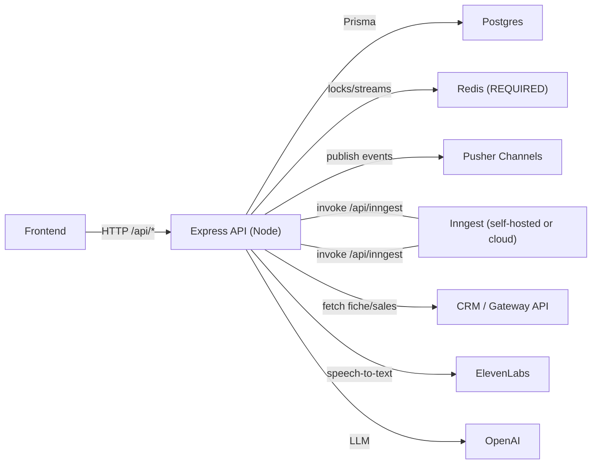
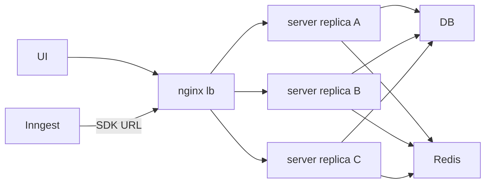

## 00 - Glossary & tracing map (system-wide)

This doc is a **shared cheat sheet** for the whole backend: core terms, entry points, workflow/event map, data model touchpoints, key env knobs, and a practical “how to trace one run” checklist.

If you’re debugging a specific feature deeply, also see:

- `../api.md` (route list)
- `../env.md` (full env reference)
- `../FRONTEND_PUSHER_EVENTS.md` (frontend realtime contract)
- `../workflow-reliability-verification-checklist.md` (hands-on DB + workflow-log triage)

---

## System map (what talks to what)

### Core runtime



**CRITICAL: Redis is REQUIRED** (not optional). Without `REDIS_URL`:
- Transcription finalizer is **skipped** (no completion signal, no progress, no lock release)
- Audits waiting on transcription **hang forever** (waiting for `fiche/transcribed` that never comes)
- Automation gates on transcription/audit **never complete**
- Batch audits return **503**

### Scaled deployment (nginx LB + multiple replicas)

In production Compose, traffic typically flows:



Key note: the Inngest SDK endpoint is served at `POST /api/inngest` (see `src/app.ts`). In scaled setups, Inngest should target the LB URL (e.g. `http://lb/api/inngest`), not an individual replica.

---

## Glossary (shared vocabulary)

- **fiche**: the primary CRM entity (identified by `fiche_id`, a string).
- **sales list**: lightweight “list of fiches” returned by the gateway for a date or date range (may include recording metadata).
- **fiche cache**: DB cache row for a fiche (`fiche_cache` / Prisma `FicheCache`), including:
  - **envelope scalars** (`cle`, `details_success`, `details_message`)
  - **`raw_data`** JSON (now heavily reduced; many sections are normalized)
  - **normalized sections** (e.g. `fiche_cache_information`, `fiche_cache_commentaires`, …)
- **recording**: one call recording linked to a fiche (`recordings` / Prisma `Recording`), uniquely by `(fiche_cache_id, call_id)`.
- **transcription**: stored on the `recordings` row (`transcriptionText`, `transcriptionData`, `hasTranscription`, `transcribedAt`) plus normalized `recording_transcription_chunks`.
- **audit**: AI analysis run for a fiche (`audits` / Prisma `Audit`), with step results in `audit_step_results` and normalized control points/citations/human reviews.
- **audit tracking id vs audit DB id**:
  - **tracking id**: often derived from the Inngest `event.id` and emitted in realtime/webhooks as `audit_id`
  - **DB id**: the canonical `audits.id` (BigInt) used by REST reads: `GET /api/audits/:audit_db_id`
- **automation schedule**: configuration that can run audits/transcriptions automatically (`automation_schedules`).
- **automation run**: one execution of a schedule (`automation_runs`), with per-fiche outcomes in `automation_run_fiche_results`.
- **progressive fetch job**: background “date range fill” job (`progressive_fetch_jobs`) used by `GET /api/fiches/status/by-date-range`.
- **workflow logs**: high-signal correlated logs persisted to `workflow_logs` when enabled (`WORKFLOW_LOG_DB_ENABLED=1`).
- **trace id**: a correlation id stored in `workflow_logs.trace_id` (often set to an entity id like `audit_db_id` or a run id).
- **Inngest event id**: the `event.id` Inngest assigns/accepts; frequently propagated into payloads as `event_id` for correlation.

---

## Event taxonomy (Inngest vs realtime)

This codebase uses **two distinct “event” systems**:

- **Inngest events** (workflow triggers + internal signals):
  - Naming: slash notation like `audit/run`, `fiche/transcribe`, `fiches/progressive-fetch-day.processed`
  - Produced by: `inngest.send({ name, data, id? })` (often from HTTP routes) and `step.sendEvent(...)` (inside workflows)
  - Typed registry: `src/inngest/client.ts` (aggregates per-domain `*.events.ts`)
- **Realtime events (Pusher)** (notify → refetch):
  - Naming: dot notation like `audit.progress`, `transcription.progress`, `automation.run.started`
  - Produced by: `publishPusherEvent(...)` / webhook publisher code (not by Inngest)

Correlation tip: many Pusher payloads include `event_id` (Inngest event id) and/or a stable DB id (e.g. `audit_db_id`) so you can jump from realtime → Inngest UI → DB.

---

## Correlation IDs cheat sheet (what to copy/paste when debugging)

| ID | Example shape | Where it comes from | Where you’ll see it | Use it for |
|---|---|---|---|---|
| `fiche_id` | `"1787121"` | CRM / UI input | URL params, Pusher payloads, `fiche_cache.fiche_id`, workflow logs (transcription) `entityId` | The primary join key across features |
| `jobId` (progressive fetch) | `"cku…"` (cuid) | DB `progressive_fetch_jobs.id` | `GET /api/fiches/status/by-date-range` result, `GET /api/fiches/jobs/:jobId`, Pusher `private-job-{jobId}` | Trace a date-range progressive fetch job |
| `event_id` (Inngest) | `"audit-<fiche>-<config>-<ms>"` | Inngest event id (often set explicitly) | HTTP responses (`event_id`), Pusher payloads (`event_id`), Inngest UI search | Jump directly to a queued workflow invocation |
| `audit_id` (tracking) | `"audit-<fiche>-<config>-<ms>"` | HTTP `/api/audits` queue routes | `POST /api/audits/run` response (`audit_id`), Pusher `private-audit-{audit_id}` | Subscribe to realtime for that run (tracking id) |
| `audit_db_id` (canonical) | `"12345"` (BigInt serialized) | DB `audits.id` | `GET /api/audits/:audit_db_id`, audit Pusher payloads (when present), `workflow_logs.traceId` for audits | Fetch authoritative audit state + workflow logs |
| `batch_id` | `"batch-<ms>-<count>"` | `POST /api/audits/batch` | Batch response, Pusher `private-job-{batch_id}` | Track batch progress/completion |
| `run_id` (automation) | `"9876"` (BigInt serialized) | DB `automation_runs.id` (created inside workflow) | `GET /api/automation/runs/:id`, Pusher job id `automation-run-{run_id}` | Trace an automation run end-to-end |
| `run_id` (transcription) | `"run-…"` | Generated by transcription orchestrator | Inngest events `transcription/recording.*`, optional `trace_id` filter in `GET /api/transcriptions/:fiche_id/logs` | Correlate per-recording workers + finalizer |

Notes:

- Audit is the most confusing: **realtime uses tracking ids**, while REST reads use **DB ids**.
- If you only have an `event_id`, search it in the Inngest UI first; it usually shows you the input payload (which contains the real DB ids you need next).

---

## API entry points (grouped)

Canonical list lives in `../api.md` (and OpenAPI at `/api-docs`).

### Health + docs

- `GET /health`
- `GET /api-docs`, `GET /api-docs.json`

### Auth + admin

- Auth: `POST /api/auth/login`, `POST /api/auth/refresh`, `POST /api/auth/logout`, `POST /api/auth/invite/accept`, `GET /api/auth/me`
- Admin: `GET/POST/PATCH /api/admin/users...`, roles/permissions, teams sync (see `../api.md`)

### Fiches + recordings (CRM/cache)

- `GET /api/fiches/status/by-date-range?startDate&endDate&refresh?&webhookUrl?&webhookSecret?`
- `GET /api/fiches/:fiche_id?refresh=true|false&include_mail_devis=true|false`
- `GET /api/recordings/:fiche_id`
- Job polling: `GET /api/fiches/jobs`, `GET /api/fiches/jobs/:jobId`

### Transcriptions

- Queue: `POST /api/transcriptions/:fiche_id?priority=high|normal|low`, `POST /api/transcriptions/batch`
- Status/logs: `GET /api/transcriptions/:fiche_id/status`, `GET /api/transcriptions/:fiche_id/logs`

### Audits

- Run: `POST /api/audits/run`, `POST /api/audits/run-latest`, `POST /api/audits/batch`
- Read: `GET /api/audits`, `GET /api/audits/:audit_id`, `GET /api/audits/:audit_id/logs`
- Reruns/review: step rerun + control point rerun endpoints (see `../api.md`)

### Automation

- Schedules CRUD + trigger: `POST /api/automation/trigger`, `GET /api/automation/runs/:id`, `GET /api/automation/runs/:id/logs`

### Realtime + chat

- Pusher auth/test: `POST /api/realtime/pusher/auth`, `POST /api/realtime/pusher/test`
- Chat SSE:
  - `POST /api/audits/:audit_id/chat`, `GET /api/audits/:audit_id/chat/history`
  - `POST /api/fiches/:fiche_id/chat`, `GET /api/fiches/:fiche_id/chat/history`

---

## Feature map: API → Inngest → DB → realtime (the “big picture”)

This section answers “when I hit an endpoint, **which workflow runs** and **what should change**?”

### RBAC scope gotcha (empty lists can be “correct”)

Many read endpoints are **visibility-scoped** by the user JWT grants (`SELF | GROUP | ALL`) and `groupes`:

- Fiches date-range/status endpoints filter the returned `fiches[]`
- Audits list endpoints filter by fiche visibility
- Recordings/transcriptions routes enforce fiche visibility
- Private realtime channel auth also enforces per-entity scope (in non-test environments)

If you’re debugging “0 results”, check `GET /api/auth/me` first (effective scopes + groupes), then re-run the same request with an API token (scope `ALL`) to confirm whether it’s authZ vs data.

### Date-range progressive fetch (fast partial + background completion)

- **HTTP entry**: `GET /api/fiches/status/by-date-range?startDate&endDate&refresh?&webhookUrl?&webhookSecret?`
  - If the range is not fully covered (or `refresh=true`), the route sends a background Inngest event:
    - **event**: `fiches/progressive-fetch-continue`
    - **event id**: `progressive-fetch-${jobId}` (dedup key)
    - file: `src/modules/fiches/fiches.routes.ts`
- **Inngest fan-out**:
  - Orchestrator: `fiches/progressive-fetch-continue`
  - Workers: `fiches/progressive-fetch-day` (one date)
  - Updater/finalizer: `fiches/progressive-fetch-day.processed` (serialized per `jobId`)
- **DB touchpoints**:
  - job state: `progressive_fetch_jobs`
  - fiche summaries: `fiche_cache` (+ `recordings` when recordings are included in sales list)
  - webhook retries: `webhook_deliveries`, `webhook_delivery_partial_fiches`
- **Realtime (Pusher)**: `fiches.progressive_fetch.*` on `private-job-{jobId}`
- **First checks**:
  - `GET /api/fiches/jobs/:jobId` (job status/progress)
  - `progressive_fetch_jobs` row status/progress/dates arrays
  - if “stuck”: Inngest → SDK connectivity to LB (common in scaled setups)

### Fiche details fetch + cache (prerequisite for everything)

- **HTTP entry**: `GET /api/fiches/:fiche_id?refresh=true|false`
- **Workflow entry (used by audits/transcriptions/automation)**: Inngest `fiche/fetch` (`fetchFicheFunction`)
- **Key correctness rule**: a CRM `404` becomes a **terminal NOT_FOUND marker** in cache so it can be treated as **SKIP** (never block runs).
- **DB touchpoints**: `fiche_cache` envelope fields + normalized sections; recordings in `recordings`
- **First checks**:
  - `fiche_cache.details_success/details_message` (and the NOT_FOUND marker behavior)
  - whether `recordings` rows exist (URLs may be empty-string until full details fill them)

### Transcription (distributed per-recording fan-out)

- **HTTP entry**: `POST /api/transcriptions/:fiche_id?priority=...`
  - sends Inngest event:
    - **event**: `fiche/transcribe`
    - **event id**: `transcribe-${fiche_id}-${Date.now()}`
    - response includes `event_id`
- **Inngest**:
  - Orchestrator: `fiche/transcribe` (build plan, then fan-out)
  - Workers: `transcription/recording.transcribe`
  - Finalizer: `transcription/recording.transcribed` (aggregates by `run_id`)
- **DB touchpoints**:
  - `recordings` (plan is DB-based; missing URLs can keep “pending” high)
  - `recording_transcription_chunks` (preferred by audits/chat for timelines)
  - optional: `workflow_logs` when `WORKFLOW_LOG_DB_ENABLED=1`
- **Realtime (Pusher)**: `transcription.*` on `private-fiche-{fiche_id}`
- **First checks**:
  - `GET /api/transcriptions/:fiche_id/status`
  - missing URL counts in `recordings` (transcription cannot succeed without URLs)
  - workflow logs: `GET /api/transcriptions/:fiche_id/logs?trace_id=<run_id>`

### Audit (orchestrator → step workers → finalizer)

- **HTTP entry**:
  - `POST /api/audits/run` (or `POST /api/audits` alias)
  - `POST /api/audits/run-latest`
  - Each sends Inngest event `audit/run` with:
    - **event id / tracking id**: `audit-${fiche_id}-${audit_config_id}-${Date.now()}`
    - response includes `event_id` and `audit_id` (tracking)
- **Inngest**:
  - Orchestrator: `audit/run` (prereqs + dispatch `audit/step.analyze`)
  - Worker: `audit/step.analyze` (one step)
  - Finalizer: `audit/step.analyzed` (aggregator/finalization; serialized per `audit_db_id`)
- **DB touchpoints**:
  - `audits` (status transitions: pending → running → completed/failed)
  - `audit_step_results` + normalized citations/control points
  - optional: `workflow_logs` where **audit logs are keyed by `traceId = audit_db_id`**
- **Realtime (Pusher)**: `audit.*` on `private-audit-{audit_tracking_id}` and also on `private-fiche-{fiche_id}`
- **First checks**:
  - find the **DB id** for the audit (from realtime payload `audit_db_id` if present, or via `GET /api/audits/by-fiche/:fiche_id`)
  - workflow logs: `GET /api/audits/:audit_db_id/logs`

### Automation (scheduler + run orchestrator)

- **HTTP entry**: `POST /api/automation/trigger` sends Inngest `automation/run`
  - note: the HTTP route does **not** set an explicit event id; response returns `event_ids[]`
- **Scheduler**: Inngest cron `scheduledAutomationCheck` (default every minute; configurable)
- **Inngest**: `automation/run` orchestrates fiche selection → fetch details → transcribe → audit fan-out
- **DB touchpoints**:
  - run record: `automation_runs` (created inside workflow; `run_id` is the key)
  - run logs: `automation_logs`
  - per-fiche outcomes: `automation_run_fiche_results`
- **Realtime (Pusher)**:
  - dedicated automation UX events `automation.run.*` on `private-job-automation-run-{run_id}`
  - domain events `automation/completed|automation/failed` exist as Inngest events for internal consumers
- **First checks**:
  - `GET /api/automation/runs/:run_id` and `/logs`
  - DB: `automation_run_fiche_results` to see which fiche is gating a stage

### Batch audits (fan-out + Redis progress aggregator)

- **HTTP entry**: `POST /api/audits/batch`
  - requires Redis; returns `503` if `REDIS_URL` is not configured
  - sends Inngest `audit/batch` with:
    - **batch_id**: `batch-${Date.now()}-${ficheIds.length}`
    - **event id**: the same `batch_id` (dedup)
- **Inngest**:
  - `audit/batch` dispatches `audit/run` events
  - progress is driven by `audit/completed` / `audit/failed` and finalizes with `audit/batch.completed`
- **Realtime (Pusher)**: `batch.*` on `private-job-{batch_id}` and `private-global`

---

## Inngest events & owning functions

All Inngest functions are served at `/api/inngest` (see `src/app.ts`).

Canonical event registry (typed):

- `src/inngest/client.ts` (aggregates)
- `src/modules/*/*.events.ts` (per domain)

If an event name is missing from `src/inngest/client.ts`, sending it via `inngest.send(...)` will be error-prone (and may fail type checks).

### Fiche/cache workflows (`src/modules/fiches/fiches.workflows.ts`)

| Inngest event | Function id | Exported const |
|---|---|---|
| `fiche/fetch` | `fetch-fiche` | `fetchFicheFunction` |
| `fiches/revalidate-date` | `revalidate-fiches-for-date` | `revalidateFichesFunction` |
| `fiches/cache-sales-list` | `cache-sales-list-for-date-range` | `cacheSalesListFunction` |
| `fiches/progressive-fetch-continue` | `progressive-fetch-continue` | `progressiveFetchContinueFunction` |
| `fiches/progressive-fetch-day` | `progressive-fetch-day` | `progressiveFetchDayFunction` |
| `fiches/progressive-fetch-day.processed` | `progressive-fetch-update-job` | `progressiveFetchUpdateJobFunction` |

### Transcription workflows (`src/modules/transcriptions/transcriptions.workflows.ts`)

| Inngest event | Function id | Exported const |
|---|---|---|
| `fiche/transcribe` | `transcribe-fiche` | `transcribeFicheFunction` |
| `transcription/recording.transcribe` | `transcribe-recording` | `transcribeRecordingFunction` |
| `transcription/recording.transcribed` | `finalize-fiche-transcription` | `finalizeFicheTranscriptionFunction` |

Notes:

- `finalizeFicheTranscriptionFunction` **requires Redis** to coordinate run state (`REDIS_URL`).
- The workflows emit an internal event `fiche/transcribed` on completion/skip; this is primarily a correlation signal (not a top-level trigger).

### Audit workflows (`src/modules/audits/audits.workflows.ts`, `src/modules/audits/audits.rerun.workflows.ts`)

| Inngest event | Function id | Exported const | File |
|---|---|---|---|
| `audit/run` | `run-audit` | `runAuditFunction` | `audits.workflows.ts` |
| `audit/step.analyze` | `audit-step-analyze` | `auditStepAnalyzeFunction` | `audits.workflows.ts` |
| `audit/step.analyzed` | `audit-finalize-from-steps` | `finalizeAuditFromStepsFunction` | `audits.workflows.ts` |
| `audit/batch` | `batch-audit` | `batchAuditFunction` | `audits.workflows.ts` |
| `audit/completed` | `batch-audit-progress-completed` | `batchAuditProgressOnCompletedFunction` | `audits.workflows.ts` |
| `audit/failed` | `batch-audit-progress-failed` | `batchAuditProgressOnFailedFunction` | `audits.workflows.ts` |
| `audit/step-rerun` | `rerun-audit-step` | `rerunAuditStepFunction` | `audits.rerun.workflows.ts` |
| `audit/step-control-point-rerun` | `rerun-audit-step-control-point` | `rerunAuditStepControlPointFunction` | `audits.rerun.workflows.ts` |

Notes:

- `audit/step.analyzed` is the **step → finalizer** aggregator trigger.
- Batch auditing uses Redis-backed state for correct progress/completion (see `AUDIT_BATCH_STATE_TTL_SECONDS` in `../env.md`).

### Automation workflows (`src/modules/automation/automation.workflows.ts`)

| Inngest trigger | Function id | Exported const |
|---|---|---|
| `automation/run` | `run-automation` | `runAutomationFunction` |
| cron (`AUTOMATION_SCHEDULER_CRON`, default `*/1 * * * *`) | `scheduled-automation-check` | `scheduledAutomationCheck` |

---

## Inngest domain events emitted (internal signals)

These are useful for correlation and for downstream consumers, even when there is no direct “owning function” trigger for them.

- **Fiches**
  - `fiche/fetched`: emitted by `fetchFicheFunction` when it returns a cached or freshly fetched fiche (except terminal NOT_FOUND marker)
  - `fiche/cache.expired`: defined in schemas (`src/modules/fiches/fiches.events.ts`) but may not be emitted yet (forward-compatible)
- **Transcriptions**
  - `fiche/transcribed`: emitted when a transcription run finalizes (and also for terminal skip like NOT_FOUND)
- **Audits**
  - `audit/completed`, `audit/failed`: emitted by the audit pipeline (and consumed by batch progress updaters)
  - `audit/batch.completed`: emitted by the batch progress updater once the pending set reaches 0
  - `audit/step-rerun-completed`, `audit/step-control-point-rerun-completed`: emitted by rerun workflows
- **Automation**
  - `automation/completed`, `automation/failed`: emitted by `automation/run` as domain-level completion signals (separate from Pusher `automation.run.*` UX events)

---

## Deterministic event IDs (useful for correlation)

### HTTP-level event IDs (routes explicitly set `id:`)

- Progressive fetch background continuation: `progressive-fetch-${jobId}`
- Audit run (and run-latest): `audit-${fiche_id}-${audit_config_id}-${Date.now()}`
- Transcription queue: `transcribe-${fiche_id}-${Date.now()}`
- Batch audit: `batch-${Date.now()}-${ficheIds.length}` (also the `batch_id`)

### Fan-out/internal deterministic IDs (workflows)

Many fan-outs also use deterministic event IDs to avoid duplicate dispatch on retries. A few examples:

- **Progressive fetch days**: `pf-day-${jobId}-${date}`
- **Progressive fetch processed**: `pf-day-processed-${jobId}-${date}` (and `...-failed` / `...-cached`)
- **Batch audit per-fiche dispatch**: `batch-${batchId}-audit-${fiche_id}-${audit_config_id}`
- **Transcription recording done**: `transcription-recording-transcribed-${run_id}-${call_id}`
- **Transcription completion**: `fiche-transcribed-${run_id}`

These IDs are helpful when searching in the Inngest UI and when correlating to `workflow_logs.inngest_event_id` (when the tracer persists it).

---

## Realtime (Pusher) quick map

Canonical contract: `../FRONTEND_PUSHER_EVENTS.md` (payload shapes + event list).

### Channels (scoping)

From `../REALTIME.md`:

- **Audit**: `private-audit-{auditId}`
- **Fiche**: `private-fiche-{ficheId}`
- **Job**: `private-job-{jobId}`
- **Global**: `private-global`

### Key event families

- `audit.*` (audit lifecycle + step progress)
- `transcription.*` (recording/fiche progress)
- `batch.*` (batch progress/completion)
- `fiches.progressive_fetch.*` (date-range progressive fetch jobs)
- `automation.run.*` (automation run UX: started/selection/completed/failed)

Operational note: **Pusher is notify → refetch**. Treat payloads as best-effort hints; REST is authoritative.

---

## Data model touchpoints (DB tables you’ll query most)

Canonical schema is `prisma/schema.prisma`. The “daily debugging set” is usually:

### Fiches + recordings + transcription

- `fiche_cache` (+ many `fiche_cache_*` normalized tables)
- `recordings`
- `recording_transcription_chunks`

### Audits

- `audit_configs`, `audit_steps`
- `audits`
- `audit_step_results`
- `audit_step_result_control_points`
- `audit_step_result_citations`
- `audit_step_result_human_reviews`
- `audit_step_result_rerun_events`

### Progressive fetch jobs + webhooks

- `progressive_fetch_jobs`
- `webhook_deliveries`
- `webhook_delivery_partial_fiches`

### Automation

- `automation_schedules`
- `automation_runs`
- `automation_logs`
- `automation_run_fiche_results`

### Cross-workflow observability (optional, recommended)

- `workflow_logs` (enabled with `WORKFLOW_LOG_DB_ENABLED=1`)

---

## Env knobs (the ones you’ll actually tune/debug)

Full reference: `../env.md`. Most “why is it stuck/slow?” issues come down to these:

### Observability

- `WORKFLOW_LOG_DB_ENABLED=1` (persist tracer logs to `workflow_logs`)
- File logs (best-effort; less complete on multi-replica):
  - `WORKFLOW_DEBUG_LOG_TO_FILE=1` (global)
  - per-workflow: `AUDIT_DEBUG_LOG_TO_FILE`, `TRANSCRIPTION_DEBUG_LOG_TO_FILE`, `FICHE_DEBUG_LOG_TO_FILE`, `AUTOMATION_DEBUG_LOG_TO_FILE`

**Terminal workflow logger** (`src/shared/workflow-logger.ts`): All major workflows (transcription, audit, automation) emit structured terminal logs with step transitions, timing, fan-out counts, and gate progress. Example output:

```
[14:23:01] ========== TRANSCRIPTION | fiche-123 | START: transcribe-fiche ==========
[14:23:01] [TRANSCRIPTION|fiche-123]   >> STEP: force-refresh-fiche
[14:23:02] [TRANSCRIPTION|fiche-123]   << DONE: force-refresh-fiche (1.2s) {"success":true}
[14:23:03] [TRANSCRIPTION|fiche-123]   !! WARN: Redis NOT available! Finalizer will be SKIPPED.
[14:23:03] [TRANSCRIPTION|fiche-123]   => FAN-OUT: transcription/recording.transcribe x5
[14:23:10] ========== TRANSCRIPTION | fiche-123 | END: enqueued (9.0s) ==========
```

These logs appear in Docker stdout / `docker compose logs server` and are the fastest way to debug workflow issues without navigating the Inngest UI.

### Inngest topology + concurrency scaling

Defined in `src/shared/inngest-concurrency.ts` and used by `src/shared/constants.ts`:

- `INNGEST_SERVER_REPLICAS` (or `SERVER_REPLICAS`)
- `INNGEST_PARALLELISM_PER_SERVER` (default 10)
- Global caps:
  - `AUDIT_RUN_CONCURRENCY`, `FICHE_FETCH_CONCURRENCY`, `TRANSCRIPTION_FICHE_CONCURRENCY`
  - worker caps: `AUDIT_STEP_WORKER_CONCURRENCY`, `TRANSCRIPTION_RECORDING_WORKER_CONCURRENCY`, `TRANSCRIPTION_FINALIZER_CONCURRENCY`
  - progressive fetch: `PROGRESSIVE_FETCH_DAY_CONCURRENCY`

### Timeouts + rate limits (Inngest + upstream)

From `src/shared/constants.ts`:

- Rate limits (Inngest): `RATE_LIMITS.FICHE_FETCH`, `RATE_LIMITS.TRANSCRIPTION`
- Timeouts (Inngest): `TIMEOUTS.FICHE_FETCH`, `TIMEOUTS.TRANSCRIPTION`, `TIMEOUTS.AUDIT_RUN`, `TIMEOUTS.BATCH_AUDIT`
- Upstream HTTP timeouts: `API_TIMEOUTS.SALES`, `API_TIMEOUTS.FICHE_DETAILS`

### External services

- CRM/gateway: `FICHE_API_BASE_URL`, `FICHE_API_AUTH_TOKEN`, `FICHE_SALES_INCLUDE_RECORDINGS`
- ElevenLabs: `ELEVENLABS_API_KEY` + `TRANSCRIPTION_ELEVENLABS_*` throttling/backoff
- OpenAI: `OPENAI_API_KEY`, `OPENAI_MODEL_AUDIT`, `OPENAI_MODEL_CHAT`

### Automation scheduler + stage gates

- Scheduler tick: `AUTOMATION_SCHEDULER_CRON` (default `*/1 * * * *`)
- Due window: `AUTOMATION_SCHEDULER_WINDOW_MINUTES` (default 20)
- Stage max waits:
  - `AUTOMATION_FICHE_DETAILS_MAX_WAIT_MS`
  - `AUTOMATION_TRANSCRIPTION_MAX_WAIT_MS`
  - `AUTOMATION_AUDIT_MAX_WAIT_MS`

### Progressive fetch webhooks

- `PROGRESSIVE_FETCH_WEBHOOK_FREQUENCY` (emit progress webhooks every N processed days)
- `API_BASE_URL` (used to build `dataUrl` in completion webhooks)

---

## How to trace one fiche/run end-to-end

This is the practical checklist to go from “a UI action” → “what happened in Inngest” → “what changed in DB” → “what logs prove it”.

### 1) Start from an entity id (pick your anchor)

- **Fiche**: `fiche_id`
- **Audit**: `audit_db_id` (canonical) and sometimes `audit_tracking_id` (realtime/webhook `audit_id`)
- **Transcription**: `fiche_id` (+ `run_id` in workflow events)
- **Automation**: `run_id` (automation run DB id)
- **Progressive fetch**: `jobId`
- **Batch**: `batch_id`

### 2) Watch realtime (fast feedback; not authoritative)

Subscribe using the channel map above (and `../FRONTEND_PUSHER_EVENTS.md`):

- Fiche: `private-fiche-{fiche_id}` → `transcription.*`, `audit.*` (also published to fiche)
- Audit: `private-audit-{audit_id}` → `audit.*`
- Progressive fetch: `private-job-{jobId}` → `fiches.progressive_fetch.*`
- Automation run: `private-job-automation-run-{run_id}` → `automation.run.*`

### 3) Confirm state via REST (authoritative)

Examples:

- **Fiche details**: `GET /api/fiches/:fiche_id` (use `refresh=true` to force refresh)
- **Transcription status**: `GET /api/transcriptions/:fiche_id/status`
- **Audit status**: `GET /api/audits/:audit_db_id`
- **Automation run**: `GET /api/automation/runs/:run_id`
- **Progressive fetch job**: `GET /api/fiches/jobs/:jobId`

### 4) Correlate in Inngest (did the workflow actually run?)

Use the Inngest UI and search by:

- **event name** (see the event map above)
- **event id** (when present in payloads as `event_id`)
- **deterministic event ids** (see above) for fan-out workers
- **function id** (e.g. `run-audit`, `fetch-fiche`, `progressive-fetch-day`, …)

Scaled deployment gotcha: if Inngest can’t reach `http://lb/api/inngest` (DNS/502), workflows will appear “stuck” because invocations never reach the SDK.

### 5) Verify DB rows (what actually changed)

These are typical first queries (adjust as needed):

#### Fiche cache row

```sql
select fiche_id, sales_date, details_success, details_message, has_recordings, recordings_count,
       fetched_at, expires_at, last_revalidated_at, updated_at
from fiche_cache
where fiche_id = '<FICHE_ID>';
```

#### Recording + transcription completeness

```sql
select count(*) as total,
       count(*) filter (where has_transcription) as transcribed
from recordings r
join fiche_cache fc on fc.id = r.fiche_cache_id
where fc.fiche_id = '<FICHE_ID>';
```

#### Audit status + step results

```sql
select id, status, started_at, completed_at, error_message
from audits
where id = <AUDIT_DB_ID>;

select step_position, step_name, score, conforme
from audit_step_results
where audit_id = <AUDIT_DB_ID>
order by step_position asc;
```

#### Automation run summary

```sql
select id, schedule_id, status, started_at, completed_at, total_fiches, successful_fiches, failed_fiches
from automation_runs
where id = <RUN_ID>;

select fiche_id, status, error, ignore_reason
from automation_run_fiche_results
where run_id = <RUN_ID>
order by fiche_id asc;
```

### 6) Pull workflow logs (high-signal, cross-replica)

DB workflow logs live in `workflow_logs`.

- If you see **no rows**, it usually means the path you’re debugging isn’t instrumented to write DB workflow logs yet (the endpoints still exist, but they’ll return `data: []`).
- When workflow DB logging is enabled/instrumented (`WORKFLOW_LOG_DB_ENABLED=1`), use:

- **Audit logs**: `GET /api/audits/:audit_db_id/logs`
- **Transcription logs**: `GET /api/transcriptions/:fiche_id/logs`

Direct SQL example:

```sql
select created_at, workflow, level, function_id, step_name, message, data
from workflow_logs
where entity_type = 'fiche'
  and entity_id = '<FICHE_ID>'
order by created_at asc
limit 500;
```

If DB workflow logs are disabled, fall back to:

- `automation_logs` (`GET /api/automation/runs/:id/logs` or SQL) for automation
- stdout logs from the running containers
- optional per-workflow file logs (best-effort; see env section above)
