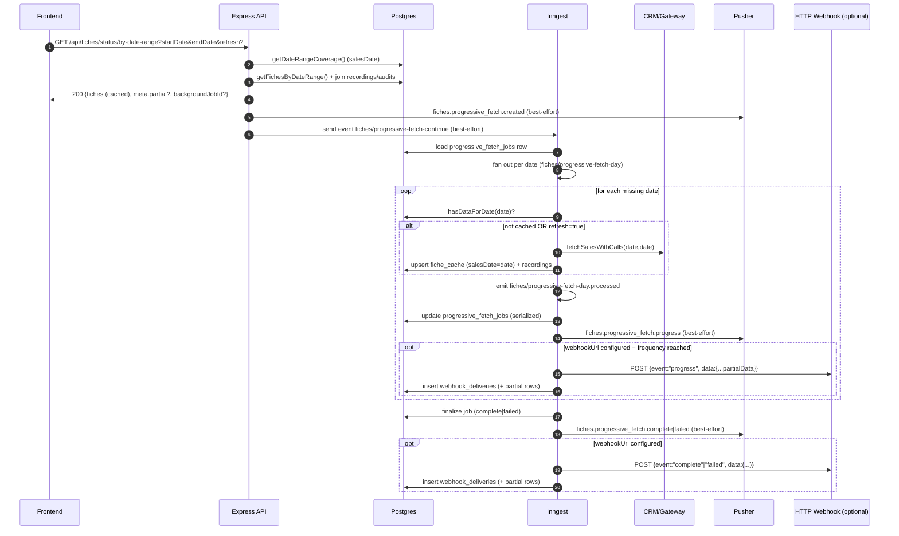
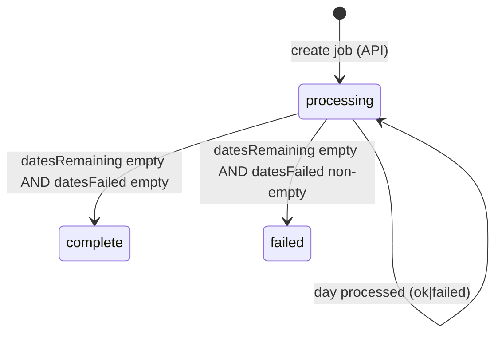

# 01 - Date-range selection (progressive fetch)

## Purpose & scope

This doc explains how the backend serves **fast date-range fiche lists** by returning **cached results immediately** and, when needed, completing missing days in the background using an **Inngest fan-out**.

**In scope**

- HTTP: `GET /api/fiches/status/by-date-range?startDate&endDate&refresh?&webhookUrl?&webhookSecret?`
- HTTP (polling): `GET /api/fiches/webhooks/fiches?jobId=...`
- HTTP (debug): `GET /api/fiches/jobs`, `GET /api/fiches/jobs/:jobId`
- Inngest: `fiches/progressive-fetch-continue` → `fiches/cache-sales-list` (single date-range search) → serialized job updater
- Cache coverage logic via `FicheCache.salesDate` + `getDateRangeCoverage()`
- RBAC scope filtering (self/group/all) and why users can see fewer fiches than exist in cache
- Webhook delivery semantics (progress/complete/failed) and retry tracking

**Out of scope**

- Single-fiche “full details” caching (`GET /api/fiches/:fiche_id`) — see `02-fiche-details-cache-and-normalization.md`
- Cache “revalidation” jobs (`fiches/revalidate-date`, `fiches/cache-sales-list`) — see Flow 03 (when available)
- Transcription and audit internals (only the status fields surfaced here are relevant)

## User story

> A user selects a date range in the UI. The UI needs **something immediately** (even if partial) and then wants the result set to **fill in** as missing days are fetched and cached.

## Entry points

### HTTP: `GET /api/fiches/status/by-date-range`

- **Route**: `src/modules/fiches/fiches.routes.ts` (`/status/by-date-range`)
- **Service**: `src/modules/fiches/fiches.service.ts` → `getFichesByDateRangeProgressive()`
- **Repository**: `src/modules/fiches/fiches.repository.ts` (`getDateRangeCoverage()`, `getFichesByDateRange()`)
- **Background workflows**: `src/modules/fiches/fiches.workflows.ts`
- **Webhook sender** (HTTP webhooks): `src/modules/fiches/fiches.webhooks.ts`
- **Realtime** (Pusher): `src/shared/pusher.ts` (job channel derivation)

**Query params**

- `startDate` (**required**): `YYYY-MM-DD`
- `endDate` (**required**): `YYYY-MM-DD`
- `refresh=true|false` (default `false`):
  - When `true`, forces a background refetch for **all days** in the requested range.
  - Requires **write permission** (see Auth below).
- `webhookUrl` (optional): where to POST job progress/completion notifications
- `webhookSecret` (optional): HMAC secret used to sign webhook payloads

**Response (high level)**

- Always returns **immediately** with:
  - `fiches`: whatever is currently cached for the range (may be empty)
  - `meta.partial=true` and `meta.backgroundJobId` when background work is needed
  - `meta.complete=true` when no background work is needed

`meta` fields match `ProgressiveFetchMeta` (`src/modules/fiches/fiches.schemas.ts`):

- `complete`, `partial`
- `backgroundJobId?`
- `totalDaysRequested`, `daysFetched`, `daysRemaining`, `daysCached`
- `cacheCoverage.datesWithData[]`, `cacheCoverage.datesMissing[]`

### HTTP (polling): `GET /api/fiches/webhooks/fiches?jobId=...`

Despite the name, this is the **frontend polling** endpoint (an alternative to HTTP webhooks and/or realtime).

- **Route**: `src/modules/fiches/fiches.routes.ts` (`/webhooks/fiches`)
- Reads the job row from `progressive_fetch_jobs`
- Returns:
  - `event`: `"progress" | "complete" | "failed"`
  - `data.partialData`: the **current cached fiches** (filtered by RBAC scope)
  - `data.datesCompleted|Remaining|Failed`, `data.progress`, etc.
  - `data.dataUrl` once terminal (points back to `/status/by-date-range`)

### HTTP webhooks (push, optional)

If `webhookUrl` is provided, the background updater sends **HTTP POST** notifications as the job progresses.

- **Sender**: `src/modules/fiches/fiches.webhooks.ts`
- **Events**: `"progress" | "complete" | "failed"`
- **Delivery tracking**: `webhook_deliveries` + `webhook_delivery_partial_fiches`
- **Headers (always)**:
  - `X-Webhook-Event`, `X-Webhook-Job-Id`, `X-Webhook-Delivery-Id`, `X-Webhook-Attempt`, `X-Webhook-Timestamp`
- **Headers (when a secret exists)**:
  - `X-Webhook-Signature`: `sha256=<hex>` (HMAC of the JSON body)
  - `X-Webhook-Signature-V2`: `sha256=<hex>` (HMAC of `${timestamp}.${body}` to reduce replay risk)

**Payload shape (example)**

```json
{
  "event": "progress",
  "jobId": "ckv0...cuid",
  "timestamp": "2026-02-06T12:34:56.789Z",
  "data": {
    "status": "processing",
    "progress": 40,
    "completedDays": 2,
    "totalDays": 5,
    "totalFiches": 123,
    "currentFichesCount": 123,
    "latestDate": "2026-02-05",
    "partialData": [
      {
        "ficheId": "123456",
        "groupe": null,
        "prospectNom": "…",
        "prospectPrenom": "…",
        "recordingsCount": 2,
        "createdAt": "2026-02-05T08:12:34.000Z"
      }
    ]
  }
}
```

**Security note**: progressive-fetch webhooks are emitted **without user context**, so they are **not RBAC-scoped**. Treat `webhookUrl` as a **trusted system-to-system integration** (typically a Next.js server route) and keep it protected by your own auth/secret verification.

### HTTP (debug): `GET /api/fiches/jobs` and `GET /api/fiches/jobs/:jobId`

Debug endpoints for inspecting job records and recent webhook deliveries.

- `GET /api/fiches/jobs`: list recent jobs
- `GET /api/fiches/jobs/:jobId`: show job status + last webhook deliveries (top 10)

### Inngest events & functions (background completion)

All functions are defined in `src/modules/fiches/fiches.workflows.ts`.

| Inngest event | Function id | Exported const | Notes |
|---|---:|---|---|
| `fiches/progressive-fetch-continue` | `progressive-fetch-continue` | `progressiveFetchContinueFunction` | Orchestrator: runs **one** date-range sales search via `cache-sales-list`, then emits per-day processed events |
| `fiches/cache-sales-list` | `cache-sales-list-for-date-range` | `cacheSalesListFunction` | Worker: fetches sales list for a date range (single request; may fall back to sequential chunks) and caches sales summaries |
| `fiches/progressive-fetch-day` | `progressive-fetch-day` | `progressiveFetchDayFunction` | Legacy worker (day-by-day CRM fetch). Not used by the main progressive-fetch flow anymore, but kept for compatibility/debug |
| `fiches/progressive-fetch-day.processed` | `progressive-fetch-update-job` | `progressiveFetchUpdateJobFunction` | Serialized updater + finalizer + webhook sender |

**Implementation note (important)**: the orchestrator loads the job from Postgres and uses `job.datesRemaining` as the source of truth. Today, only `event.data.jobId` and `event.data.force_refresh` are actually used; `startDate/endDate/datesAlreadyFetched/webhookUrl/webhookSecret` in the event type are effectively informational.

### Key environment knobs (tuning)

- `FICHE_SALES_SEARCH_CONCURRENCY`: global max concurrency for upstream CRM sales searches (defaults to `1`).
- `FICHE_FETCH_CONCURRENCY`: global max concurrency for upstream CRM fiche detail fetches (defaults to `3`).
- `PROGRESSIVE_FETCH_DAY_CONCURRENCY`: legacy knob for `fiches/progressive-fetch-day` (defaults to `FICHE_SALES_SEARCH_CONCURRENCY`).
- `PROGRESSIVE_FETCH_WEBHOOK_FREQUENCY`: send `"progress"` webhooks every N processed days (default `5`, and always on terminal).
- `FICHE_SALES_INCLUDE_RECORDINGS=1`: include recording metadata in sales-list fetches (larger payloads, slower).
- `FICHE_SALES_CACHE_CONCURRENCY`: per-day DB upsert concurrency (defaults to `INNGEST_PARALLELISM_PER_SERVER`).
- `INNGEST_SERVER_REPLICAS` / `SERVER_REPLICAS`: replica count used to scale global concurrency defaults.
- `INNGEST_PARALLELISM_PER_SERVER`: baseline per-replica parallelism (default `10`).
- `WEBHOOK_ALLOWED_ORIGINS`: strict allowlist for outgoing `webhookUrl` origins (exact `url.origin` match; overrides hostname/IP checks).
- `API_BASE_URL`: base used when building `dataUrl` in polling responses and completion webhooks.
- Pusher/realtime: `PUSHER_*` and `PUSHER_USE_PRIVATE_CHANNELS` (controls whether job channels are `private-job-*` or `job-*`).

## Auth & RBAC behavior (critical)

### Permissions

- All `/api/fiches/*` routes require `fiches.read` by default (router middleware).
- `refresh=true` requires **write** access (`fiches.write`), since it triggers upstream fetch + DB mutations.
- Machine API tokens can bypass some permission checks in `requirePermission` (see comment in `fiches.routes.ts`).

### Scope enforcement (SELF / GROUP / ALL)

The API filters results **after** fetching cached data:

- **ALL**: no filter (default for API tokens and some internal callers)
- **GROUP**: only fiches whose group is in `auth.groupes`
- **SELF**: only fiches assigned to the user (`information.attribution_user_id === auth.crmUserId`)

Implementation details (`src/modules/fiches/fiches.routes.ts`):

- Scope is derived from the JWT grant for permission key `fiches` (defaults to `SELF`).
- GROUP filtering for `/status/by-date-range` (and `/status/by-date`) is applied by checking the returned `f.groupe` field (which comes from `FicheCache.groupe`).
  - Other routes may use `filterFicheIdsByGroupScope()`, which additionally checks `fiche_cache_information.groupe`.
- SELF filtering uses `filterFicheIdsBySelfScope()`, which checks `fiche_cache_information.attribution_user_id` (requires full-details cache).

**User-visible implications**

- A job may fetch/cache many fiches, but the user may still see **0 fiches** if RBAC filters them out.
- Job-level metrics in `progressive_fetch_jobs` (like `totalFiches`) are **not scope-aware**. The polling endpoint (`/webhooks/fiches`) applies RBAC to `partialData`, but the debug job endpoint (`/jobs/:jobId`) mostly reflects the raw job row.

**Deep implication: sales-summary-only cache + scoped tokens can look empty**

The sales-list schema (`salesFicheSchema`) does **not** include `groupe` or `attribution_user_id`. When we cache sales summaries (`cacheFicheSalesSummary`), new rows often have:

- `fiche_cache.groupe = NULL`
- no `fiche_cache_information` row (because that’s created by full-details caching)

Therefore:

- **GROUP scope** users may not see newly cached fiches until a **full-details** fetch populates group fields.
- **SELF scope** users may not see newly cached fiches until a **full-details** fetch populates `attribution_user_id`.

This is one of the most common causes of “0 fiches” even while a progressive job is actively filling the cache.

## Data model (Prisma / Postgres)

### Cache coverage source of truth: `fiche_cache.sales_date`

Coverage is based on `FicheCache.salesDate` (table `fiche_cache`, column `sales_date`):

- Date-range reads use `salesDate BETWEEN startDate AND endDate`
- Coverage checks use unique `salesDate` values present in `fiche_cache`

Important nuance:

- **Coverage means “we have at least one fiche row for that date”**, not “we fetched that date completely”.
- The current approach **cannot represent “fetched date with zero fiches”** (see Fix backlog).

Relevant code:

- `src/modules/fiches/fiches.repository.ts`:
  - `getDateRangeCoverage(startDate, endDate)` → `{ datesWithData, datesMissing }`
  - `hasDataForDate(date)` (used by day workers)

### Progressive fetch jobs: `progressive_fetch_jobs`

`model ProgressiveFetchJob` → table `progressive_fetch_jobs` (`prisma/schema.prisma`).

Key fields:

- Identity: `id` (cuid), `start_date`, `end_date`
- Status: `status` (`pending|processing|complete|failed`), `progress` (0–100)
- Counters: `total_days`, `completed_days`, `total_fiches`
- Dates tracking arrays:
  - `dates_already_fetched[]` (treated as “done”)
  - `dates_remaining[]` (to be processed)
  - `dates_failed[]` (terminal failures)
- Webhook config: `webhook_url`, `webhook_secret`, `webhook_events[]`, `last_webhook_sent_at`, `webhook_attempts`, `webhook_last_error`
- Results: `result_fiche_ids[]`, `error`
- Timestamps: `created_at`, `updated_at`, `completed_at`

### Webhook deliveries: `webhook_deliveries` + `webhook_delivery_partial_fiches`

HTTP webhook attempts are stored for debugging and retry:

- `webhook_deliveries` stores:
  - delivery metadata (`event`, `url`, status/attempt/statusCode)
  - normalized payload columns (so retries/signatures don’t need large JSON blobs)
- `webhook_delivery_partial_fiches` stores the “partialData” fiche rows associated with a delivery (ordered by `row_index`)

## Happy path (end-to-end)

### What happens on the initial request

1. Client calls `GET /api/fiches/status/by-date-range?startDate=...&endDate=...`
2. Service attempts job **dedup**:
   - If there is an existing job for the same range created within the last **5 minutes** and `refresh` is not set, it reuses the job and returns cached data immediately.
3. Service checks cache coverage using `getDateRangeCoverage()` (via `salesDate`).
4. Service loads cached fiches from DB and enriches them with transcription/audit status.
5. If any dates are missing (or `refresh=true`), the service:
   - creates a `progressive_fetch_jobs` row with `dates_remaining[]` (and `dates_already_fetched[]` when not refreshing)
   - publishes a best-effort realtime event `fiches.progressive_fetch.created` (Pusher)
   - triggers the background orchestrator by sending the Inngest event `fiches/progressive-fetch-continue` (best-effort)
6. Route applies RBAC filtering to the returned `fiches[]` and `total`.
7. Client receives an immediate response:
   - **complete** when no background work is needed
   - **partial** with a `backgroundJobId` when background work is required

### Background completion (fan-out + serialized updater)

The background job is implemented as:

- **Orchestrator**: `fiches/progressive-fetch-continue`
  - loads the job row
  - fans out one event per date remaining:
    - event: `fiches/progressive-fetch-day`
    - deterministic id: `pf-day-${jobId}-${date}`
- **Day worker**: `fiches/progressive-fetch-day`
  - checks if the date is already cached (`hasDataForDate(date)`) unless `force_refresh=true`
  - fetches CRM sales for that day (`fichesApi.fetchSalesWithCalls(date, date, ...)`)
  - caches each fiche summary:
    - `fichesCache.cacheFicheSalesSummary(..., { salesDate: date, lastRevalidatedAt: now })`
  - emits `fiches/progressive-fetch-day.processed` (success or failure)
- **Serialized updater/finalizer**: `fiches/progressive-fetch-day.processed`
  - merges the date into `datesAlreadyFetched[]` or `datesFailed[]`
  - recomputes `datesRemaining[]`, `progress`, `completedDays`
  - recomputes `totalFiches` from DB (range read)
  - publishes realtime progress events:
    - `fiches.progressive_fetch.progress`
    - then a terminal `...complete` or `...failed`
  - sends HTTP webhooks (if configured):
    - `"progress"` periodically (every N processed days) and/or on terminal
    - `"complete"` or `"failed"` on terminal

### Sequence diagram



### Job state machine & invariants (deeper analysis)

The job acts like a small state machine, with per-day processing results folded into a single row.



Key invariants (as maintained by the serialized updater):

- `datesAlreadyFetched`, `datesFailed`, `datesRemaining` form a partition of the requested date set.
- `completedDays === datesAlreadyFetched.length`.
- \(processedDays = datesAlreadyFetched.length + datesFailed.length\) and `progress ≈ round(processedDays/totalDays*100)`.
- Terminal rows are written with `progress=100`, `datesRemaining=[]`, and `completedAt` set.
- Some endpoints use **derived status** because a row can be “effectively terminal” (`progress=100` and no remaining dates) even if `status` still says `"processing"` (e.g., if a prior attempt failed after partially updating DB).

## Cached / uncached scenarios (explicit)

### Scenario A — Fully cached range

- `getDateRangeCoverage()` returns `datesMissing=[]`
- Response:
  - `meta.complete=true`
  - `meta.partial=false`
  - `meta.backgroundJobId` absent

### Scenario B — Partially cached range (some missing days)

- `datesMissing.length > 0`
- Response returns cached fiches immediately and creates a job:
  - `meta.partial=true`
  - `meta.backgroundJobId=<JOB_ID>`
  - `meta.cacheCoverage.datesMissing` lists the remaining dates
- Background:
  - only the missing dates are fanned out and processed

### Scenario C — Empty cache (no cached fiches for the range)

- Coverage returns all days as missing
- Response:
  - `total=0`, `fiches=[]`
  - `meta.partial=true`, `backgroundJobId` present
- Background:
  - all days are fetched in the background

### Scenario D — Force refresh (`refresh=true`)

- Requires `fiches.write`
- Response still returns **current cached data** immediately (stale is allowed).
- Background job is created for **all dates** (even those already cached):
  - `force_refresh=true` is passed through to day workers
  - day workers refetch from CRM even when the date has cached data

### Scenario E — Job deduplication (5-minute window)

If a job exists for the same range and is younger than 5 minutes (and `refresh` is not set):

- the service returns cached data immediately with:
  - `meta.backgroundJobId = existingJob.id`
  - `meta.complete = existingJob.status === "complete"`
  - `meta.partial = existingJob.status !== "complete"`
- no new job is created

## Failure modes (and current behavior)

### Input validation

- Missing/invalid `startDate` or `endDate` (`YYYY-MM-DD` required) → `400`
- `startDate > endDate` → `400`

### AuthZ / permissions

- Missing `fiches.read` → request rejected by middleware
- `refresh=true` without `fiches.write` → `403` (`AuthorizationError`)

### Webhook URL security (SSRF guard)

- Unsafe `webhookUrl` rejected at request time → `400`
- Defense in depth: webhook sender validates again and records a failed delivery
- If `WEBHOOK_ALLOWED_ORIGINS` is set, the URL must match one of the allowed **origins** exactly (scheme + host + port) and this allowlist **overrides** private-IP checks.
- If no allowlist is configured:
  - in development, `localhost`/loopback are allowed
  - in production, `localhost`/private IPs are rejected but **public** hostnames are allowed (consider setting an allowlist)

### CRM/API failures for individual days

- Day worker retries (Inngest retries=2)
- On failure, the day worker emits `...processed` with `ok=false`
- Updater records the date in `dates_failed[]`
- Job finalizes as `failed` if any failed dates exist
- Cached results are still returned by polling/reads (best-effort partial)

### “Date cached” false positives (completeness gap)

Both `getDateRangeCoverage()` and day workers use **existence of any fiche row** for a date as “cached”.

If an earlier caching attempt only cached *some* fiches for a day:

- the date is considered “covered”
- the day worker won’t refetch it (unless `refresh=true`)
- users may observe “missing fiches” for that day

### Inngest dispatch failure from the API (job can stall)

The API creates the job row first, then **best-effort** dispatches `fiches/progressive-fetch-continue`.

If dispatch fails:

- the client still receives `backgroundJobId`
- the job row can remain `processing` without progress updates
- repeated calls within the 5-minute dedup window will **reuse** the job and will not re-dispatch automatically

### Dedup + webhook configuration gotcha

Job deduplication is keyed only by `startDate/endDate` + “created within the last 5 minutes”.

That means if a job already exists for the range:

- passing a **new** `webhookUrl`/`webhookSecret` will **not** attach it to the existing job
- the response may advertise a `backgroundJobId`, but that job’s webhook config is whatever was stored when it was created

If you need to ensure webhooks are configured, ensure the **first** request that creates the job includes the webhook parameters (or bypass dedup with `refresh=true`).

### Inngest outage / queueing delays

- Jobs remain in `processing` with `datesRemaining` non-empty until workers run.
- Polling endpoint continues to return the current cached data.

### Realtime (Pusher) not configured

- `publishPusherEvent()` becomes a no-op (logs a warning once)
- The flow still works via polling and/or HTTP webhooks.

### Webhook delivery failures

If a webhook target returns errors/timeouts:

- Delivery attempts are stored in `webhook_deliveries`
- Retries use exponential backoff (up to `maxAttempts`, default 3)
- Signature headers are added when a secret exists:
  - `X-Webhook-Signature`: `sha256(HMAC(body))`
  - `X-Webhook-Signature-V2`: `sha256(HMAC(timestamp + "." + body))`

### Webhook payload scope (security)

Webhook payloads are generated server-side during background processing and are **not filtered** by RBAC scope (no user context exists in the workflow). If you need scoped notifications, you’ll need to redesign payload generation to include a scope key (or send only non-sensitive correlation IDs and let the receiver query scoped endpoints).

### Finalization robustness (“derived status”)

Polling endpoints defensively derive a terminal status when:

- `status === "processing" && progress === 100 && datesRemaining.length === 0`

This prevents a “stuck processing” UI when the DB row was updated but the explicit terminal status update didn’t happen.

## Observability checkpoints

### Logs (server)

High-signal messages to look for:

- API/service:
  - `"Starting progressive fetch"`
  - `"Cache coverage analyzed"`
  - `"Returning cached data immediately"`
  - `"Background job created for missing dates"`
  - `"Triggering background fetch continuation"`
- Inngest workflows:
  - `"Fanning out progressive fetch day workers"`
  - `"Force refresh enabled; refetching date from CRM even though cached"`
  - `"Day failed for progressive fetch job"`
  - `"Progressive fetch job updated"`

### Database (Postgres)

**Inspect a job**

```sql
select
  id,
  status,
  progress,
  total_days,
  completed_days,
  start_date,
  end_date,
  dates_already_fetched,
  dates_remaining,
  dates_failed,
  total_fiches,
  error,
  created_at,
  updated_at,
  completed_at
from progressive_fetch_jobs
where id = '<JOB_ID>';
```

**See which days have any cached fiches**

```sql
select sales_date, count(*) as fiches
from fiche_cache
where sales_date between '2026-02-01' and '2026-02-07'
group by sales_date
order by sales_date;
```

**Inspect webhook delivery attempts**

```sql
select
  id,
  job_id,
  event,
  status,
  status_code,
  attempt,
  max_attempts,
  next_retry_at,
  created_at
from webhook_deliveries
where job_id = '<JOB_ID>'
order by created_at desc
limit 20;
```

### Inngest correlation

Useful deterministic IDs:

- Orchestrator dispatch (API): `progressive-fetch-${jobId}`
- Day worker events: `pf-day-${jobId}-${date}`
- Processed signals: `pf-day-processed-${jobId}-${date}` (and `...-cached`, `...-failed`)

These are helpful for searching runs in the Inngest UI.

### Realtime (Pusher)

Events emitted (best-effort):

- `fiches.progressive_fetch.created`
- `fiches.progressive_fetch.progress`
- `fiches.progressive_fetch.complete`
- `fiches.progressive_fetch.failed`

Channels:

- When payload includes `jobId`, the event is published to: `private-job-<JOB_ID>` (or `job-<JOB_ID>` if public channels are enabled).

### Workflow logs (`workflow_logs`) (optional)

This flow does **not** currently persist structured workflow logs via `src/shared/workflow-tracer.ts`.

If you add tracing to these code paths, a common query pattern is:

```sql
select *
from workflow_logs
where trace_id = '<JOB_ID>'
order by created_at asc;
```

## Fix backlog (independent)

### 1) Persist “day fetched” markers (handles zero-fiche days + completeness)

- **Problem**: Coverage can’t represent “we fetched this date and there were 0 fiches”, so the date remains “missing” forever.
- **Suggested patch**:
  - Add a per-day coverage table (e.g. `fiche_sales_days`) storing `{ date, fetchedAt, totalFromCrm, cachedCount, lastError }`.
  - Update `getDateRangeCoverage()` / `hasDataForDate()` to consult the marker table (not just `fiche_cache`).
  - Update day worker (`progressiveFetchDayFunction`) to upsert the marker even when `salesData.fiches.length === 0`.
- **Where**:
  - `prisma/schema.prisma`
  - `src/modules/fiches/fiches.repository.ts`
  - `src/modules/fiches/fiches.workflows.ts`
- **DoD**:
  - A range containing “no sales” dates completes once and does not refetch those dates on subsequent calls.

### 2) Make background dispatch retryable on job reuse

- **Problem**: If initial Inngest dispatch fails, the job can stall; dedup reuse won’t re-dispatch.
- **Suggested patch**:
  - In `getFichesByDateRangeProgressive()`, when reusing an existing job with `datesRemaining.length > 0`, attempt to dispatch `fiches/progressive-fetch-continue` again (idempotent + concurrency-guarded).
  - Alternatively add `lastDispatchedAt` to `ProgressiveFetchJob` and re-dispatch when stale.
- **Where**:
  - `src/modules/fiches/fiches.service.ts`
  - (optional schema) `prisma/schema.prisma`
- **DoD**:
  - A transient Inngest outage doesn’t permanently stall jobs.

### 3) Align “derived status” across endpoints

- **Problem**: `/webhooks/fiches` and `/jobs/:jobId` derive a terminal status, but `getFichesByDateRangeProgressive()` reuse path uses `existingJob.status` directly.
- **Suggested patch**:
  - Apply the same derived-status logic when reusing jobs (or finalize the DB row if derivable).
- **Where**: `src/modules/fiches/fiches.service.ts`, `src/modules/fiches/fiches.routes.ts`
- **DoD**:
  - Reused-job responses show `meta.complete=true` when the job is effectively complete.

### 4) Improve per-day completeness guarantees (not just “any row exists”)

- **Problem**: One cached fiche row makes a day “covered”, even if other fiches failed to cache.
- **Suggested patch**:
  - Store and compare CRM “expected count” per day (from `fetchSalesWithCalls`) vs cached count.
  - Refetch a day when cached count < expected (bounded retries).
- **Where**:
  - `src/modules/fiches/fiches.workflows.ts` (day worker + updater)
  - New per-day marker table (see item #1)

### 5) Surface “0 fiches” reasons clearly to the frontend

- **Problem**: Empty `fiches[]` can mean “cache not ready”, “RBAC filtered everything”, or “truly no sales”.
- **Suggested patch**:
  - Add explicit meta signals (e.g. `meta.rbac.scope`, `meta.rbac.filteredOutCount`, `meta.coverageReasonByDate[]`).
  - Ensure this does not leak cross-scope sensitive totals to end users.
- **Where**: `src/modules/fiches/fiches.routes.ts`, `src/modules/fiches/fiches.service.ts`

### 6) Update Swagger description (currently misleading)

- **Problem**: Swagger comment says “fetch first missing day immediately”; implementation returns cached only and does all missing days in background.
- **Suggested patch**: Update the swagger description in `src/modules/fiches/fiches.routes.ts`.

### 7) Reduce “0 fiches” surprises under scoped RBAC

- **Problem**: Progressive fetch caches **sales summaries** which do not contain `groupe` or `attribution_user_id`. Under `GROUP`/`SELF` scopes, the API can legitimately return 0 results even while caches exist.
- **Suggested patch options** (pick one, in increasing cost):
  - **Make the UI expectations explicit**: return `meta.rbac.visibilityMayBeIncomplete=true` (and explain that details caching is needed for scoped visibility).
  - **Store minimal RBAC fields during sales-summary caching** if the upstream sales list can provide them (or add a lightweight upstream endpoint that does).
  - **Async “RBAC metadata fill”**: after caching summaries for a day, enqueue a bounded fan-out that fetches only the minimal fields needed for visibility (group + attribution) and persists them.
- **Where**:
  - `src/modules/fiches/fiches.cache.ts` (`cacheFicheSalesSummary`)
  - `src/modules/fiches/fiches.workflows.ts` (`progressiveFetchDayFunction`)
  - `src/modules/fiches/fiches.routes.ts` (meta signaling)

### 8) Make GROUP scope filtering consistent (use DB helper)

- **Problem**: `/status/by-date-range` filters GROUP scope using only `f.groupe` (which comes from `fiche_cache.groupe`). If group information is only present in `fiche_cache_information.groupe`, those fiches will be filtered out.
- **Suggested patch**: Use `filterFicheIdsByGroupScope()` in the GROUP branch (same as `/api/fiches/search`) to consult both `fiche_cache.groupe` and `fiche_cache_information.groupe`.
- **Where**: `src/modules/fiches/fiches.routes.ts` (`/status/by-date` and `/status/by-date-range`)

### 9) Keep `resultFicheIds` accurate (or remove it)

- **Problem**: `progressive_fetch_jobs.result_fiche_ids` is initialized from the *initial cached* response and is not updated as the cache grows; it can be misleading for debugging/consumers.
- **Suggested patch**:
  - Either remove/deprecate `resultFicheIds`, or
  - Update it in the serialized updater after recomputing the current cached set for the range.
- **Where**:
  - `src/modules/fiches/fiches.service.ts` (job create)
  - `src/modules/fiches/fiches.workflows.ts` (`progressiveFetchUpdateJobFunction`)

### 10) Harden dedup against races (duplicate jobs for same range)

- **Problem**: Dedup is best-effort (`findFirst` then `create`). Concurrent requests can still create multiple jobs for the same range.
- **Suggested patch**:
  - Add a deterministic `dedupKey` column (e.g. `${startDate}:${endDate}` or include scope) with a unique constraint for a short TTL window, or
  - Use a Redis lock around job creation (`startDate/endDate`) to serialize creation.
- **Where**:
  - `prisma/schema.prisma`
  - `src/modules/fiches/fiches.service.ts` (`getFichesByDateRangeProgressive`)

### 11) Fix progressive fetch event type drift

- **Problem**: `src/modules/fiches/fiches.events.ts` describes fields like `datesAlreadyFetched` as “returned to user”, but the current implementation doesn’t use them (DB job row is the source of truth).
- **Suggested patch**: Update the type comments and/or narrow the event payload to what’s actually used (`jobId`, `force_refresh`).
- **Where**: `src/modules/fiches/fiches.events.ts`

