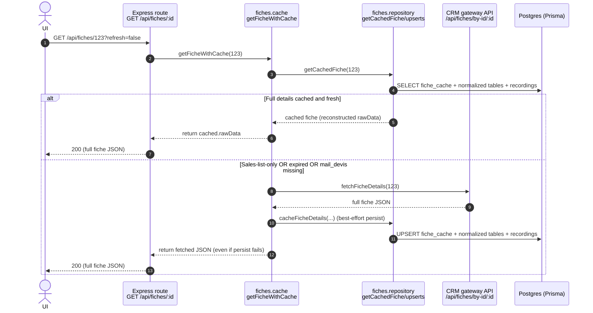
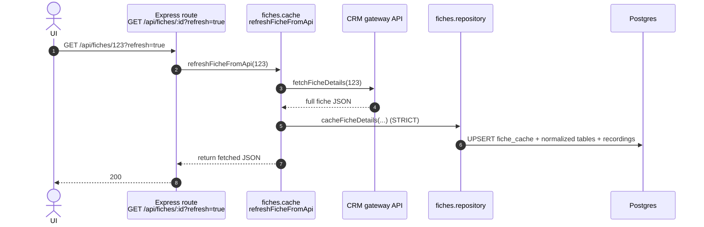
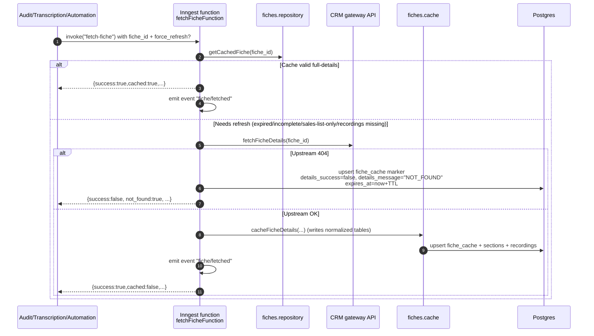

# 02 - Fiche details cache & normalization (advanced ingest)

This doc explains the **single-fiche “full details” fetch** flow and how we **persist + reconstruct** the CRM payload efficiently and safely:

- **Sales-list-only cache** (“basic”): minimal fiche shape stored during date-range caching.
- **Full-details cache** (“advanced”): full CRM fiche details stored via **normalized tables** + a reduced JSON blob.
- **Compatibility layer**: read-time reconstruction that preserves the legacy API response shape even when `fiche_cache.raw_data` is trimmed/backfilled.

Related docs:

- `00-glossary-and-tracing.md` (system-wide map + tracing checklist)
- `01-date-range-progressive-fetch.md` (date-range progressive fetch)
- `03-cache-revalidation.md` (sales-list cache revalidation; does not fetch full details)
- `04-recordings-ingest-and-access.md` (recording invariants + transcription chunks)
- `../api.md` (route list)
- `../env.md` (env knobs)

## Purpose & scope

**In scope**

- HTTP: `GET /api/fiches/:fiche_id` (`refresh` + `include_mail_devis`)
- Inngest: `fiche/fetch` (`fetchFicheFunction`) as a prerequisite used by audits/transcriptions/automation
- Persistence: `fiche_cache` + normalized `fiche_cache_*` tables + `recordings`
- Upstream failure handling: **404**, **401/403**, **5xx**, **timeouts**

**Out of scope**

- Date-range progressive fetch jobs and per-day caching (`/api/fiches/status/by-date-range`) — see Flow 01/03
- Transcription and audit internals (only their interaction with `fiche/fetch` is covered)

## User story

> A user opens a fiche in the UI. The backend should return fiche details quickly:
> - return cached full details when available
> - otherwise fetch from CRM, cache it, and return it
> - if `refresh=true`, force a fresh fetch + DB write
> - optionally include “mail devis” payload when requested

## Entry points

### HTTP: `GET /api/fiches/:fiche_id`

- **Route**: `src/modules/fiches/fiches.routes.ts`
- **Service**: `src/modules/fiches/fiches.service.ts` → `getFiche()`
- **Cache orchestrator**: `src/modules/fiches/fiches.cache.ts`
- **Upstream client**: `src/modules/fiches/fiches.api.ts`
- **DB access**: `src/modules/fiches/fiches.repository.ts`

**Parameters**

- `refresh=true|false` (default `false`)
  - When `true`, bypasses cache and forces a CRM fetch + DB write.
- `include_mail_devis=true|false` (default `false`)
  - When `true`, includes the (large) “mail devis” section and will fetch it if it isn’t cached.

**Auth**

- Requires **fiche read** (`fiches.read`) for all endpoints under `/api/fiches/*`.
- If `refresh=true`, also requires **fiche write** (`fiches.write`) (the request mutates DB).
- RBAC **scope enforcement** is applied on response content using `information.groupe` and `information.attribution_user_id` (self/group/all).

### HTTP (debug): `GET /api/fiches/:fiche_id/cache`

Returns **metadata only** (not the full fiche JSON): `fetchedAt`, `expiresAt`, `recordingsCount`, etc.

Useful for quickly checking whether the fiche is cached without returning the full payload.

### Upstream: fiche details fetch (gateway/CRM)

The backend talks to the gateway via `src/modules/fiches/fiches.api.ts`.

- **Function**: `fetchFicheDetails(ficheId, cle?, { includeRecordings, includeMailDevis })`
- **Gateway path**: `GET /api/fiches/by-id/:fiche_id`
- **Key query params**:
  - `include_recordings=true|false` (defaults to `true` for fiche details)
  - `include_transcriptions=false` (we run our own transcription system)
  - `include_mail_devis=true|false` (opt-in; large payload)

**`cle` semantics (important)**

- We intentionally do **not** pass `cle` query params, even if we have a cached value.
- The gateway is responsible for refreshing/validating `cle` internally when fetching by fiche ID.
- We still store `cle` in DB (`fiche_cache.cle` and `fiche_cache_information.cle`) because it’s a useful scalar for observability and compatibility.

### Inngest: `fiche/fetch` → `fetchFicheFunction`

- **Event**: `fiche/fetch` (`src/modules/fiches/fiches.events.ts`)
- **Function**: `fetchFicheFunction` (`src/modules/fiches/fiches.workflows.ts`)
- **Success event**: `fiche/fetched` (emitted only on successful fetch/cache)

This workflow is used as a **prerequisite** by:

- `src/modules/transcriptions/transcriptions.workflows.ts` (force-refresh before building transcription plan)
- `src/modules/audits/audits.workflows.ts` (force-refresh before timeline/steps)
- `src/modules/automation/automation.workflows.ts` (distributed fan-out for fiche details)

## Key env knobs (relevant to this flow)

- **Cache TTL (hours)**: `CACHE_EXPIRATION_HOURS` (currently `240`)
- **Gateway base URL**: `FICHE_API_BASE_URL` or `FICHE_API_URL`
- **Gateway auth**: `FICHE_API_AUTH_TOKEN` (supports raw token or `Bearer ...`)
- **Recordings upsert concurrency (per process)**: `FICHE_RECORDINGS_UPSERT_CONCURRENCY` (default `3`)
- **Inngest fiche fetch global concurrency**: `FICHE_FETCH_CONCURRENCY` (defaults to global parallelism per replica)
- **NOT_FOUND marker TTL (ms)**: `FICHE_NOT_FOUND_TTL_MS` (default `5 * 60 * 1000`)

## Data model (Prisma)

### Core table: `fiche_cache` (`FicheCache`)

Defined in `prisma/schema.prisma` as `model FicheCache` (mapped to table `fiche_cache`).

**Key fields**

- `fiche_id` (`ficheId`) **unique**: stable external identifier
- `raw_data` (`rawData`) JSON:
  - either a **sales-list-only** summary (`_salesListOnly=true`)
  - or a **reduced** full-details blob (heavy sections removed and stored in normalized tables)
- `sales_date` (`salesDate`) (`YYYY-MM-DD`): which sales-list date this fiche belongs to (used by date-range flows)
- `cle` (scalar): CRM/gateway security key (stored as a column to avoid JSON duplication)
- `details_success`, `details_message`: response envelope fields stored as columns (not inside JSON)
- `recordings_count`, `has_recordings`: summary flags for recordings
- `expires_at` (`expiresAt`): cache “freshness” timestamp (see semantics below)
- `last_revalidated_at`: updated by sales-list caching/revalidation flows

**Important invariant**

- Cache expiration is a **freshness hint**, not a deletion mechanism.
  - We do **not** delete old rows automatically.
  - Expiration decides whether we *try* to refresh; we may still return stale full details if refresh fails.

### Normalized fiche sections: `fiche_cache_*`

Full-details caching writes major sections into dedicated tables and reconstructs the legacy API shape on read.

The main ones are:

- `fiche_cache_information` (`FicheCacheInformation`) (1:1 by `fiche_cache_id`)
  - includes core CRM fields (groupe, attribution, provenance, etc.)
  - etiquettes are stored in `fiche_cache_etiquettes` (`FicheCacheEtiquette`) (1:N, ordered by `etiquette_index`)
- `fiche_cache_prospects` (`FicheCacheProspect`) (1:1)
- `fiche_cache_documents` (`FicheCacheDocument`) (1:N, ordered by `row_index`)
- `fiche_cache_commentaires` (`FicheCacheCommentaire`) (1:N)
- `fiche_cache_mails` (`FicheCacheMail`) (1:N)
- `fiche_cache_rendez_vous` (`FicheCacheRendezVous`) (1:N)
- `fiche_cache_alertes` (`FicheCacheAlerte`) (1:N)
- `fiche_cache_enfants` (`FicheCacheEnfant`) (1:N)
- `fiche_cache_conjoints` (`FicheCacheConjoint`) (0..1)
- `fiche_cache_reclamations` (`FicheCacheReclamation`) (1:N)
- `fiche_cache_autres_contrats` (`FicheCacheAutreContrat`) (1:N)
- `fiche_cache_raw_sections` (`FicheCacheRawSection`) (1:N; stores the `raw_sections` key/value blob)
- `fiche_cache_elements_souscription` (`FicheCacheElementsSouscription`) (0..1; flattened columns + JSON for `questions_*`)
- Tarification:
  - `fiche_cache_tarification` (`FicheCacheTarification`)
  - `fiche_cache_tarification_gammes` (`FicheCacheTarificationGamme`)
  - `fiche_cache_tarification_formules` (`FicheCacheTarificationFormule`)
  - `fiche_cache_tarification_formule_details` (`FicheCacheTarificationFormuleDetail`)
- Mail devis (opt-in):
  - `fiche_cache_mail_devis` (`FicheCacheMailDevis`) + its nested category/item/note tables

**Write pattern**

Most “list-like” sections are written with a **replace** strategy:

- `deleteMany({ ficheCacheId })`
- `createMany(...)` (or nested creates)

This makes the DB state deterministic and avoids partial updates when the upstream payload changes shape.

### Raw JSON strategy: reduce `fiche_cache.raw_data`, reconstruct on read

The “full fiche details” payload from the gateway can be very large. To keep `fiche_cache` rows stable and lightweight:

- We store stable envelope scalars as columns:
  - `fiche_cache.cle`
  - `fiche_cache.details_success`
  - `fiche_cache.details_message`
- We store heavy/structured sections in normalized tables:
  - `information`, `prospect`, documents/comments/mails/… arrays, `tarification`, `raw_sections`, etc.
- We store recordings in `recordings` (not embedded JSON).

As a result, after caching (and especially after backfills), `fiche_cache.raw_data` can be **small** or even **`{}`** — and the API response shape is preserved by read-time reconstruction in `getCachedFiche()`.

**Mail devis special case**

When the gateway response explicitly includes a `mail_devis` key:

- If it’s a JSON object: it is normalized into `fiche_cache_mail_devis*` tables.
- If it is `null`: we keep a **`raw_data.mail_devis = null` marker** so future reads with `include_mail_devis=true` don’t refetch forever.

### Normalization write semantics (atomicity & ordering)

`cacheFicheDetails()` performs:

- One upsert for `fiche_cache` (envelope scalars + reduced `raw_data`)
- Then a series of **upsert/replace** operations per section (information, prospect, arrays, etc.)

Important nuance:

- Many repository helpers use `prisma.$transaction([...])` (non-interactive) to avoid pooler issues like Prisma `P2028` in interactive transactions.
- Each section is typically **atomically replaced** (deleteMany + createMany), but the overall cache write is **not a single transaction** across all sections.
- If a worker crashes mid-write, the read layer defaults missing arrays to `[]`/`{}` to preserve response shape; a later refresh/backfill should heal.

### Recordings: `recordings` (`Recording`)

Recordings are stored separately and attached back into the fiche JSON at read time.

**Key fields / invariants**

- Unique per fiche + call: `@@unique([ficheCacheId, callId])`
- `recording_url` (`recordingUrl`) is **non-nullable**
  - upstream sales-list endpoints can omit URLs
  - **rule**: create with empty string, but **never overwrite** a non-empty URL with an empty URL

This rule prevents downstream breakage (transcription/audit depend on stable recording URLs).

## Cache state classification (how we decide to refetch)

This is the “why did we hit the CRM?” section — it’s where most production confusion comes from.

### HTTP: `getFicheWithCache()` (refresh=false)

Inputs:

- `fiche_id`
- `include_mail_devis` (optional)

Rules (simplified from `src/modules/fiches/fiches.cache.ts`):

- If no cache row exists → fetch from CRM, then **best-effort** persist.
- If cache exists:
  - **Refresh** when any of these are true:
    - `rawData._salesListOnly === true` (sales-list-only; never acceptable as “details”)
    - `expiresAt <= now` (stale; refresh is a hint)
    - `include_mail_devis=true` and the cached `rawData` does **not** have a `mail_devis` key
  - If CRM refresh fails:
    - if cache had full details (not sales-list-only): return stale cached data
    - if cache was sales-list-only: fail (no safe fallback)

### Inngest: `fetchFicheFunction` (event `fiche/fetch`)

In `src/modules/fiches/fiches.workflows.ts`, the cache check is stricter because downstream workflows depend on correctness:

- Refetch full details when:
  - no cache (`no_cache`)
  - cache expired (`cache_expired`)
  - caller requested `force_refresh=true` (`force_refresh`)
  - sales-list-only (`sales_list_only`)
  - “cache incomplete”: raw data doesn’t look like a validated full-details payload (`cache_incomplete`)
  - recordings drift:
    - cache indicates recordings exist, but recording rows are missing (`recordings_missing_rows`)
    - recordings exist but at least one URL is blank (`recordings_missing_url`) — self-heal case

Additional terminal rule:

- If the cache row is a **NOT_FOUND marker** (`details_success=false` and `details_message="NOT_FOUND"`)
  - and it is still within TTL (`expiresAt > now`)
  - and caller did **not** request `force_refresh=true`
  - then the workflow **skips** CRM calls and returns `{ not_found: true }` (terminal “skip” signal).

## Happy paths

### A) HTTP “open fiche” (refresh=false)

Primary code:

- `fichesService.getFiche()` → `fichesCache.getFicheWithCache()`



**Important semantics**

- If refresh is attempted because cache is expired/incomplete but CRM fails:
  - if we already have **full details** cached, we return **stale cached** data
  - if we only have **sales-list-only** data, we **fail** (no safe fallback)

### B) HTTP “force refresh” (refresh=true)

Primary code:

- `fichesService.getFiche(..., forceRefresh=true)` → `fichesCache.refreshFicheFromApi()`



**Difference vs refresh=false**

- This path is **DB-strict**: if DB writes fail, the request fails (it is explicitly a write operation).

### C) Inngest prerequisite: `fiche/fetch` (audits/transcriptions/automation)

Primary code:

- `fetchFicheFunction` in `src/modules/fiches/fiches.workflows.ts`



## Cached vs uncached scenarios (explicit)

### Scenario matrix (what happens today)

| Situation | `GET /api/fiches/:id` (refresh=false) | `GET /api/fiches/:id` (refresh=true) | `fiche/fetch` workflow |
|---|---|---|---|
| Full details cached, not expired | returns cached | fetches + rewrites DB | returns cached |
| Full details cached, expired | tries CRM; **falls back to stale** if CRM fails | tries CRM; **fails** if DB write fails | tries CRM; retries; caches |
| Sales-list-only cached (`_salesListOnly=true`) | fetches full details (no safe fallback) | fetches full details | fetches full details |
| `include_mail_devis=true` but `mail_devis` not present in cached JSON | fetches full details incl. mail_devis; best-effort persist | fetches full details incl. mail_devis | does **not** fetch mail_devis (event does not request it) |
| Recordings exist but some URLs are blank | may still return cached unless expired/sales-list-only triggers refresh | refresh will fetch and rewrite | forces refetch (self-heal) |
| DB down | returns CRM data (best-effort persist logs an error) | request fails (write path) | workflow step fails; Inngest retries |

### Sales-list-only cache (“basic”)

Created by `fichesCache.cacheFicheSalesSummary()` when caching sales lists.

**Characteristics**

- `fiche_cache.raw_data` contains only basic fields + `_salesListOnly=true`
- Does **not** write full details sections (`information`, `prospect`, etc.)
- Writes recordings to `recordings` (URLs may be missing on sales-list endpoints)
- Additive rule: if full details already exist, do **not** overwrite them with sales-list-only JSON

### Full-details cache (“advanced”)

Created by:

- HTTP fetch paths (`getFicheWithCache` refresh and cache-miss)
- Inngest `fiche/fetch` (`fetchFicheFunction`)

**What gets written**

From `fichesCache.cacheFicheDetails()`:

- `fiche_cache` upsert
  - columns: `cle`, `details_success`, `details_message`, `sales_date`, `recordings_count`, `expires_at`, …
  - `raw_data` reduced: removes envelope scalars (`success`, `message`, `cle`), removes normalized sections, removes `recordings`
- normalized tables:
  - `fiche_cache_information`, `fiche_cache_prospects`, `fiche_cache_documents`, … (see list above)
- recordings:
  - `recordings` upsert (bounded concurrency via `FICHE_RECORDINGS_UPSERT_CONCURRENCY`, default 3)

**Read-time reconstruction**

`fichesRepository.getCachedFiche()`:

- fetches `fiche_cache` + normalized tables + `recordings`
- attaches reconstructed `information`, `prospect`, arrays (documents/commentaires/…) and `recordings` back into `rawData`
- attaches `cle` + `success/message` scalars from columns when `information` exists
- only loads **mail devis** when `include_mail_devis=true` (to avoid large payload by default)

## Refresh semantics & cache expiration

### `expiresAt` meaning

- Set to `now + CACHE_EXPIRATION_HOURS` on write (`CACHE_EXPIRATION_HOURS=240`).
- Treated as a **refresh hint**:
  - if expired, we *try* to refresh
  - if refresh fails and we already have full details, we return stale cached data (refresh=false path)

### `refresh=true` meaning

- Always fetches CRM details and **must** write DB (or the request fails).
- Requires write permission because it mutates DB.

## Upstream error handling (404 / 500 / timeouts)

### Where errors are produced

- HTTP flows call `fichesApi.fetchFicheDetails()` directly.
- Inngest flows call `fichesApi.fetchFicheDetails()` inside `fetchFicheFunction` steps.

### Retry strategy (API client)

In `src/modules/fiches/fiches.api.ts`:

- Retries up to 3 times with exponential backoff + jitter for:
  - HTTP 408, 429, 5xx
  - network/timeout errors (`ECONNABORTED`, `ENOTFOUND`, `EAI_AGAIN`, …)
- Honors `Retry-After` when provided.
- Sanitizes errors before throwing (avoid leaking full AxiosError objects).

### Retry layering + timeout budget (deep dive)

There are **two retry layers** that can stack:

- The API client retry loop (`withFicheApiRetry`, default 3 attempts)
- Inngest function retries (`fetchFicheFunction` has `retries: 3`)

And each HTTP call can take up to **120s** per attempt.

**Why this matters**

- Worst-case, the API client alone can spend ~6 minutes (3 × 120s) before throwing.
- But `fetchFicheFunction` has a function “finish” timeout of **5 minutes**.

This mismatch can cause:

- step timeouts before the API client finishes its own retry loop
- additional Inngest retries on top of already-retried upstream calls
- bursty CRM load when multiple workflows force-refresh the same fiche under timeouts

This is a known trade-off; see Fix backlog for a concrete hardening approach.

### 404 “fiche not found”

**In Inngest (`fiche/fetch`)**

- 404 is treated as **terminal**:
  - a stable marker is persisted into `fiche_cache`:
    - `details_success=false`
    - `details_message="NOT_FOUND"`
    - `raw_data={}`
    - `expires_at=now+FICHE_NOT_FOUND_TTL_MS` (default 5 minutes)
  - the function returns `{ not_found: true }` so downstream workflows can **skip** and never wait forever.

Downstream behavior today:

- Transcription workflow treats `not_found` as terminal skip and emits `fiche/transcribed` completion.
- Audit workflow treats “not found” as terminal prereq failure and marks the audit failed deterministically.

**In HTTP (`GET /api/fiches/:id`)**

- If CRM returns 404 and there is no usable cached full-details payload, the API responds 404.
- If a cached full-details payload exists but refresh fails, we return **stale full details** (refresh=false path).

⚠️ **Known mismatch** (important)

The `fiche/fetch` NOT_FOUND marker currently stores `raw_data={}` and does **not** create normalized `information`.
The HTTP cache read path (`getFicheWithCache`) does not explicitly detect this marker and can treat it as “cached”.

This is intentional for workflow “skip” behavior, but it’s confusing for HTTP reads and should be addressed (see Fix backlog).

### 5xx / timeouts

**HTTP reads**

- If we have cached full details, the refresh attempt falls back to stale cached data.
- If we only have sales-list-only data or no cache, the request fails (typically 502 via `FicheApiError`).

**Inngest**

- Non-terminal upstream failures throw and let Inngest retry (`retries: 3`).
- Rate limiting is also applied per fiche ID (`RATE_LIMITS.FICHE_FETCH`) to avoid hammering CRM.

### 401/403 (upstream auth)

- HTTP: returned as 502 “external API error” (we do not surface upstream auth details directly).
- Inngest: treated as **non-retriable** and fails fast (`NonRetriableError("Authentication failed…")`).

### Failure modes beyond upstream (DB/shape/runtime)

- **DB temporarily unavailable**
  - `GET /api/fiches/:id` with `refresh=false` can still succeed (returns CRM data; logs a persist failure).
  - `GET /api/fiches/:id` with `refresh=true` fails (explicit write path).
  - Inngest workflows fail/retry (expected).
- **Partial normalization writes**
  - Because caching is not one big transaction, a crash can leave some sections updated and others missing.
  - Read-time reconstruction defaults missing lists to `[]` and objects to `{}` to preserve shape.
  - A later refresh/backfill should heal.
- **Scope enforcement edge cases**
  - Routes enforce scope via `information.groupe` and `information.attribution_user_id`.
  - If `information` is missing (e.g. NOT_FOUND marker or incomplete cache), scoped callers can see **403** instead of **404** today.
  - This is confusing and called out in Fix backlog.
- **Inngest down**
  - HTTP `GET /api/fiches/:id` still works (direct CRM call).
  - Workflows that rely on `fiche/fetch` (transcription/audit/automation) cannot force-refresh and may stall/fail.

## Observability checkpoints

### Logs you should see

**HTTP**

- `Getting fiche with cache` (cache lookup started)
- `Cache miss, fetching from API` or `Cache expired, refreshing fiche details`
- `Fiche details fetched and validated` (upstream fetch succeeded)
- `Fiche cached with details` (if DB persist succeeded)
- If DB persist fails on refresh=false: `Failed to persist fetched fiche to cache; returning data anyway`

**Inngest (`fiche/fetch`)**

- `Starting fiche fetch`
- `Checking database cache` (plus `reason` for cache miss/incomplete)
- `Fetching from external API`
- `Database save successful`
- `Fiche fetch workflow completed`

### DB rows to inspect

- `fiche_cache` row by `fiche_id`
  - confirm `expires_at`, `recordings_count`, `cle`
  - confirm `details_success/details_message` (especially for NOT_FOUND markers)
- `recordings` rows:
  - check `recording_url` is non-empty for transcribable calls
  - verify `@@unique(fiche_cache_id, call_id)` holds
- Normalized sections (pick a few):
  - `fiche_cache_information` exists for full details
  - documents/commentaires/mails rows match counts expected from upstream

### Quick SQL checks (when debugging a specific fiche)

Replace `123` with the fiche id.

```sql
-- Core cache envelope + marker detection
select
  id,
  fiche_id,
  details_success,
  details_message,
  cle,
  recordings_count,
  expires_at,
  fetched_at
from fiche_cache
where fiche_id = '123';
```

```sql
-- Is full-details information normalized?
select fiche_cache_id, groupe, attribution_user_id, cle
from fiche_cache_information
where fiche_cache_id = (
  select id from fiche_cache where fiche_id = '123'
);
```

```sql
-- Recordings with blank URLs (self-heal trigger in fiche/fetch)
select call_id, recording_url
from recordings
where fiche_cache_id = (select id from fiche_cache where fiche_id = '123')
  and btrim(recording_url) = '';
```

### Inngest events

- Trigger: `fiche/fetch`
- Success signal: `fiche/fetched` (not emitted for NOT_FOUND terminal markers)

### Workflow logs (`workflow_logs`) (optional)

If `WORKFLOW_LOG_DB_ENABLED=1` and the relevant code path uses the shared tracer (`src/shared/workflow-tracer.ts`), you can query logs by:

- `workflow='fiche'`
- and `entityType/entityId` (recommended: `entityType='fiche'`, `entityId='<fiche_id>'`)
- or `inngestEventId/functionId/stepName`

### Backfill + inspection scripts (if cache rows look “empty”)

If you see `fiche_cache.raw_data` as `{}` for many rows, that can be expected after normalization backfills.

Useful scripts (run in small batches):

- `scripts/backfill-fiche-cache-envelope-columns.ts` (moves `cle/success/message` to columns, trims JSON)
- `scripts/backfill-fiche-cache-normalized-sections.ts` (normalizes sections and trims JSON; supports resume)
- `scripts/backfill-fiche-cache-mail-devis.ts` (normalizes mail devis payloads; skips null markers)
- `scripts/inspect-fiche-cache-row-rawdata.ts` (inspect one row’s remaining JSON)

## Fix backlog (independent)

### 1) Make NOT_FOUND marker safe for HTTP reads

**Problem**

The workflow “NOT_FOUND marker” stores `raw_data={}` without `information`, but `getFicheWithCache()` may treat it as a valid cached fiche and return `{}`.

**Suggested patch**

- Detect marker rows in `fichesRepository.getCachedFiche()` and/or `fichesCache.getFicheWithCache()`:
  - if `detailsSuccess === false && detailsMessage === "NOT_FOUND"`, throw a `NotFoundError` / `FicheApiError(404)`
  - optionally include TTL expiry semantics (`expiresAt`) for reattempts

**Definition of done**

- `GET /api/fiches/:id` returns a clear 404 when a NOT_FOUND marker exists.
- Workflows still treat NOT_FOUND as terminal skip.

### 2) Tighten “success=false => 404” mapping

**Problem**

`fetchFicheDetails()` currently treats any `200` response with `success=false` as 404. If upstream uses `success=false` for non-404 errors, we may incorrectly mark a fiche as NOT_FOUND.

**Suggested patch**

- Require stronger evidence before mapping to 404:
  - match known upstream error codes/messages
  - otherwise treat as 502 with safe metadata (status/code/path)

**Test plan**

- Unit tests for mapping logic with representative payloads.

### 3) Improve observability of normalization writes (counts + timing)

**Suggested patch**

- Add a `WorkflowTracer` span around `cacheFicheDetails()`:
  - log counts per normalized section (documents/commentaires/recordings/…)
  - include timings per step (API fetch, normalization writes)
- Keep metadata bounded and sanitized (no raw Axios dumps).

### 4) Add regression tests for critical invariants

- Sales-list-only cache does not overwrite full details.
- `recordingUrl` never overwritten by empty string.
- `include_mail_devis` behavior:
  - absent vs present vs explicit `null` marker.

### 5) Align retry/timeouts across layers (avoid “retry explosions”)

**Problem**

The API client can retry (up to 3 attempts) with long per-attempt timeouts, and Inngest can retry the whole function again. Under timeouts, this can multiply upstream load and exceed the `5m` function timeout.

**Suggested patches**

- Make `withFicheApiRetry` configurable per caller (HTTP vs workflow), e.g.:
  - shorter axios timeouts when called from Inngest
  - fewer client-side attempts when Inngest already retries
- Ensure worst-case \(maxAttempts × timeout + backoff\) fits inside `TIMEOUTS.FICHE_FETCH`.

**Definition of done**

- A forced-refresh fiche fetch does not exceed Inngest finish timeout under repeated upstream timeouts.
- Observed upstream request volume per fiche under failure is bounded/predictable.

### 6) Return a deterministic 404 (not 403) when `information` is missing/marker row

**Problem**

Scope enforcement depends on `information.*`. Marker rows (and some incomplete cache states) can yield confusing 403s for scoped users.

**Suggested patch**

- When `details_success=false && details_message="NOT_FOUND"`: return 404 immediately at HTTP layer.
- When cached row lacks `information` and caller scope is not ALL: treat as 404 (or trigger refresh) instead of 403.


