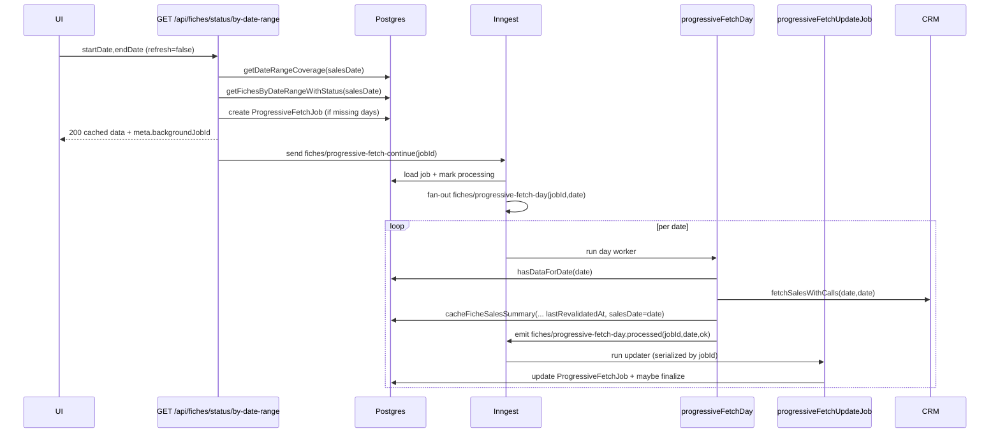

## Cache revalidation (sales list + `refresh=true`)

### Purpose + scope

- **What this covers**: how the backend **revalidates the sales-list cache** for fiches in a date range (and/or a single date), including `refresh=true` behavior, the **per-day workers**, the **job updater/finalizer**, and the operational invariants/SLA expectations.
- **What this does not cover**:
  - Fetching **full fiche details** (those are on-demand via `fiche/fetch` and `GET /api/fiches/:fiche_id` paths).
  - Transcriptions, audits, or automation (they depend on fiche details/recordings but are separate workflows).

### User story

- A user opens the “Fiches” screen for a date range and wants:
  - **Fast response** (show whatever is already cached immediately).
  - **Background completion** (fill missing days), and optionally:
  - **Force a refresh** (`refresh=true`) to refetch from CRM for the entire range (even if already cached).
  - **Progress visibility** via Pusher and/or **webhooks**.

### Entry points

#### HTTP

- **Progressive date-range status**: `GET /api/fiches/status/by-date-range?startDate&endDate&refresh&webhookUrl&webhookSecret`
  - `refresh=true` requires **write access** (`assertFichesWrite(req)`).
  - Always returns cached data immediately; background work is tracked as a `ProgressiveFetchJob`.
  - Implementation: `src/modules/fiches/fiches.routes.ts` → `getFichesByDateRangeProgressive(...)`.
- **Poll for job updates (frontend alternative to webhooks)**: `GET /api/fiches/webhooks/fiches?jobId=...`
  - Defensively derives final status if the finalizer didn’t run.
- **Job inspection**:
  - `GET /api/fiches/jobs/:jobId` (includes last webhook deliveries)
  - `GET /api/fiches/jobs?status=...`

#### Inngest events + functions

- **Progressive fan-out**:
  - Event: `fiches/progressive-fetch-continue` → function `progressiveFetchContinueFunction`
  - Event: `fiches/progressive-fetch-day` → function `progressiveFetchDayFunction`
  - Event: `fiches/progressive-fetch-day.processed` → function `progressiveFetchUpdateJobFunction` (**serialized per job**, finalizes)
- **Range warm-cache / revalidation (single workflow, no job tracking)**:
  - Event: `fiches/cache-sales-list` → function `cacheSalesListFunction`
- **Single-day revalidate (delegates to cache-sales-list)**:
  - Event: `fiches/revalidate-date` → function `revalidateFichesFunction` (invokes `cacheSalesListFunction` for the same day)

See: `src/modules/fiches/fiches.events.ts`, `src/modules/fiches/fiches.workflows.ts`.

### Data model (Prisma)

#### `fiche_cache` (`FicheCache`)

- **Key fields used by this flow**:
  - `salesDate` (string `YYYY-MM-DD`): **source of truth** for date-range coverage and queries
  - `lastRevalidatedAt` (DateTime?): staleness signal used by revalidation policy
  - `rawData` (JSON): may contain `_salesListOnly=true` when only sales-list data is cached
  - `recordingsCount`, `hasRecordings`
- Schema: `prisma/schema.prisma` → `model FicheCache`

#### `recordings` (`Recording`)

- Sales-list caching upserts recordings (URLs, timestamps, transcription flags, etc.).
- This flow **does not delete** recordings; it’s additive.

#### `progressive_fetch_jobs` (`ProgressiveFetchJob`)

- Tracks progressive background work for `GET /status/by-date-range`.
- Key fields:
  - `status`: `pending | processing | complete | failed`
  - `progress`: `0..100`
  - `datesAlreadyFetched`, `datesRemaining`, `datesFailed`
  - `webhookUrl`, `webhookSecret`, webhook tracking fields
- Schema: `prisma/schema.prisma` → `model ProgressiveFetchJob`

#### `webhook_deliveries` + `webhook_delivery_partial_fiches`

- Normalized storage for webhook payloads and retry status.
- Implementation: `src/modules/fiches/fiches.webhooks.ts`

#### Optional: `workflow_logs` (if enabled)

- Cross-workflow log sink, gated by `WORKFLOW_LOG_DB_ENABLED`.
- Created by migration `prisma/migrations/20260205120000_add_workflow_logs/migration.sql`.

---

## What “revalidation” means in this system

### Revalidation target: **sales list + recordings summary**

- The “revalidation” done by:
  - `cacheSalesListFunction` (`fiches/cache-sales-list`), and
  - `progressiveFetchDayFunction` (`fiches/progressive-fetch-day`)
- …fetches the CRM **sales list with calls/recordings** (via `fetchSalesWithCalls`) and updates the DB cache using:
  - `fichesCache.cacheFicheSalesSummary(...)` (sales-list-only envelope + recordings).

### What revalidation does NOT guarantee

- It **does not fetch full fiche details** (normalized tables like `fiche_cache_information`, etc.) unless another workflow does that explicitly.
- It **does not delete** stale items; it only upserts/patches.

### Cache freshness policy (staleness window)

The shared policy helper is:

- `fichesRevalidation.shouldRevalidate(dateString, lastRevalidatedAt)` in `src/modules/fiches/fiches.revalidation.ts`
  - `date_is_today` → always revalidate
  - `never_validated` → revalidate
  - `stale_cache` if \(> 24\) hours since `lastRevalidatedAt`
  - otherwise `cache_fresh`

Note: today, the **progressive** date-range endpoint uses `refresh=true` for explicit revalidation and does **not** call this staleness policy automatically.

---

## Happy paths (step-by-step)

### 1) `refresh=false`: “fill missing days” progressive caching

**Request**: `GET /api/fiches/status/by-date-range?startDate=...&endDate=...`

1. Route validates inputs and optional webhook URL (SSRF guard).
2. Service computes cache coverage using `FicheCache.salesDate`:
   - `getDateRangeCoverage(startDateStr, endDateStr)`
3. Service reads cached data for the whole range (`getFichesByDateRangeWithStatus`) and returns immediately.
4. If any dates are missing, service creates a `ProgressiveFetchJob` with:
   - `datesRemaining = datesMissing`
   - `datesAlreadyFetched = datesWithData`
   - `progress = round(daysFetched / totalDays * 100)`
5. Route triggers `fiches/progressive-fetch-continue` (idempotent id: `progressive-fetch-${jobId}`).
6. Inngest orchestrator fans out per-day work: `fiches/progressive-fetch-day` for each remaining date.
7. Each day worker:
   - checks `hasDataForDate(date)` (salesDate-based)
   - fetches from CRM if missing
   - caches sales summaries + recordings (`cacheFicheSalesSummary(...)`)
   - emits `fiches/progressive-fetch-day.processed`
8. The per-job updater:
   - updates `progressive_fetch_jobs` deterministically
   - emits Pusher progress events
   - optionally sends progress webhooks
   - finalizes the job when `datesRemaining` becomes empty.

Sequence diagram:



### 2) `refresh=true`: forced revalidation for the entire range (background)

**Request**: `GET /api/fiches/status/by-date-range?...&refresh=true`

Key differences vs `refresh=false`:

- **Authorization**: requires `fiches.write` (see `assertFichesWrite(req)`).
- **Dedup bypass**: existing job reuse is skipped when forcing refresh.
- **Remaining dates**: service sets `remainingDates = allDates`, even if cache coverage is complete.
- **Day workers**: per-day worker refetches from CRM even when already cached (because `force_refresh=true`).

In other words, `refresh=true` treats the range as “needs revalidation”, not “needs completion”.

---

## Cached / uncached scenarios (explicit)

- **Scenario A: range fully cached, `refresh=false`**
  - Service returns cached data.
  - `remainingDates = []` → **no job is created** → `meta.complete=true`.

- **Scenario B: range partially cached, `refresh=false`**
  - Service returns cached data.
  - `remainingDates = datesMissing` → job created → background fills missing dates.

- **Scenario C: range not cached at all, `refresh=false`**
  - Service returns an empty list immediately (still non-blocking).
  - `remainingDates = allDates` (because `datesMissing = allDates`) → job created → background warms the entire range.

- **Scenario D: repeated request within 5 minutes, same range, `refresh=false`**
  - Service reuses the most recent `ProgressiveFetchJob` for the same `startDate/endDate` window.
  - API returns cached data + the same `backgroundJobId` for realtime/polling continuity.

- **Scenario E: any cache state, `refresh=true`**
  - Service forces `remainingDates = allDates` and `daysFetched=0`:
    - creates a new job even if coverage is complete
    - bypasses the 5-minute dedup reuse logic
  - Day workers refetch each day from CRM (`force_refresh=true`) and bump `lastRevalidatedAt`.

- **Scenario F: per-range warm-cache (`fiches/cache-sales-list`)**
  - If `salesData` is provided in the event payload, the workflow skips the CRM fetch step and uses the prefetched data.
  - Otherwise it fetches from CRM directly, with 5-day chunk fallback on failures.

---

## Per-day vs per-range revalidation mechanisms

### Per-day revalidation (distributed): `progressiveFetchDayFunction`

- Entry: `fiches/progressive-fetch-day` with `{ jobId, date, force_refresh }`.
- Behavior:
  - If `force_refresh=true`, refetches CRM for that day even if already cached.
  - Writes:
    - `fiche_cache` upserts (sales summary) with `lastRevalidatedAt = now()` and `salesDate = date`
    - `recordings` upserts for that fiche cache
  - Emits: `fiches/progressive-fetch-day.processed` (success or failure)

Why this exists:

- It scales across replicas.
- It isolates failures to a single date.
- It provides job-level progress and finalization.

### Per-range warm-cache: `cacheSalesListFunction`

- Entry: `fiches/cache-sales-list` with `{ startDate, endDate }`.
- Behavior:
  - Fetches sales-with-calls for the range in **one call**, with fallback to **5-day chunking** on errors/timeouts.
  - Caches each fiche’s sales summary + recordings with `lastRevalidatedAt = now()`.
  - No `ProgressiveFetchJob` is created (no job progress model).

When to use it:

- “Warm the cache” admin flows, scheduled warmups, or single-day revalidation via `fiches/revalidate-date`.

### Single date revalidation: `revalidateFichesFunction`

- Entry: `fiches/revalidate-date` with `{ date }`.
- Delegates to `cacheSalesListFunction` with `startDate=endDate=date`.

---

## Deep dive: execution model (Inngest + knobs + tradeoffs)

### Inngest function settings (timeouts, retries, rate limits, concurrency)

Current guardrails (from `src/modules/fiches/fiches.workflows.ts`):

| Function id | Trigger event | Retries | Finish timeout | Rate limit | Concurrency |
|---|---|---:|---:|---|---|
| `revalidate-fiches-for-date` | `fiches/revalidate-date` | 3 | 5m | 20 / 1m | (none) |
| `cache-sales-list-for-date-range` | `fiches/cache-sales-list` | 2 | 10m | 20 / 1m | (none) |
| `progressive-fetch-continue` | `fiches/progressive-fetch-continue` | 2 | 30m | 20 / 1m | `jobId` / 1 |
| `progressive-fetch-day` | `fiches/progressive-fetch-day` | 2 | 10m | 20 / 1m (keyed by `date`) | global limit + `date` / 1 |
| `progressive-fetch-update-job` | `fiches/progressive-fetch-day.processed` | 2 | 30m | (none) | `jobId` / 1 |

Important implications:

- **Per-day “lock”**: date-level concurrency (`key=event.data.date`, `limit=1`) ensures only one replica processes a given day at a time across all jobs.
- **Single writer**: the updater is serialized by `jobId` so job state transitions are deterministic.
- **Route-side dedup**: the API sends `fiches/progressive-fetch-continue` with `id=progressive-fetch-${jobId}` (best-effort idempotency).

### Environment knobs (behavior + cost controls)

These env vars materially change cost/behavior:

- **`FICHE_SALES_INCLUDE_RECORDINGS`** (`"1"` enables): include recordings in `fetchSalesWithCalls`.
- **`FICHE_SALES_CACHE_CONCURRENCY`**: per-run concurrency for caching fiches in `cacheSalesListFunction` and day workers (DB write pressure).
- **`PROGRESSIVE_FETCH_DAY_CONCURRENCY`**: cap how many *distinct* days can run concurrently (still max 1 worker per day due to date key).
- **`PROGRESSIVE_FETCH_WEBHOOK_FREQUENCY`** (default `5`): send a progress webhook every N processed days (and always on completion/failure).
- **`API_BASE_URL`**: used to build `dataUrl` in completion webhooks.

### Correctness: “completion” vs “revalidation”

- **`refresh=false`** is primarily a **coverage completer**:
  - Missing days are fetched/cached in background.
  - Already-cached days are *not* refetched; `lastRevalidatedAt` may remain stale for those days.
- **`refresh=true`** is a **range revalidation**:
  - All days are refetched (even if already cached) and sales-summary rows touched by the refresh will get `lastRevalidatedAt` updated.

### Job updater finalization deep dive (why jobs should reach a terminal state)

The updater (`progressiveFetchUpdateJobFunction`) is designed to be safe under retries/duplicates and to avoid “done but never finalized” states.

Simplified algorithm:

```text
on fiches/progressive-fetch-day.processed(jobId, date, ok):
  job = load(jobId)
  if job missing or already complete/failed: return

  allDates = [job.startDate..job.endDate] inclusive (UTC)
  completedSet = set(job.datesAlreadyFetched)
  failedSet = set(job.datesFailed)

  if ok: completedSet.add(date); failedSet.delete(date)
  else: failedSet.add(date)

  completedDates = allDates ∩ completedSet
  failedDates = allDates ∩ failedSet
  remainingDates = allDates \ completedDates \ failedDates

  processedDays = |completedDates| + |failedDates|
  progress = round(processedDays / |allDates| * 100)

  // Duplicate processed events are usually no-ops…
  // …but if remainingDates is empty and job not finalized, DO NOT early-return.

  update job (status=processing, progress, dates*, totalFiches recomputed)
  emit Pusher progress + maybe webhook progress

  if remainingDates empty:
    finalize job (status=complete|failed, progress=100, completedAt=now)
    emit Pusher terminal + terminal webhook
```

Extra safety net: the polling endpoints compute a **derivedStatus** (`processing`+`progress=100`+`datesRemaining=[]` ⇒ `complete|failed`) even if the finalizer didn’t run.

### Performance & scaling analysis (what gets expensive, when)

- **Per-day progressive mode** (`refresh=false|true`):
  - makes up to **N CRM calls** for an N-day range (one call per day)
  - writes `fiche_cache` + `recordings` rows for each fiche
  - updates the job row once per processed day
  - can be heavy for large ranges, but isolates failures by day and distributes work across replicas
- **Per-range warm-cache** (`fiches/cache-sales-list`):
  - attempts **one CRM call** for the entire range (falls back to chunked 5-day calls)
  - performs the same per-fiche DB upserts, but without `ProgressiveFetchJob` progress/finalization

Guidance:

- Keep `PROGRESSIVE_FETCH_DAY_CONCURRENCY` low enough to respect CRM quotas and avoid DB write spikes.
- Tune `FICHE_SALES_CACHE_CONCURRENCY` based on Postgres capacity; too high increases lock contention and can harm user-facing latency.
- Use `refresh=true` sparingly for large ranges (it forces work for every day, even if coverage is already complete).

### Spec vs implementation note (Swagger drift)

The Swagger description for `/api/fiches/status/by-date-range` still mentions “returns cached data + first missing day immediately”.

The current implementation (`getFichesByDateRangeProgressive`) intentionally **never waits for CRM** and does **no synchronous missing-day fetch**; it returns cached data only and schedules all remaining days in background.

### Security + RBAC nuances (polling vs webhooks)

Be explicit about what is scope-filtered today:

- **HTTP response (`/status/by-date-range`)**: scope-filtered by the route (GROUP/SELF/ALL) before returning `result.fiches`.
- **Polling endpoint (`/api/fiches/webhooks/fiches?jobId=...`)**: loads cached data then scope-filters `partialData` before returning it.
- **Pusher job events (`fiches.progressive_fetch.*`)**: do not include `partialData` (only counts + date arrays), so they are less sensitive.
- **Progress webhooks**: the updater builds webhook `partialData` from an unscoped DB query (`getFichesByDateRange(...)`) and does **not** apply RBAC scope filtering.
  - This is usually OK only if `webhookUrl` is restricted to a trusted internal receiver (enforced via SSRF allowlist), and the receiver applies its own scoping.
  - If `webhookUrl` can be meaningfully controlled by end users, this becomes a potential **scope bypass / data exfil** path and should be fixed (see fix backlog).

---

## SLAs & invariants (operational contract)

### Response-time SLA (API)

- **Invariant**: `GET /api/fiches/status/by-date-range` **never blocks on CRM**.
  - It always returns **cached data immediately** and starts background work when needed.
  - This is true for both `refresh=false` and `refresh=true`.

### Cache coverage invariants

- **Invariant**: date-range coverage is based on `FicheCache.salesDate`, not `createdAt`.
  - `getDateRangeCoverage(...)` and `hasDataForDate(date)` both rely on `salesDate`.
  - Sales-list caching must ensure `salesDate` is set (see `cacheFicheSalesSummary`).

### “Do not destroy full details” invariant

- **Invariant**: sales-list caching is **additive**:
  - If full fiche details already exist, sales-list caching must not overwrite them with `_salesListOnly` data.
  - Implementation: `cacheFicheSalesSummary` preserves `rawData` unless the row is already sales-list-only.

### Idempotency + finalization invariants

- **Event idempotency**:
  - Fan-out per day uses deterministic event ids: `pf-day-${jobId}-${date}`.
  - Day processed signals use deterministic ids (`pf-day-processed-${jobId}-${date}...`).
- **Updater serialization**: job updater concurrency key is `event.data.jobId` (limit 1).
- **Finalization**: updater finalizes when `datesRemaining.length === 0`.
  - If a duplicate processed event arrives and the job is “done but not finalized”, the updater intentionally avoids the noop early-return to still finalize.
- **Defensive derived status**: job polling endpoints derive `complete/failed` if:
  - `status=processing`, `progress=100`, `datesRemaining=[]`.

### Webhook invariants (security + tracking)

- **SSRF guard** is applied:
  - at request time (`validateOutgoingWebhookUrl` in routes), and
  - again at send time (`sendWebhook` in `fiches.webhooks.ts`).
- **Every webhook attempt** is tracked in DB (`webhook_deliveries`, retries included).

---

## Failure modes (what happens today)

### CRM failures (timeouts/5xx)

- **Per-day path**: a day worker failing triggers `onFailure`, which emits `...day.processed` with `ok=false`.
  - The job ends `failed` if any date is in `datesFailed`.
  - Cached data for other dates remains usable.
- **Per-range path**: `cacheSalesListFunction` falls back to 5-day chunking.
  - Some chunks may fail while others succeed; the function continues caching what it can.

### Inngest down / not delivering events

- API still returns cached data and may create a `ProgressiveFetchJob`, but background work won’t progress.
- Polling endpoints will show the job stuck in `processing` (unless something updates it).

### Webhook failures / unsafe URLs

- Unsafe URL: delivery is recorded as `failed` with the validation error; job webhook fields are updated.
- Delivery errors / non-2xx responses: webhook delivery retries up to `maxAttempts` (default 3) with exponential backoff.

### Pusher/realtime failures

- Pusher emissions are best-effort (`.catch(() => null)`); they should not break job finalization.

---

## Observability checkpoints

### Logs to expect

- **API route** (`fiches.routes.ts`):
  - “Triggering background fetch continuation” (jobId, remainingDatesCount, webhookConfigured)
- **Service** (`getFichesByDateRangeProgressive`):
  - “Starting progressive fetch”
  - “Cache coverage analyzed” (cached vs missing)
  - “Background job created for missing dates”
- **Inngest orchestrator** (`progressiveFetchContinueFunction`):
  - “Fanning out progressive fetch day workers”
- **Day worker** (`progressiveFetchDayFunction`):
  - “Force refresh enabled; refetching date from CRM even though cached” (when `refresh=true`)
- **Updater** (`progressiveFetchUpdateJobFunction`):
  - “Day failed for progressive fetch job”
  - “Progressive fetch job updated” (processedDays, remaining)
- **Webhooks** (`fiches.webhooks.ts`):
  - “Webhook delivery created”
  - “Sending webhook” / “Webhook delivered successfully” / “Webhook delivery failed”

### DB rows to inspect (SQL snippets)

- **Find jobs for a range**:

```sql
select id, status, progress, start_date, end_date, completed_days, total_days, completed_at
from progressive_fetch_jobs
where start_date = '2026-02-01' and end_date = '2026-02-06'
order by created_at desc
limit 5;
```

- **Inspect one job**:

```sql
select *
from progressive_fetch_jobs
where id = '<jobId>';
```

- **See cache coverage by day (salesDate)**:

```sql
select sales_date, count(*) as fiches
from fiche_cache
where sales_date between '2026-02-01' and '2026-02-06'
group by sales_date
order by sales_date;
```

- **Check revalidation freshness**:

```sql
select fiche_id, sales_date, last_revalidated_at, recordings_count
from fiche_cache
where sales_date between '2026-02-01' and '2026-02-06'
order by last_revalidated_at asc nulls first
limit 200;
```

- **Webhook delivery status**:

```sql
select id, event, status, status_code, attempt, next_retry_at, created_at
from webhook_deliveries
where job_id = '<jobId>'
order by created_at desc;
```

### Realtime (Pusher) checkpoints

- **Channel**: `private-job-{jobId}`
- **Events**:
  - `fiches.progressive_fetch.created`
  - `fiches.progressive_fetch.progress`
  - `fiches.progressive_fetch.complete`
  - `fiches.progressive_fetch.failed`

See: `docs/FRONTEND_PUSHER_EVENTS.md` and `docs/BACKEND_FRONTEND_CONTRACT.md`.

### Webhook checkpoints

- Payloads + headers are defined in `src/modules/fiches/fiches.webhooks.ts`.
- Deliveries are stored normalized in `webhook_deliveries` and `webhook_delivery_partial_fiches`.

### `workflow_logs` checkpoints (if enabled)

- Enable DB sink with `WORKFLOW_LOG_DB_ENABLED=1` (and instrument with `createWorkflowTracer(...)`).
- Query:

```sql
select *
from workflow_logs
where workflow = 'fiche'
order by created_at desc
limit 200;
```

---

## Fix backlog (independent)

- **Align revalidation policy queries with `salesDate`**
  - Today, `getOldestRevalidationInRange(...)` filters by `createdAt` but date-range flows use `salesDate`.
  - Suggested change: update `getOldestRevalidationInRange` in `src/modules/fiches/fiches.repository.ts` to filter on `salesDate` range (strings), not `createdAt`.
  - Definition of done: staleness decisions reflect the requested CRM date range consistently.

- **Record the error on day failure in the job row**
  - In `progressiveFetchUpdateJobFunction`, `update-job` keeps `job.error` unchanged on failures.
  - Suggested change: set `error` when `ok=false` (e.g., first failure or last failure message) to make “stuck/failed” diagnosis easier while the job is still processing.

- **Reduce DB load from `count-fiches-in-range`**
  - Updater counts fiches in-range on every processed event (can be expensive for large ranges).
  - Suggested change: count less frequently (every N days) or only on finalize.

- **Add an explicit “refresh job” marker**
  - Persist `force_refresh` on the job row so ops/UI can differentiate “completion fill” vs “forced revalidation”.

- **Add workflow tracer instrumentation for fiche revalidation**
  - Add `createWorkflowTracer({ workflow: "fiche", entity: { type: "progressive_fetch_job", id: jobId }, ... })` to:
    - route/service job creation
    - day worker start/end
    - updater updates + finalization
  - Enables DB-backed correlation in `workflow_logs` across replicas.

- **Fix Swagger drift for progressive fetch**
  - Swagger text for `GET /api/fiches/status/by-date-range` still claims “cached + first missing day immediately”.
  - Suggested change: update the route docstring in `src/modules/fiches/fiches.routes.ts` to reflect the real behavior:
    - cached data returned immediately
    - all missing (or all days for `refresh=true`) fetched in background

- **Scope-filter (or remove) `partialData` in progress webhooks**
  - Today, progress webhooks include fiche identifiers + prospect names built from an unscoped DB query in `progressiveFetchUpdateJobFunction`.
  - Suggested change (pick one):
    - **Store requester scope on `ProgressiveFetchJob`** (e.g., `scopeKind`, `groupes`, `crmUserId`) at job creation time, and apply the same filtering logic used by `/api/fiches/webhooks/fiches`.
    - Or: **stop sending `partialData` in webhooks** (send only counts + dates) and rely on the scope-filtered polling endpoint for fiche lists.

- **Decide whether staleness-based revalidation should be wired**
  - The staleness policy exists (`fiches.revalidation.shouldRevalidate`) and `lastRevalidatedAt` is updated by cache writers, but the progressive endpoint does not automatically revalidate stale caches.
  - Suggested change: either:
    - wire a cron/admin trigger that emits `fiches/revalidate-date` / `fiches/cache-sales-list`, or
    - explicitly treat revalidation as **manual-only** (`refresh=true`) and document/deprecate the unused smart-cache path.

- **Add `refresh=true` spam/abuse guardrails**
  - `refresh=true` bypasses 5-minute job reuse and forces work for all days.
  - Suggested change: enforce a minimum interval per `(user, range)` or per `(range)` and/or cap maximum range size for refresh requests.

