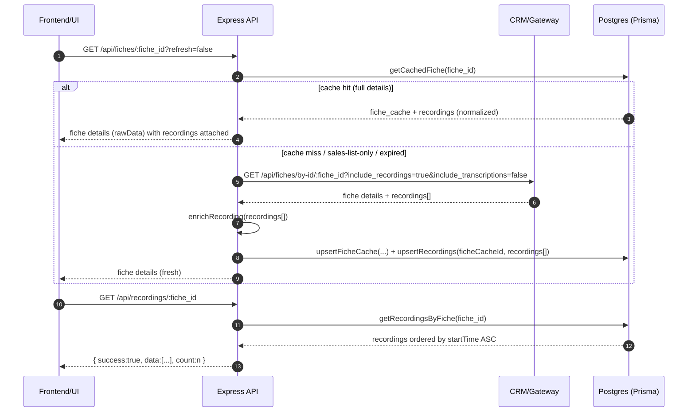
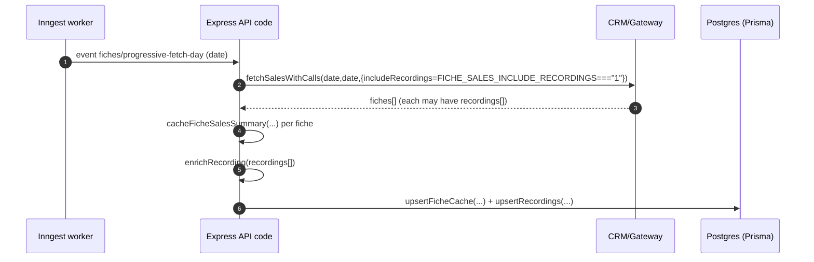
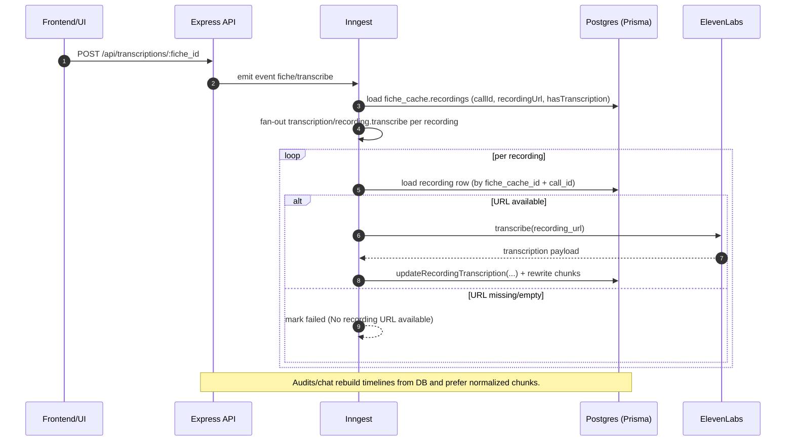

## 04 - Recordings ingest, storage, and access

This doc explains how **call recordings** are fetched from the CRM/gateway, **stored** in Postgres, and **served** to callers. It also covers the non-obvious invariants that make downstream workflows reliable: the **`recordingUrl` empty-string rule**, upsert semantics, and how **normalized transcription chunks** power audits and transcript tools.

Related docs:

- `00-glossary-and-tracing.md` (system-wide map + tracing checklist)
- `../api.md` (route list)
- `../env.md` (env knobs)

---

## Purpose + scope

### What this covers

- Where recordings come from upstream (gateway/CRM) and what the **recording objects** look like
- How recordings are **normalized** into DB rows (`recordings`) and kept stable across refreshes
- The **`recordingUrl` non-null constraint** in DB and how we handle missing URLs safely
- How transcription normalization writes `recording_transcription_chunks` and reduces JSON payload size
- Where downstream workflows (transcriptions, audits, chat) **depend** on recordings + chunks

### What this does not cover

- The full transcription workflow (locks, Redis run-state, retries) beyond what is necessary to understand **recording dependencies**
- The audit orchestration itself (see `docs/flows/06-audits.md` once available)

---

## User story (what the UI/user is doing)

- User opens a fiche (or a date-range list) and expects to see **recordings metadata** quickly.
- User clicks **“transcribe recordings”** and expects progress and completion.
- User runs an **audit** and expects evidence/citations to reference the right recording URL and timestamps.

---

## Entry points

### Upstream (gateway/CRM) fetches that include recordings

The backend talks to the gateway via `src/modules/fiches/fiches.api.ts`.

#### Sales list for a date (optionally includes recordings)

- **Function**: `fetchSalesWithCalls(startDate, endDate, { includeRecordings })`
- **Gateway path**: `GET /api/fiches/search/by-date-with-calls`
- **Key query params**:
  - `date=DD/MM/YYYY` (the CRM/gateway only accepts a single date; ranges are chunked elsewhere)
  - `include_recordings=true|false` (**controlled by** `FICHE_SALES_INCLUDE_RECORDINGS`)
  - `include_transcriptions=false` (we run our own transcription system)

Practical notes:

- `fetchSalesWithCalls` accepts an `includeRecordings` option, but our Inngest workflows typically pass an explicit boolean derived from `FICHE_SALES_INCLUDE_RECORDINGS === "1"`. So unless that env var is enabled, sales-list caching usually **does not** bring recording URLs into the DB.
- The comment in `src/modules/fiches/fiches.api.ts` about “date range requests don’t include recordings” reflects intended behavior; the authoritative behavior is the **caller-provided** `includeRecordings` value.

Used by:

- Progressive fetch per-day workers (`src/modules/fiches/fiches.workflows.ts`, event `fiches/progressive-fetch-day`)
- Sales list caching (`src/modules/fiches/fiches.workflows.ts`, event `fiches/cache-sales-list`)

#### Fiche details (recordings included by default)

- **Function**: `fetchFicheDetails(ficheId, cle?, { includeRecordings, includeMailDevis })`
- **Gateway path**: `GET /api/fiches/by-id/:fiche_id`
- **Key query params**:
  - `include_recordings=true|false` (defaults to true for details)
  - `include_transcriptions=false`
  - `include_mail_devis=true|false` (opt-in; unrelated to recordings but present)

Used by:

- `GET /api/fiches/:fiche_id` and cache refresh logic (`src/modules/fiches/fiches.cache.ts`)
- Inngest `fiche/fetch` prerequisite stage (audits/transcriptions/automation)

### Backend API: recordings access

#### Get all recordings for a fiche

- **Endpoint**: `GET /api/recordings/:fiche_id`
- **Router**: `src/modules/recordings/recordings.routes.ts`
- **Permissions**:
  - Requires `recordings.read`
  - Enforces fiche visibility scope (`SELF | GROUP | ALL`) by reading `fiche_cache` + `fiche_cache_information`
- **Data source**: `getRecordingsByFiche(ficheId)` in `src/modules/recordings/recordings.repository.ts`
- **Ordering**: chronological **oldest → newest** (`orderBy: startTime asc`)

Note: fiche “details” responses also embed a `recordings` array for compatibility, but this doc focuses on the dedicated recordings endpoint and DB storage.

### Permissions & data exposure (important nuance)

Today, recording URLs are exposed through **two** paths:

- `GET /api/recordings/:fiche_id` is guarded by **`recordings.read`**.
- `GET /api/fiches/:fiche_id` is guarded by **`fiches.read`**, and the Swagger description explicitly says it returns fiche details **with recordings**.

If the intent is “recordings are more sensitive than fiche details”, this is a policy mismatch: a user without `recordings.read` can still see `recording_url` via the fiche details route. If this is intentional, document it as such in the RBAC model; otherwise, see fix backlog.

---

## Data model

Canonical definitions live in `prisma/schema.prisma`.

### `recordings` (Prisma `Recording`)

- **Primary key**: `recordings.id` (BigInt)
- **Foreign key**: `recordings.fiche_cache_id` → `fiche_cache.id` (Cascade on delete)
- **Uniqueness invariant**: one row per `(fiche_cache_id, call_id)`
  - Prisma: `@@unique([ficheCacheId, callId])`
- **Key fields**:
  - `call_id` (String): upstream call identifier
  - `recording_url` (String, **non-nullable**): audio URL **or empty string**
  - Parsed metadata (nullable): `recording_date`, `recording_time`, `from_number`, `to_number`, `uuid`
  - Call metadata (nullable): `direction`, `answered`, `start_time`, `duration_seconds`
  - Transcription columns:
    - `has_transcription` (Boolean)
    - `transcription_id` (String?)
    - `transcription_text` (Text?)
    - `transcription_data` (Json?) — **often cleared** once chunks exist
    - `transcription_language_code`, `transcription_language_probability`
    - `transcribed_at` (DateTime?)

### `recording_transcription_chunks` (Prisma `RecordingTranscriptionChunk`)

- **Primary key**: `id` (BigInt)
- **Foreign key**: `recording_id` → `recordings.id` (Cascade on delete)
- **Uniqueness invariant**: stable chunk indexing per recording
  - Prisma: `@@unique([recordingId, chunkIndex])`
- **Key fields**:
  - `chunk_index` (Int, 0-based)
  - `start_timestamp`, `end_timestamp` (Float seconds)
  - `message_count` (Int)
  - `speakers` (String[])
  - `full_text` (Text)

### `fiche_cache` recording hints (Prisma `FicheCache`)

The fiche cache row maintains **summary/hint fields**:

- `fiche_cache.has_recordings` (Prisma `FicheCache.hasRecordings`)
- `fiche_cache.recordings_count` (Prisma `FicheCache.recordingsCount`)

These are set by caching orchestrators (sales summary and full details) and are used by some workflows (notably automation) as a **fast snapshot** without joining the `recordings` table.

Important invariants:

- **Source of truth** for “what recordings exist” is the `recordings` table (Prisma relation `FicheCache.recordings`).
- `has_recordings/recordings_count` are **best-effort hints** and can drift:
  - No-deletion policy can leave extra `recordings` rows even if upstream later removes them.
  - Partial caching (sales list vs details) can set `has_recordings=true` while recording URLs are still blank.
  - A failed upsert batch can leave `recordings_count` inconsistent with the table.

---

## Recording object shapes (upstream and internal)

### Upstream recordings shape (gateway)

Gateway “fiche details” responses often include recordings like:

- `call_id` (string)
- `start_time` (ISO-ish string)
- `duration_seconds` (number)
- `direction` (string)
- `from_number`, `to_number` (string)
- `answered` (boolean)
- `recording_url` (string, may be missing in some sales-list contexts)

Example fixture: `config/api-response-recordings.json` (see `.recordings[]`).

Real-world inconsistencies to expect (and why enrichment exists):

- `recording_url` may include **query strings** (signed URLs). The parser strips query/fragment only for **filename matching**, but the full URL is still persisted/used for fetching.
- Filename shapes are not fully uniform (some URLs don’t match the `{uuid}-DD-MM-YY-HHhMM-from-to.mp3` pattern). In those cases we fall back to the provided `start_time/from_number/to_number` fields.
- `start_time` can arrive without timezone; parsing then becomes environment-dependent (see Failure modes).
- Upstream can sometimes provide contradictory timestamps (URL filename vs `start_time`). Today we store:
  - `recordings.start_time` from upstream `start_time`
  - `recordings.recording_date/time` from parsed/enriched metadata

### Enrichment: `enrichRecording`

Before persisting, recordings are enriched in `src/utils/recording-parser.ts`:

- Normalizes naming to snake_case output (`recording_url`, `call_id`)
- Attempts to parse recording URL filename pattern into:
  - date/time/uuid/from/to (best case)
- Falls back to `start_time/from_number/to_number/uuid` fields when URL is not parseable

The enriched object includes:

- `parsed: { date, time, timestamp, from_number, to_number, ... } | null`

This `parsed` blob is the main source for DB `recordingDate/recordingTime/fromNumber/toNumber/uuid`.

---

## Happy paths (end-to-end)

### Path A: Fiche details fetch → store recordings → serve `/api/recordings`



### Path B: Progressive fetch day → optionally store recordings from sales list



If `FICHE_SALES_INCLUDE_RECORDINGS` is not enabled, sales-list caching still persists the fiche summary but may not create/refresh recording rows until full details are fetched.

### Path C: Transcription → chunk normalization → audit timeline dependencies



---

## The `recordingUrl` rule (non-null DB + empty string semantics)

### Why it exists

`Recording.recordingUrl` is **non-nullable** in Postgres (`recording_url String` in Prisma), but upstream **sales list** endpoints may omit recording URLs (or return blanks) even when a call exists.

We want to:

- Persist a stable `(fiche_cache_id, call_id)` row early (so later updates land on the same row)
- Avoid breaking downstream workflows by accidentally wiping a good URL

### The rule (implemented in `upsertRecordings`)

In `src/modules/fiches/fiches.repository.ts`:

- **On create**: store `recordingUrl = recording_url.trim()` or `""`
- **On update**: only set `recordingUrl` when the upstream provides a **non-empty** URL
  - “Never overwrite a non-empty URL with an empty string”

Downstream dependency highlights:

- **Transcription worker** requires a non-empty URL (otherwise it fails that recording).
- **Audit timeline rebuild** skips recordings with falsy `recordingUrl` (prevents citations pointing to nowhere).

### Subtlety: “non-empty URL” is necessary but not sufficient

- A URL can be **present** (non-empty) but still **non-functional** (expired signed URL, 403, CDN outage).
- The DB invariant we enforce is “never wipe a good URL with empty”, not “URL is valid and fetchable”.

This matters because downstream systems often treat `recordingUrl != ""` as “transcribable”, but real-world failures (403/404) need their own observability and (ideally) a first-class status (see fix backlog).

---

## Upsert semantics (what gets written where)

### Where upserts happen

Recordings are persisted from two caching paths:

- `cacheFicheDetails(...)` in `src/modules/fiches/fiches.cache.ts`
- `cacheFicheSalesSummary(...)` in `src/modules/fiches/fiches.cache.ts`

Both call:

- `upsertRecordings(ficheCacheId, recordings[])` in `src/modules/fiches/fiches.repository.ts`

### Concurrency + idempotency

- Upserts are run per recording with a **module-scoped** concurrency limiter to avoid Prisma pool exhaustion (`P2024`).
- The limit defaults to 3 and is configurable with:
  - `FICHE_RECORDINGS_UPSERT_CONCURRENCY`

Idempotency is provided by the unique key:

- `(fiche_cache_id, call_id)`

### No-deletion policy

There is **no automatic deletion** of `recordings` when upstream changes its list.

Implications:

- DB can accumulate recordings over time (even if the gateway later hides/removes them).
- “Counts” on `fiche_cache` (e.g. `recordingsCount`) should be treated as **hints**, while the authoritative set is the `recordings` table.
- Drift detection requires explicit reconciliation (see fix backlog).

### Write-time vs read-time shape (why recordings “disappear” from `raw_data`)

To keep `fiche_cache.raw_data` small:

- On **write** (`cacheFicheDetails` in `src/modules/fiches/fiches.cache.ts`), recordings are stripped out of the JSON blob and persisted into the `recordings` table.
- On **read** (`getCachedFiche` in `src/modules/fiches/fiches.repository.ts`), recordings are re-attached to `raw_data.recordings` for backward compatibility, mapped back into the legacy API shape (snake_case).

This has two important consequences:

- If you inspect `fiche_cache.raw_data` directly in SQL, you may see `{}` even though `recordings` exist (because they are stored in a separate table and only re-attached at read time).
- Workflows that try to “derive recordings” from `raw_data.recordings` are inherently fragile; prefer joining `recordings` or using `fiche_cache.recordings_count/has_recordings` only as hints.

---

## Cache validity & self-heal behaviors (recordings-specific)

The Inngest `fiche/fetch` workflow (`src/modules/fiches/fiches.workflows.ts`) treats the cache as “invalid” and forces an upstream refetch not only when the cache is expired or sales-list-only, but also for **recordings integrity** issues.

Specifically, after loading a cached fiche row (including its `recordings` relation), it computes:

- `wantsRecordings = hasRecordings || recordingsCount > 0 || recordings.length > 0`
- `missingRecordingRows = wantsRecordings && recordings.length === 0`
- `blankUrls = wantsRecordings && recordings.some(r => r.recordingUrl.trim() === "")`

If any of these are true, the workflow refetches full details and re-upserts recordings.

This is an important reliability guardrail because sales-list caching can upsert recordings with **empty URLs**, and the system tries to “heal” that state automatically before downstream workflows depend on it.

---

## Transcription chunk normalization (recording_transcription_chunks)

### Write path

Chunks are written when transcription completes:

- Worker calls `updateRecordingTranscription(...)` in `src/modules/recordings/recordings.repository.ts`
- That function:
  - Derives `words[]` from `transcriptionData.words` (preferred) or synthesizes words from `transcriptionText`
  - Builds chunks via `buildConversationChunksFromWords(words)`
  - **Rewrites** chunks for that recording:
    - `deleteMany(recording_transcription_chunks where recording_id=...)`
    - `createMany(chunks, skipDuplicates: true)`
  - Updates `recordings` columns (`hasTranscription`, `transcribedAt`, language fields)
  - Optionally clears `transcriptionData` (stores `DbNull`) once chunks exist to reduce DB size

Backfill script for legacy rows:

- `scripts/backfill-transcription-chunks.ts` (same logic at rest)

### Read path (audits/chat)

To rebuild a timeline from DB efficiently, audits call:

- `getRecordingsWithTranscriptionChunksByFiche(ficheId)` (selects chunks first, avoids loading huge JSON)

In `src/modules/audits/audits.workflows.ts` (`rebuildTimelineFromDatabase`):

- Prefer normalized `transcriptionChunks` (stable indices; low memory)
- If a recording has `hasTranscription=true` but `transcriptionChunks=[]`, fall back to:
  - `transcriptionData.words` (if present) or `transcriptionText` → synthetic words → chunks
- **Skip** any recording without a non-empty `recordingUrl`

This is the critical dependency chain for:

- `searchTranscript` / `getTranscriptChunks` tools (`src/modules/audits/audits.transcript-tools.ts`)
- Evidence/citation gating that needs stable chunk references + URLs

---

## Ordering & index stability (critical for tooling + evidence)

### Ordering differences across endpoints/workflows

Recordings are not always returned in the same order depending on which path you hit:

- `GET /api/recordings/:fiche_id` returns recordings ordered **oldest → newest** (`startTime ASC`).
- `GET /api/fiches/:fiche_id` (cache path) attaches `raw_data.recordings` ordered **newest → oldest** because `getCachedFiche` loads `recordings` with `startTime DESC`.
- Transcription planning and audit timeline rebuilds generally use **oldest → newest** ordering.

If a UI feature relies on “recording #1 / recording #2”, it must specify which ordering it means.

### What “recording_index” means (and why it’s not a stable ID)

Transcript tools and evidence citations use `(recording_index, chunk_index)` coordinates.

In `rebuildTimelineFromDatabase`, `recording_index` is assigned sequentially while iterating DB recordings, **after filtering**:

- keep only `hasTranscription=true`
- keep only non-empty `recordingUrl`

So:

- indices are **dense** among included recordings, not among *all* recordings
- indices can change if:
  - a previously-missing URL becomes available
  - a new recording becomes transcribed
  - ordering changes due to `startTime` parsing issues

For stable identity across time, use `(fiche_id, call_id)` (unique by design).

### Chunk rewrite semantics and citation persistence

- Chunks are rewritten as `deleteMany + createMany` per recording when a transcription is stored, so **chunk row ids are not stable**.
- The stable coordinate is the **integer** `chunk_index` for a given recording’s current transcript.
- Audit citations persisted to DB store:
  - `recording_index`, `chunk_index`
  - and also `recording_url`, `recording_date`, `recording_time` (string metadata for UI)
  - but **do not store `call_id`** today

This is good enough for display, but it makes “link citation → exact `recordings` row” harder than necessary. Consider persisting `call_id` (or `recording_id`) alongside citations (see fix backlog).

---

## Cached / uncached scenarios (explicit)

### 1) Fiche cached (full details) + recordings already stored

- `GET /api/recordings/:fiche_id` reads from DB immediately.
- `GET /api/fiches/:fiche_id` returns rawData with recordings attached (compatibility), but only includes `transcription.conversation` (not full JSON).

### 2) Fiche cached from sales list only, with recordings disabled

- `FICHE_SALES_INCLUDE_RECORDINGS !== "1"` means sales-list caching may not persist recordings.
- Transcription status may show `total=0` until fiche details are fetched (because status uses DB recordings).
- Later `fetchFicheDetails(...include_recordings=true)` will populate recordings and enable transcriptions/audits.

### 3) Upstream returns recordings but omits `recording_url`

- Row is created with `recordingUrl=""` (DB constraint satisfied).
- Later updates (from fiche details) can fill URL **without losing the row identity**.
- Downstream:
  - Transcription worker fails that recording unless a URL is later filled.
  - Audit timeline rebuild skips it (so it won’t appear in evidence search).

### 4) Upstream URL parse fails (unexpected filename)

- `enrichRecording` sets `parsed=null` unless it can fall back to `start_time/from/to`.
- DB still stores the URL (if present) and any provided call metadata.
- Timeline and UI may have missing `recordingDate/recordingTime` until better metadata is available.

### 5) Upstream changes/removes recordings over time

- DB keeps old rows (no deletion).
- If you need “exactly matches upstream today”, you must add reconciliation logic (see fix backlog).

---

## Failure modes (and current behavior)

### Upstream/gateway failures

- **Timeouts/5xx** when calling gateway endpoints:
  - Caching is generally best-effort; callers may still receive data if cache exists.
  - Recordings won’t update until the next successful fetch.

### Missing/empty recording URLs

- **Transcription**:
  - Worker returns failure for that call: `"No recording URL available"`
  - Fiche-level completion may show low `completed/total` because some recordings can never be transcribed without URLs.
- **Audits**:
  - Timeline rebuild explicitly skips recordings with empty URL, reducing available evidence/citations.

### Timestamp parsing / timezone ambiguity (ordering bugs)

`recordings.start_time` is currently derived from `new Date(start_time_string)` on upsert. If upstream sends ISO strings **without an explicit timezone**, JavaScript parses them as **local time**, which can change ordering depending on server timezone.

Symptoms:

- recordings appear “out of order” between environments
- `recording_index` shifts, causing citations/tool references to point to the wrong place in a rebuilt timeline

Mitigation ideas are in the fix backlog (derive start time from parsed URL timestamp when available; force UTC parsing for timezone-less strings).

### Hint drift (`fiche_cache.recordings_count`) vs real rows

Automation (and some polling code) uses `fiche_cache.recordings_count/has_recordings` as a snapshot. If those drift from the `recordings` table, the system can:

- incorrectly ignore fiches as “no recordings”
- or skip the “too many recordings” guardrail when it should apply

The authoritative count is `count(recordings where fiche_cache_id=...)`.

### DB pressure / concurrency

- High fan-out caching can exhaust Prisma connection pool.
  - Mitigation: `FICHE_RECORDINGS_UPSERT_CONCURRENCY` bounds concurrent upserts per process.

### Redis down (indirect impact)

- Recordings fetch/store does not require Redis.
- Transcription finalization and “wait for completion” behavior may fall back to polling (or be less robust) without Redis; recordings status remains DB-based.

---

## Deep-dive debugging recipes (recordings ↔ transcription ↔ audits)

### Recipe 1: “Transcription pending never reaches 0”

This almost always reduces to **recordings rows that can’t be transcribed**, most commonly because `recordingUrl=""`.

- **Step 1 (status)**: `GET /api/transcriptions/:fiche_id/status`
  - If `total > 0` and `pending` stays high, proceed.
- **Step 2 (confirm missing URLs)**: run the “Total recordings + missing URLs” SQL below.
  - If `missing_url > 0`, those calls are currently **untranscribable** until URLs are filled.
- **Step 3 (attempt remediation)**:
  - Force-refresh full fiche details (this is the path most likely to fill URLs):
    - `GET /api/fiches/:fiche_id?refresh=true`
  - Then re-queue transcription:
    - `POST /api/transcriptions/:fiche_id`
- **Step 4 (correlate async work)**:
  - The transcription queue response includes an Inngest `event_id` (format: `transcribe-${fiche_id}-${Date.now()}`).
  - Use that `event_id` to find the run in the Inngest UI; the per-recording events include the transcription `run_id`.

If the gateway never provides URLs for some calls, you’ll need product/design decisions:

- treat those recordings as **terminal “URL missing”** (don’t count them as “pending”), or
- add a gateway-side endpoint to retrieve signed/authorized URLs on demand.

### Recipe 2: “Audit has few/no citations even though transcription is complete”

Audits rebuild evidence from DB and require:

- `hasTranscription=true`
- **non-empty** `recordingUrl`
- available chunks (`recording_transcription_chunks`) or a fallback source (`transcriptionText`/`transcriptionData`)

Start with:

- chunk coverage query (“Chunk coverage” SQL below)
- missing URL query (“Total recordings + missing URLs” SQL below)

If chunks are missing for recordings marked `hasTranscription=true`, you likely have incomplete backfill/normalization or a failure in the transcription write path.

---

## Observability checkpoints

### Logs you should see

- **Gateway fetch**:
  - `fetchSalesWithCalls`: logs `include_recordings` and counts
  - `fetchFicheDetails`: logs `recordings_count`
- **Cache self-heal** (Inngest `fiche/fetch`):
  - cache-check reasons like `recordings_missing_rows` / `recordings_missing_url`
  - flags like `blankUrls` and `missingRecordingRows`
- **Enrichment** (`enrichRecording`):
  - `debug`: “processing recording”, `final_url`
  - `warn`: “failed to parse URL” when both URL parsing and metadata fallback fail
- **DB persist**:
  - `upsertRecordings`: “Storing recordings”, “Recordings stored”
- **Transcription plan**:
  - logs `missing_url_total`, `missing_url_to_transcribe`
- **Audit timeline rebuild** (symptom-based):
  - missing evidence often correlates with recordings skipped due to missing URL or missing chunks

### DB rows to verify (SQL snippets)

#### Total recordings + missing URLs

```sql
select
  count(*) as total,
  count(*) filter (where recording_url is null or trim(recording_url) = '') as missing_url,
  count(*) filter (where has_transcription) as transcribed
from recordings r
join fiche_cache fc on fc.id = r.fiche_cache_id
where fc.fiche_id = '<FICHE_ID>';
```

#### Chunk coverage (normalized transcript availability)

```sql
select
  r.call_id,
  r.has_transcription,
  count(c.*) as chunk_count
from recordings r
join fiche_cache fc on fc.id = r.fiche_cache_id
left join recording_transcription_chunks c on c.recording_id = r.id
where fc.fiche_id = '<FICHE_ID>'
group by r.call_id, r.has_transcription
order by r.call_id asc;
```

#### “Why does transcription status show 0?”

Status is DB-based. Confirm recording rows exist:

```sql
select r.call_id, r.recording_url, r.has_transcription, r.transcribed_at
from recordings r
join fiche_cache fc on fc.id = r.fiche_cache_id
where fc.fiche_id = '<FICHE_ID>'
order by r.start_time asc nulls last;
```

### Realtime / webhook signals

Transcription webhooks (see `src/shared/webhook.ts`) emit:

- `transcription.started`
- `transcription.recording_started` (includes `recording_url`)
- `transcription.recording_completed`
- `transcription.recording_failed` (often `"No recording URL available"`)
- `transcription.progress`

Treat these as **progress hints**; DB and REST endpoints are authoritative.

### Workflow logs (`workflow_logs`) correlation

Workflow log endpoints exist, but you’ll only see rows if the workflow is instrumented to write DB workflow logs.

- When enabled/instrumented (`WORKFLOW_LOG_DB_ENABLED=1`), transcription logs are queryable via:
  - REST: `GET /api/transcriptions/:fiche_id/logs?trace_id=<run_id>&level=debug`
    - note: the route also accepts `run_id=<run_id>` (alias) and supports `since/until/limit/offset`
  - SQL (below)

```sql
select created_at, level, function_id, step_name, message, data
from workflow_logs
where workflow = 'transcription'
  and entity_type = 'fiche'
  and entity_id = '<FICHE_ID>'
order by created_at asc
limit 500;
```

---

## Debugging playbook (symptom → likely cause → checks)

### Symptom: Transcription status shows `total=0`

Likely cause: the fiche exists, but recordings were never persisted (sales-list-only cache without recordings + fiche details never fetched).

Checks:

- `GET /api/fiches/:fiche_id?refresh=true` (forces a details fetch which should upsert recordings)
- DB:

```sql
select fc.fiche_id, fc.has_recordings, fc.recordings_count, count(r.*) as recordings_rows
from fiche_cache fc
left join recordings r on r.fiche_cache_id = fc.id
where fc.fiche_id = '<FICHE_ID>'
group by fc.fiche_id, fc.has_recordings, fc.recordings_count;
```

### Symptom: Transcription is “stuck” (pending never reaches 0)

Likely causes:

- recording rows exist but some have `recording_url=''` (cannot transcribe)
- recording URLs exist but are **expired/forbidden** (provider fetch fails)

Checks:

```sql
select r.call_id, r.recording_url, r.has_transcription
from recordings r
join fiche_cache fc on fc.id = r.fiche_cache_id
where fc.fiche_id = '<FICHE_ID>'
  and (trim(r.recording_url) = '' or r.recording_url is null)
order by r.call_id asc;
```

Then check workflow logs for `missing_url_to_transcribe` and per-recording failures (`transcription.recording_failed`).

### Symptom: Automation ignored “No recordings”, but you can see recordings in DB

Likely cause: automation’s polling snapshot used `fiche_cache.recordings_count/has_recordings` (or legacy `raw_data.recordings`) and those hints drifted from the `recordings` table.

Checks:

- Compare snapshot vs actual table count (query above)
- If `onlyWithRecordings=true`, verify the snapshot fields are correct after full details fetch completes.

### Symptom: Audits have few/no citations (or citations don’t “match” transcript)

Likely causes:

- timeline rebuild skipped recordings (missing URL or missing transcription)
- chunks were never normalized for those recordings
- evidence gating removed citations because quoted text didn’t appear in referenced chunk

Checks:

```sql
select
  count(*) as recordings_total,
  count(*) filter (where has_transcription) as recordings_transcribed,
  count(*) filter (where trim(recording_url) <> '') as recordings_with_url
from recordings r
join fiche_cache fc on fc.id = r.fiche_cache_id
where fc.fiche_id = '<FICHE_ID>';
```

And chunk coverage:

```sql
select
  r.call_id,
  r.has_transcription,
  count(c.*) as chunk_count
from recordings r
join fiche_cache fc on fc.id = r.fiche_cache_id
left join recording_transcription_chunks c on c.recording_id = r.id
where fc.fiche_id = '<FICHE_ID>'
group by r.call_id, r.has_transcription
order by r.call_id asc;
```

### Symptom: Recordings appear in “wrong order” (especially across envs)

Likely cause: `start_time` parsing is timezone-sensitive when upstream omits a timezone.

Checks:

```sql
select r.call_id, r.start_time, r.recording_date, r.recording_time
from recordings r
join fiche_cache fc on fc.id = r.fiche_cache_id
where fc.fiche_id = '<FICHE_ID>'
order by r.start_time asc nulls last;
```

If `recording_date/time` looks correct but `start_time` ordering is suspicious, consider deriving `start_time` from parsed URL timestamp (fix backlog).

---

## Status computation dependencies (what relies on recordings)

### Transcription status (`GET /api/transcriptions/:fiche_id/status`)

- Implemented in `src/modules/transcriptions/transcriptions.service.ts`
- Computes:
  - `total` = number of `recordings` rows for the fiche
  - `transcribed` = count where `hasTranscription=true`
  - `pending = total - transcribed`

So:

- If recordings were never persisted (no sales-list recordings + no fiche details fetch), status will report `total=0`.
- Missing URLs do **not** reduce `total`; they can keep `pending` high until URLs are filled.

### Audit timeline building (tools mode + evidence)

Audits rebuild timeline from DB and:

- Requires `hasTranscription=true`
- Requires **non-empty** `recordingUrl`
- Prefers `recording_transcription_chunks` (normalized) for stable indices and memory safety

If URLs are missing or chunks are missing, evidence discovery and citations degrade.

### Automation selection gates (recordings-aware scheduling)

Automation runs (`src/modules/automation/automation.workflows.ts`) treat recordings as a key signal:

- `onlyWithRecordings=true` drops fiches that end up with 0 recordings **after** full details are fetched.
- `maxRecordingsPerFiche` (or `AUTOMATION_MAX_RECORDINGS_PER_FICHE`) can ignore fiches with huge recording counts to protect fan-out and provider quotas.

Important nuance: the automation “snapshot poll” reads `fiche_cache.recordings_count/has_recordings` and may fall back to legacy `raw_data.recordings.length`. It does **not** count the `recordings` relation directly in that poll loop (performance choice). If you see misclassification, compare snapshot fields vs `recordings` table count.

---

## Fix backlog (independent)

### Guardrails for missing/empty URLs

- **Persist a first-class “URL missing” state**:
  - Add `recording_url_status` (`OK | MISSING | FORBIDDEN | EXPIRED`) or similar
  - Update transcription planning to exclude `MISSING` rows from “pending” totals (or report separately)
- **Fail fast earlier**:
  - In `fiche/transcribe` plan builder: filter `toTranscribe` to only those with usable URLs and report counts clearly
- **Add a targeted “refresh recordings URLs” action**:
  - E.g. force `fetchFicheDetails(include_recordings=true)` and re-upsert before transcribing

### Tighten URL trust / SSRF posture for transcription fetches

- The transcription worker downloads audio from `recording_url`. If the upstream source is ever compromised or user-influenced, this is an SSRF vector.
- Add allowlist validation (scheme + host) for `recording_url` before calling ElevenLabs/downloading audio, similar to how outgoing webhooks are SSRF-guarded.

### Detect and remediate “recordings list drift”

- Add a reconciliation job to compare upstream call IDs vs DB:
  - Mark stale rows (soft flag) instead of deleting (preserves audit evidence history)
  - Surface drift metrics/logs per fiche

### Performance/shape improvements for `/api/recordings/:fiche_id`

- Avoid returning huge `transcriptionData` JSON by default:
  - Switch to a `select` list in `getRecordingsByFiche` or add a query param `include_transcription_data=1`
- Consider consistent ordering (asc vs desc) across endpoints or document it explicitly.

### Make citations linkable to stable recording identity

- Persist `call_id` (or `recording_id`) alongside `recording_index/chunk_index` in citations tables.
- This makes it possible to resolve “citation → exact DB recording row” even if ordering or filtering changes.

### Resolve the RBAC exposure mismatch (recordings in fiche details)

- If `recordings.read` is intended to gate `recording_url`, update `GET /api/fiches/:fiche_id` to omit recordings unless the user has that permission.
- If it’s intentional that fiche readers can see recordings, remove the separate permission or clarify it in docs (avoid a false sense of security).

### Normalize/derive `start_time` safely

- Prefer parsed URL timestamp (when available) as the canonical `recordings.start_time`, or enforce UTC parsing for timezone-less ISO strings.
- Add a migration/backfill to fix existing rows with suspicious local-time parsing if it becomes an issue.

### Tests / definition of done

- Unit/integration tests for `upsertRecordings`:
  - Create with missing URL → `recordingUrl=""`
  - Update with empty URL → does **not** overwrite a non-empty URL
- Regression test: a fiche with recordings from sales list missing URLs becomes transcribable after details refresh fills URLs.
