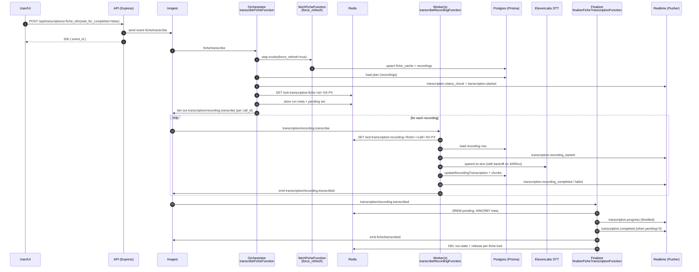

## 05 - Manual transcription (user clicks “transcribe recordings”)

This doc explains how **manual transcription** is queued and executed across replicas:
HTTP → Inngest orchestrator → per-recording workers → distributed finalizer.

Related docs:

- `00-glossary-and-tracing.md` (system-wide map + tracing checklist)
- `04-recordings-ingest-and-access.md` (recording invariants: `recordingUrl` empty-string rule, upserts)
- `../env.md` (env knobs, including transcription + redis + pusher)
- `../FRONTEND_PUSHER_EVENTS.md` (frontend realtime contract)

---

## Purpose + scope

### What this covers

This document explains the **manual transcription** flow end-to-end:

- REST API request → Inngest orchestrator → per-recording workers → distributed finalizer
- Cross-replica **locks** and **Redis run-state**
- Provider throttling (**retries/backoff**) and completion signals
- The main reasons transcription runs can **appear “stuck”** and how to debug them

### What this does not cover

- Audit flow (see `docs/flows/06-audits.md` when available)
- Automation schedules (they reuse the same `fiche/transcribe` event, but are documented separately)

### Critical note (manual endpoints are enqueue-only)

The manual HTTP endpoints intentionally enqueue work with `wait_for_completion=false`:

- You get a fast 200 response (event queued).
- Completion is signaled later via **realtime events** and/or by polling `GET /api/transcriptions/:fiche_id/status`.

The *same* `fiche/transcribe` event supports `wait_for_completion=true` for workflows that must block (eg. audits).

## User story

A user opens a fiche in the UI and clicks **“Transcribe recordings”**. They expect:

- The request to return quickly (async)
- Progress updates while recordings are being transcribed
- A terminal “completed” signal (even if some recordings failed)

## Entry points

### REST API

- **Queue (single fiche)**: `POST /api/transcriptions/:fiche_id?priority=high|normal|low`
  - AuthZ: `requirePermission("transcriptions.write")` + fiche visibility scope check
  - Enqueues Inngest event `fiche/transcribe` with `wait_for_completion=false`
  - Returns: `{ success, fiche_id, event_id }`
  - Note: route only matches numeric fiche ids (`/:fiche_id(\\d+)`)
- **Queue (batch)**: `POST /api/transcriptions/batch`
  - Body: `{ fiche_ids: string[], priority?: "high"|"normal"|"low" }`
  - AuthZ: `requirePermission("transcriptions.write")` + scope check for *all* fiche IDs
  - Enqueues one `fiche/transcribe` per fiche
  - Uses deterministic event IDs: `transcribe-${fiche_id}-${YYYY-MM-DD}` (dedup within the day)
    - Implication: re-submitting the batch for the same fiche on the same day can be a no-op (Inngest may dedup the event)
- **Poll status**: `GET /api/transcriptions/:fiche_id/status`
  - AuthZ: `requirePermission("transcriptions.read")` + fiche visibility scope check
  - Reads DB (`recordings.has_transcription`) and returns `{ total, transcribed, pending, percentage, recordings[] }`
- **Fetch workflow logs (DB)**: `GET /api/transcriptions/:fiche_id/logs?run_id=&level=&since=&until=&limit=&offset=`
  - Reads from `workflow_logs` table (see “Observability”)
  - Note: transcription workflow is **not yet instrumented** with the workflow tracer, so this can be empty today
- **Fetch one recording transcription**: `GET /api/transcriptions/:fiche_id/recordings/:call_id`
  - Reads from DB `recordings.transcriptionData` (if present) or falls back to `recordings.transcriptionText`

### Inngest events + owning functions

- **Orchestrator trigger**: `fiche/transcribe`
  - Function: `transcribeFicheFunction` (`id: "transcribe-fiche"`)
- **Fan-out (per recording)**: `transcription/recording.transcribe`
  - Function: `transcribeRecordingFunction` (`id: "transcribe-recording"`)
- **Worker completion signal**: `transcription/recording.transcribed`
  - Emitted by the worker (always, even for cached/skip)
  - Consumed by the finalizer
- **Terminal internal completion**: `fiche/transcribed`
  - Emitted by the orchestrator (DB-poll fallback) *or* by the finalizer (Redis mode)
  - Downstream workflows (eg. audits) can `waitForEvent` on this

## Configuration knobs (env)

The transcription workflow’s behavior is primarily controlled by these environment variables (non-exhaustive).

### Orchestrator (`transcribeFicheFunction`, event `fiche/transcribe`)

| Env var | Default | What it changes |
| --- | --- | --- |
| `ELEVENLABS_API_KEY` | _(required)_ | Missing/empty → **NonRetriableError** (workflow fails fast). |
| `INNGEST_SERVER_REPLICAS` / `SERVER_REPLICAS` | `1` | Used to compute global concurrency defaults (see below). |
| `INNGEST_PARALLELISM_PER_SERVER` | `10` | Used to compute global concurrency defaults (see below). |
| `TRANSCRIPTION_FICHE_CONCURRENCY` | `replicas * per_server` | Max concurrent *fiche* orchestrations. |
| `TRANSCRIPTION_MAX_WAIT_SECONDS` | `900` (min `30`) | Max time the orchestrator will wait for completion when `wait_for_completion=true` (and also influences per-fiche lock TTL). |
| `TRANSCRIPTION_LOCK_TTL_MS` | `max(30m, max_wait + 10m)` | TTL of the per-fiche lock `lock:transcription:fiche:<fiche_id>`. |
| `TRANSCRIPTION_RUN_STATE_TTL_SECONDS` | `7200` | TTL for Redis run-state keys (meta/pending/failed/activeRun). |
| `TRANSCRIPTION_POLL_INTERVAL_SECONDS` | `5` | DB polling interval in the **non-Redis fallback** path (when `wait_for_completion=true` but Redis run-state is unavailable). |

Notes:

- The orchestrator also has an Inngest-level **rate limit** (`RATE_LIMITS.TRANSCRIPTION`, default 50/min) keyed by `fiche_id`. This typically doesn’t dominate throughput; the per-recording provider cap does.

### Per-recording worker (`transcribeRecordingFunction`, event `transcription/recording.transcribe`)

| Env var | Default | What it changes |
| --- | --- | --- |
| `TRANSCRIPTION_RECORDING_WORKER_CONCURRENCY` | `replicas * per_server` | Global worker concurrency cap. |
| `TRANSCRIPTION_RECORDING_PER_FICHE_CONCURRENCY` | `per_server` | Per-fiche worker concurrency cap (prevents one fiche from monopolizing workers). |
| `TRANSCRIPTION_ELEVENLABS_RATE_LIMIT_PER_MINUTE` | `10` | Global provider call cap (prevents 429). This is a major throughput limiter. |
| `TRANSCRIPTION_ELEVENLABS_MAX_ATTEMPTS` | `6` | Max attempts per recording inside the worker loop (not Inngest retries). |
| `TRANSCRIPTION_ELEVENLABS_BACKOFF_BASE_SECONDS` | `2` | Backoff base for retryable provider errors (429/408/5xx). |
| `TRANSCRIPTION_ELEVENLABS_BACKOFF_MAX_SECONDS` | `60` | Backoff max. |

### Finalizer (`finalizeFicheTranscriptionFunction`, event `transcription/recording.transcribed`)

| Env var | Default | What it changes |
| --- | --- | --- |
| `TRANSCRIPTION_FINALIZER_CONCURRENCY` | `replicas * per_server` | Global finalizer concurrency cap (finalizer is cheap; mainly protects Redis). |
| `TRANSCRIPTION_PROGRESS_WEBHOOK_FREQUENCY` | `3` | Emit `transcription.progress` every N processed recordings (and at end). |

### Observability toggles

| Env var | Default | What it changes |
| --- | --- | --- |
| `WORKFLOW_LOG_DB_ENABLED` | `false` | Enables DB persistence for the workflow tracer (`workflow_logs`), but transcription needs tracer instrumentation to populate it. |
| `TRANSCRIPTION_DEBUG_LOG_TO_FILE` | `false` | Enables file logging via `createWorkflowTracer` (same caveat as above). |
| `PUSHER_*` / `PUSHER_USE_PRIVATE_CHANNELS` | varies | Realtime delivery. If Pusher is not configured, the workflow still runs but the UI will not see `transcription.*` events. |

## Data model

### Postgres (Prisma models/tables)

- **`FicheCache` → `fiche_cache`**
  - Used for scope checks and to load associated recordings
  - `FicheCache.id` (BigInt) is serialized as string and passed to workers as `fiche_cache_id`
- **`Recording` → `recordings`**
  - Key fields/invariants:
    - `@@unique([ficheCacheId, callId])`
    - `recordingUrl: String` is **non-null** (but may be `""`; treated as “missing URL” by the workflow)
    - `hasTranscription: Boolean` is the **source of truth** for “transcribed”
    - `transcriptionId`, `transcriptionText`, `transcribedAt` are filled when a recording completes
    - `transcriptionData` may be cleared (`DbNull`) when we successfully normalize chunks (see below)
      - Implication: `GET /api/transcriptions/:fiche_id/recordings/:call_id` will often fall back to `transcriptionText` and return `words: []` (word-level JSON is intentionally reduced)
- **`RecordingTranscriptionChunk` → `recording_transcription_chunks`**
  - Normalized chunks derived from word-level data (or synthesized from text)
  - Used by audits/chat to avoid loading huge JSON payloads
- **`WorkflowLog` → `workflow_logs`**
  - Cross-workflow observability store (optional; controlled by `WORKFLOW_LOG_DB_ENABLED`)
  - The transcription flow currently uses stdout logs + realtime events; DB workflow logs require tracer instrumentation

### Redis (locks + run-state keys)

Locks (best-effort; if Redis is unavailable they degrade to “enabled=false” and behave as always-acquired):

- **Per-fiche lock**: `lock:transcription:fiche:<FICHE_ID>`
  - Held by the orchestrator for the full run
  - Released by:
    - The **finalizer** (Redis mode), or
    - The **orchestrator** (DB-poll fallback when `wait_for_completion=true`)
  - TTL: `TRANSCRIPTION_LOCK_TTL_MS` (default is at least 30 minutes)
- **Per-recording lock**: `lock:transcription:recording:<FICHE_ID>:<CALL_ID>`
  - Prevents duplicate provider calls across replicas for the same recording

Run-state (Redis mode only; TTL extended on each completion event):

- `transcription:fiche:<FICHE_ID>:activeRun` → `<RUN_ID>`
- `transcription:fiche:<FICHE_ID>:run:<RUN_ID>:meta` (hash)
- `transcription:fiche:<FICHE_ID>:run:<RUN_ID>:pending` (set of `call_id`)
- `transcription:fiche:<FICHE_ID>:run:<RUN_ID>:failed` (set of `call_id`)
- `transcription:fiche:<FICHE_ID>:run:<RUN_ID>:finalized` (string, NX guard)

## Happy path (manual transcription)

### Step-by-step

1. **API enqueues** `fiche/transcribe` with `wait_for_completion=false` (returns immediately).
2. **Orchestrator** (`transcribeFicheFunction`) processes the event:
   - Validates `ELEVENLABS_API_KEY` (non-retriable if missing)
   - **Force-refreshes fiche details** by invoking `fetchFicheFunction` with `force_refresh=true`
     - This ensures the recordings list + recording URLs are up-to-date before planning
   - Builds a **transcription plan** from DB (`fiche_cache.recordings`) selecting only untranscribed recordings
   - Sends realtime `transcription.status_check` and `transcription.started`
   - Acquires the **per-fiche Redis lock**
   - Stores **Redis run-state** (`pending` set + `meta` counters)
   - Fans out one event per recording: `transcription/recording.transcribe`
   - Returns (because `wait_for_completion=false`)
3. **Per-recording worker** (`transcribeRecordingFunction`) runs on any replica:
   - Acquires the **per-recording lock**
   - Skips immediately if the DB row already has `hasTranscription=true`
   - Calls ElevenLabs speech-to-text
   - Updates DB via `updateRecordingTranscription`:
     - Sets `recordings.has_transcription=true`, `transcription_id`, `transcription_text`, `transcribed_at`
     - Writes `recording_transcription_chunks` and clears `recordings.transcription_data` (to reduce JSON bloat)
   - Emits realtime `transcription.recording_*`
   - Emits `transcription/recording.transcribed` (ok/cached/error)
4. **Distributed finalizer** (`finalizeFicheTranscriptionFunction`) aggregates completion events:
   - Removes the `call_id` from the `pending` set (idempotency; duplicates are ignored)
   - Updates counters in `meta` and sends realtime `transcription.progress` periodically
   - When `pending` reaches 0:
     - Emits realtime `transcription.completed`
     - Emits internal event `fiche/transcribed`
     - Releases the **per-fiche lock**
     - Cleans up run-state keys

### Sequence diagram



## Completion semantics (what “done” means)

There are multiple “done” signals depending on the caller and the runtime environment.

### Manual UI “done”

For the manual HTTP endpoints (`wait_for_completion=false`), there are two different notions of “done”:

- **Fully transcribed coverage** (“all recordings have transcripts”):
  - `GET /api/transcriptions/:fiche_id/status` returns `pending=0`
- **Workflow finished** (“we attempted all targets; some may have failed”):
  - Best indicated by `transcription.completed` (which includes a `failed` count) or by Redis run-state draining.

Realtime “done” signals that *may* appear (when Pusher is configured and Redis finalizer is functioning):

- `transcription.completed` (emitted by the Redis finalizer when the pending set drains)

Important nuances:

- Failed recordings typically keep `recordings.has_transcription=false`, so `/status.pending` can stay > 0 even after the workflow has “finished” (with `failed>0`).
- When **everything is already transcribed**, the orchestrator emits `transcription.started` and internal `fiche/transcribed`, but it does **not** emit `transcription.completed` (today). UIs should treat `transcription.status_check.is_complete=true` and/or `/status` as terminal in that case.

### Downstream workflow “done” (audits/automation callers)

Callers that need to block typically send/expect `wait_for_completion=true` (default when omitted). In that mode:

- The orchestrator will wait for `fiche/transcribed` (Redis mode) or poll DB until the targeted recordings are transcribed (fallback mode).
- This prevents downstream workflows from proceeding with missing transcript data.

## Idempotency + deduplication (deep dive)

Transcription is designed to be **safe under retries** and **safe across replicas**, but it is not a single “exactly once” primitive; instead it’s a layered set of guardrails.

### API-level idempotency

- `POST /api/transcriptions/:fiche_id` uses an event id with `Date.now()` → **no dedup** (every click queues a new event).
- `POST /api/transcriptions/batch` uses a deterministic event id per day → **dedup within the day**.
  - Great for “don’t spam” behavior.
  - Risk: “retry this fiche again today” may be silently deduped unless you use the single-fiche endpoint.

### Orchestrator-level idempotency (per-fiche lock)

- Per-fiche Redis lock `lock:transcription:fiche:<fiche_id>` prevents multiple orchestrators from fanning out per-recording work concurrently.
- If the lock is not acquired:
  - With `wait_for_completion=true`, the orchestrator waits for `fiche/transcribed` (so callers don’t proceed early).
  - With `wait_for_completion=false`, it returns immediately after reading DB status (manual UX remains snappy).

### Worker-level idempotency (per-recording lock + DB truth)

- Worker acquires `lock:transcription:recording:<fiche_id>:<call_id>`.
- Worker also checks DB (`recordings.has_transcription`) and skips if already true.
- The DB is the canonical truth for the status endpoint, audits’ timeline building, and post-mortems.

### Finalizer idempotency (Redis pending set + finalize guard)

- Finalizer removes `call_id` from `pending` using `SREM`:
  - If `SREM` returns 0, the event is treated as a duplicate/late event and ignored.
- Finalization happens only once via `SET finalizedKey NX`.

### Subtle edge case (lock-collision semantics)

Today, if a worker can’t acquire the per-recording lock, it **emits a cached-success completion** without re-checking DB first. This choice avoids deadlocking the finalizer on duplicate worker executions, but it can create confusing states:

- Finalizer may count a recording as “processed/cached” even though the DB row still has `has_transcription=false` (briefly, or longer if the lock was stale).
- If the UI relies only on `transcription.completed`, it may display “done” while `/status` still shows pending recordings.

This is a good candidate for hardening (see Fix backlog).

## Concurrency, rate limits, and expected duration (why it can look slow)

### The dominant limiter is usually the provider rate cap

The per-recording worker has a **global** rate limit:

- `TRANSCRIPTION_ELEVENLABS_RATE_LIMIT_PER_MINUTE` (default 10)

That means the system can only *start* about ~10 provider transcriptions/min across all fiches (even if you scale replicas), unless you raise this cap and the provider allows it.

### Back-of-the-envelope timing model

Let:

- \(N\) = recordings to transcribe (untranscribed at plan time)
- \(R\) = provider rate cap (recordings/min)
- \(T\) = average end-to-end worker time per recording (download + provider + DB write)

Lower bound on duration is roughly:

- \( \lceil N / R \rceil \) minutes, plus overheads (and additional delay when 429/backoff happens)

Example (defaults):

- \(N=25\), \(R=10/min\) → at least ~3 minutes, typically longer if audio is long or provider throttles.

### Progress “chunkiness”

Progress is intentionally throttled:

- `TRANSCRIPTION_PROGRESS_WEBHOOK_FREQUENCY=3` → progress event about every 3 processed recordings.
- When combined with \(R=10/min\), the UI may only see a progress update about every ~18 seconds *at best*.

## Cached / “uncached” scenarios

Explicitly enumerated situations where the workflow does less work than expected:

1. **Everything already transcribed**
   - Orchestrator sees `already_transcribed === total_recordings`
   - Sends `transcription.started` (for consistency) and emits `fiche/transcribed` immediately
2. **Duplicate manual trigger while a run is in progress**
   - Orchestrator fails to acquire `lock:transcription:fiche:<id>`
   - It does **not** start a second fan-out; it returns “cached” after reading current DB status
3. **Per-recording cached**
   - Worker loads the recording and finds `hasTranscription=true`
   - Emits `transcription/recording.transcribed` with `{ cached: true }` without calling ElevenLabs
4. **Per-recording lock collision**
   - Worker can’t acquire `lock:transcription:recording:<fiche>:<call>`
   - Emits “cached=true” completion to avoid double-counting
5. **Fiche not found upstream (404)**
   - Force-refresh returns `{ not_found: true }`
   - Orchestrator treats this as **terminal skip**:
     - Emits realtime `transcription.failed` (reason: 404)
     - Emits internal `fiche/transcribed` so downstream workflows never wait forever

## Failure modes

### Auth / scope

- **401/403**: missing `transcriptions.read|write` permission or fiche is out of scope
- Scope checks are done by querying `fiche_cache` (+ `fiche_cache_information`) for:
  - `GROUP`: fiche belongs to one of the caller’s `groupes`
  - `SELF`: `information.attribution_user_id` matches caller’s `crm_user_id`

### Redis unavailable (CRITICAL)

**Redis is REQUIRED for transcription to work end-to-end.** Without `REDIS_URL`:

- Redis locks become **no-ops** (treated as acquired; `enabled=false`)
- **Finalizer requires Redis**; if Redis is down/unconfigured:
  - `transcription/recording.transcribed` events are still emitted
  - The finalizer returns `{ skipped: true }` immediately
  - **Consequence (cascading failure)**:
    - No `transcription.progress` / `transcription.completed` events fire
    - No internal `fiche/transcribed` event fires
    - Audits that invoke `fiche/transcribe` with `wait_for_completion=true` **hang forever** waiting for `fiche/transcribed`
    - Automation gates on transcription completion **never pass**
    - Per-fiche locks are **never released**, blocking subsequent runs
  - **Symptom**: transcription workers process 1-2 recordings then everything appears "stuck"
  - **Terminal log signature**: `[TX-FINALIZER] !! ERROR: Redis NOT available! Finalizer SKIPPED.`

**Fix**: Ensure `REDIS_URL` is set in `.env` (e.g., `REDIS_URL="redis://localhost:6379"` or `redis://redis:6379` in Docker).

### Provider throttling / backoff

- Worker-level backoff is internal (not Inngest retries):
  - Retryable statuses: **429**, **408**, **5xx**
  - Attempts: `TRANSCRIPTION_ELEVENLABS_MAX_ATTEMPTS` (default 6)
  - Exponential backoff: base `TRANSCRIPTION_ELEVENLABS_BACKOFF_BASE_SECONDS` (default 2), capped at `TRANSCRIPTION_ELEVENLABS_BACKOFF_MAX_SECONDS` (default 60)
  - Honors provider `Retry-After` when present
- Inngest worker `retries: 0` (by design to avoid spamming the provider)

### Missing recording URL / missing DB rows

- If `recording_url` is missing/empty for an untranscribed recording:
  - Worker emits `transcription.recording_failed`
  - Finalizer counts it as `failed`
- If the worker cannot find the recording row in DB:
  - Same behavior: `recording_failed` + failed aggregation

### Timeouts / “lost” completion events

The finalizer only finalizes when every targeted `call_id` is removed from the Redis `pending` set.
If a worker run **never emits** `transcription/recording.transcribed` (timeout/crash/Inngest issue), the run can remain “in progress” until the lock/run TTL expires.

## Observability checkpoints

### Terminal workflow logs (fastest debugging)

The transcription orchestrator, worker, and finalizer all emit structured terminal logs via `src/shared/workflow-logger.ts`. Look for these in `docker compose logs server`:

- **Orchestrator** (`[TRANSCRIPTION|<fiche_id>]`):
  - `START: transcribe-fiche` with priority and wait mode
  - `STEP: force-refresh-fiche` / `DONE: force-refresh-fiche` with timing
  - `STEP: check-redis` / `DONE: check-redis` with `{ available: true|false }`
  - `!! WARN: Redis NOT available!` (critical -- finalizer will skip)
  - `FAN-OUT: transcription/recording.transcribe x<N>` with call IDs
  - `END: enqueued` or `END: completed` with timing

- **Worker** (`[TX-WORKER|<fiche_id>/<call_id>]`):
  - `START: transcribe-recording` with recording index and URL
  - Step timing for lock acquisition, ElevenLabs call, DB write

- **Finalizer** (`[TX-FINALIZER|<fiche_id>/<call_id>]`):
  - `START: finalize-recording` with ok/cached/error
  - `!! ERROR: Redis NOT available! Finalizer SKIPPED.` (the critical failure)
  - `END: waiting` with `{ remaining: N, processed: M }`
  - `All recordings processed! Finalizing run...` when pending reaches 0

### Realtime (Pusher) events (what the UI should see)

Event names are **exactly** the legacy webhook names:

- `transcription.status_check`
- `transcription.started`
- `transcription.recording_started`
- `transcription.recording_completed`
- `transcription.recording_failed`
- `transcription.progress` (Redis finalizer mode; throttled)
- `transcription.completed` (Redis finalizer mode)
- `transcription.failed` (only in a few terminal cases, e.g. fiche 404 skip)

Channels are derived from payload keys:

- Most transcription payloads include `fiche_id` → channel is `private-fiche-<FICHE_ID>` (or `fiche-<FICHE_ID>` if public channels are enabled)

### DB rows that should change

- `recordings`:
  - `has_transcription=true`
  - `transcription_id` + `transcription_text` set
  - `transcribed_at` set
  - `transcription_data` often cleared to `NULL` (chunks become the preferred normalized store)
- `recording_transcription_chunks`:
  - Deleted and recreated for the recording when chunk derivation succeeds

### Redis run-state (when enabled)

To debug a run for a fiche:

- `GET transcription:fiche:<FICHE_ID>:activeRun` → `<RUN_ID>`
- `HGETALL transcription:fiche:<FICHE_ID>:run:<RUN_ID>:meta`
  - Look at `processed`, `cached`, `failed`, `target_total`, `already_transcribed`, `total_recordings`
- `SCARD transcription:fiche:<FICHE_ID>:run:<RUN_ID>:pending`
  - If it never reaches 0, some worker completion event is missing

### `workflow_logs` (DB) (if enabled + instrumented)

The API exposes:

- `GET /api/transcriptions/:fiche_id/logs?run_id=<TRACE_ID>`

And the raw table can be queried as:

```sql
select *
from workflow_logs
where workflow = 'transcription'
  and entity_type = 'fiche'
  and entity_id = '<FICHE_ID>'
order by created_at asc
limit 200;
```

Note: transcription workflow is not yet using `createWorkflowTracer(...)`, so `workflow_logs` may be empty today.

## Debug playbook (when the UI says “stuck”)

This is the quickest way to find the real bottleneck without guessing.

### 1) Establish DB ground truth

Use:

- `GET /api/transcriptions/:fiche_id/status`

Interpretation:

- If it shows `pending=0`, the fiche is **fully transcribed**.
- If it shows `pending>0`, it may be:
  - still processing, **or**
  - finished with failures (eg. missing URLs) — the status endpoint is coverage-oriented and does not distinguish “in progress” vs “failed”.

### 2) Check missing/empty recording URLs (most common “it can’t progress” reason)

In DB, `recordingUrl` is non-null, but an empty string means “missing URL”. Those recordings will fail and remain pending unless refreshed upstream.

Suggested SQL:

```sql
select r.call_id, r.recording_url, r.has_transcription, r.transcribed_at
from recordings r
join fiche_cache fc on fc.id = r.fiche_cache_id
where fc.fiche_id = '<FICHE_ID>'
order by r.start_time asc nulls last;
```

And for missing URLs:

```sql
select r.call_id, r.recording_url
from recordings r
join fiche_cache fc on fc.id = r.fiche_cache_id
where fc.fiche_id = '<FICHE_ID>'
  and length(trim(r.recording_url)) = 0;
```

### 3) Confirm realtime delivery is actually enabled

- If Pusher is not configured (or `PUSHER_DRY_RUN=1`), the UI will not receive `transcription.*` events.
- In that situation, rely on `/status` polling.

### 4) Inspect the Inngest runs

In the Inngest UI, look for runs of:

- `transcribe-fiche` (orchestrator)
- `transcribe-recording` (worker)
- `finalize-fiche-transcription` (finalizer)

If workers are queued but not running, you’re usually hitting rate limits/concurrency caps.

If workers are running but finalizer runs are missing, suspect Redis connectivity/run-state issues.

### 5) Inspect Redis run-state (if configured)

Find the active run:

- `GET transcription:fiche:<FICHE_ID>:activeRun` → `<RUN_ID>`

Then check:

- Pending count: `SCARD transcription:fiche:<FICHE_ID>:run:<RUN_ID>:pending`
- Meta: `HGETALL transcription:fiche:<FICHE_ID>:run:<RUN_ID>:meta`
- Lock TTL: `PTTL lock:transcription:fiche:<FICHE_ID>`

If pending never decreases but workers are not running, you likely have lost/failed worker executions.

### 6) Safe remediation options

- Requeue the fiche using the **single-fiche** endpoint (avoids batch dedup-by-day).
- If Redis is unavailable, expect **no** final aggregated completion; rely on DB status until pending reaches 0.
- Avoid deleting locks blindly; it can cause duplicate provider calls and inconsistent finalization.

## Why runs can appear “stuck”

Common real-world causes (and what to check):

1. **Expectation mismatch: manual endpoint is enqueue-only**
   - `POST /api/transcriptions/:fiche_id` sets `wait_for_completion=false`
   - The 200 response does *not* mean transcriptions are done; it only means the event was queued
2. **Redis is down/unconfigured**
   - Finalizer is skipped → no aggregated `transcription.progress` / `transcription.completed`
   - Use `GET /api/transcriptions/:fiche_id/status` to see DB progress, and rely on per-recording events
3. **Pusher not configured**
   - Realtime publish fails → UI won’t receive progress events
   - Again: rely on `/status` polling
4. **Provider throttling/backoff**
   - Only a subset completes quickly due to:
     - Global worker rate limit (default 10/min) and per-fiche concurrency caps
     - Exponential backoff on 429/5xx
   - Progress events are also throttled (`TRANSCRIPTION_PROGRESS_WEBHOOK_FREQUENCY`, default every 3 recordings)
5. **A worker never emitted its completion event**
   - Pending set never drains → finalizer never finalizes → per-fiche lock stays until TTL
   - Check Redis `pending` count and Inngest function run history for timeouts
6. **Duplicate request + lock collision**
   - The workflow may skip fan-out because another run holds `lock:transcription:fiche:<id>`
   - UI sees `status_check` but little else unless it’s subscribed to `transcription.*` events
7. **No `transcription.completed` event when already complete**
   - If all recordings were already transcribed, the system relies on `transcription.status_check.is_complete=true` and `/status`
8. **Batch dedup-by-day hides “retry” attempts**
   - The batch endpoint uses deterministic event IDs; a same-day re-submit may be silently deduped
9. **Lock TTL too short for extreme cases**
   - Very large fiches (many recordings) can take longer than the per-fiche lock TTL at low provider rates
   - This can lead to overlapping runs (usually mitigated by per-recording locks, but can confuse progress signals)
10. **`/status.pending` can include permanent failures**
   - Failed/missing-URL recordings typically keep `has_transcription=false`, so the status endpoint can look “stuck” even after the workflow finished with `failed>0`
11. **`/status` can drift from “this run”**
   - `/status` is a snapshot of the *current* recordings list in DB, not a per-run view
   - If a fiche refresh adds new recordings later, `total`/`pending` can increase after a run has already completed

## Fix backlog (independent)

High-signal improvements that can be implemented independently:

- **Expose `run_id` to clients**
  - Include `run_id` in realtime payloads (and optionally the manual API response) to improve debugging
- **Expose run summary in the status endpoint**
  - Option: enrich `GET /api/transcriptions/:fiche_id/status` with last-known run summary when Redis meta exists (`activeRun`, `processed`, `failed`, `target_total`)
  - This lets the UI distinguish “still processing” vs “finished with failures” without requiring realtime
- **Always emit a terminal signal in enqueue mode when Redis is unavailable**
  - Option A: if `wait_for_completion=false` *and* Redis is unavailable, fall back to DB polling + `transcription.completed` emission (bounded)
  - Option B: add a “sweeper” Inngest job that finalizes stale runs by checking DB state and emitting completion
- **Workflow tracer instrumentation for transcription**
  - Wrap orchestrator/worker/finalizer high-level steps with `createWorkflowTracer({ workflow:"transcription", entity:{type:"fiche",id:fiche_id}, traceId:run_id })`
  - This makes `GET /api/transcriptions/:fiche_id/logs` genuinely useful
- **Stuck-run detection**
  - If `pending` is non-zero and no completions for \(N\) minutes, emit a warning event and/or release the per-fiche lock with a reason
- **Surface lock ownership**
  - Log and persist `lock_key` + `lock_token` + TTL remaining to help operators understand why a run is blocked
- **Harden lock-collision semantics**
  - When a per-recording lock cannot be acquired, re-check DB (or wait briefly) before emitting “cached=true”
  - Prevents “completed” signals from racing ahead of DB truth
- **Emit `transcription.completed` on already-complete runs**
  - Either send it directly in the “already transcribed” branch, or emit a new explicit terminal event like `transcription.noop_completed`

