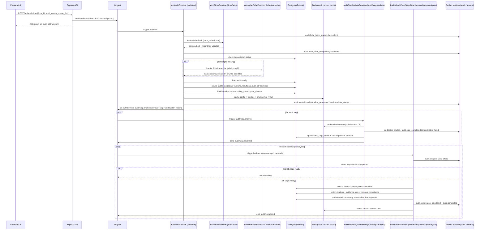

## Flow 06 — Audits (manual run, reruns)

## Purpose & scope

This document explains the **current backend code path** for running an AI audit on a fiche:

- API request → Inngest `audit/run` orchestrator
- Prerequisites: **force-refresh fiche** → **ensure transcription** → **build timeline (chunks)**
- Fan-out: one worker per audit step (`audit/step.analyze`)
- Aggregation/finalization: `audit/step.analyzed` finalizer
- How results are persisted (normalized tables + transaction constraints)
- Step reruns + control-point reruns (and how they mutate stored results deterministically)

**Out of scope**

- Automation scheduling that triggers audits (see flow 07).
- Full fiche caching internals and transcription internals (see flows 02/05).

## User story

A user selects a fiche and runs an audit (optionally “latest config”), then watches realtime progress and finally opens the normalized audit result. If a step/control point looks wrong, the user can **rerun** it with custom guidance or **override** it via human review.

## Entry points

### API endpoints (Express)

Audit execution:

- `POST /api/audits/run`
  - Body:
    - `fiche_id` (string)
    - `audit_config_id` (number) — preferred
    - `audit_id` (number) — legacy alias for `audit_config_id`
    - `use_rlm` / `useRlm` (boolean, optional): enables transcript tools mode (see “Transcript modes”)
    - Optional correlation fields: `user_id`, `automation_schedule_id`, `automation_run_id`, `trigger_source`
  - AuthZ: `requirePermission("audits.run")` + scope check (`SELF|GROUP|ALL`) via `assertFicheInAuditsScope`
  - Response: `{ event_id, audit_id, fiche_id, audit_config_id }`
    - **Important**: the returned `audit_id` is a **tracking id** (the Inngest event id / route id), **not** the DB audit id.

- `POST /api/audits/run-latest`
  - Body: `fiche_id`, optional `user_id`, optional `use_rlm`/`useRlm`
  - Looks up latest active config then emits `audit/run`

Batch execution:

- `POST /api/audits/batch`
  - Body: `fiche_ids[]`, optional `audit_config_id`, optional `use_rlm`/`useRlm`
  - AuthZ: `audits.run` + scope checks
  - **Requires Redis** (fails fast with 503 if `REDIS_URL` not configured)
  - Emits Inngest `audit/batch`

Audit reads + logs:

- `GET /api/audits` (filters + pagination; defaults to `isLatest=true`, `deletedAt=null`)
- `GET /api/audits/by-fiche/:fiche_id`
- `GET /api/audits/:audit_id` (here `audit_id` is the **DB** `audits.id`)
- `GET /api/audits/:audit_id/logs` (reads from `workflow_logs` where `workflow="audit"` and `traceId=<audit_db_id>`)

Human review overrides:

- `PATCH /api/audits/:audit_id/steps/:step_position/review` (step-level override)
- `PATCH /api/audits/:audit_id/steps/:step_position/control-points/:control_point_index/review` (control-point override)

Reruns:

- `POST /api/audits/:audit_id/steps/:step_position/rerun`
  - AuthZ: `requirePermission("audits.rerun")` + scope check by audit
  - Optional body: `customPrompt` / `customInstructions`
  - Emits Inngest `audit/step-rerun`

- `POST /api/audits/:audit_id/steps/:step_position/control-points/:control_point_index/rerun`
  - AuthZ: `audits.rerun` + scope check
  - Optional body: `customPrompt` / `customInstructions`
  - Emits Inngest `audit/step-control-point-rerun`

Code:

- Routes: `src/modules/audits/audits.routes.ts`, `src/modules/audits/audits.rerun.routes.ts`

### Inngest events & functions

Core run:

- Event `audit/run` → function `runAuditFunction` (`id: "run-audit"`) in `src/modules/audits/audits.workflows.ts`
- Fan-out events `audit/step.analyze` → function `auditStepAnalyzeFunction` (`id: "audit-step-analyze"`)
- Aggregation event `audit/step.analyzed` → function `finalizeAuditFromStepsFunction` (`id: "audit-finalize-from-steps"`)
- Domain events emitted internally:
  - `audit/completed`
  - `audit/failed`

Batch:

- Event `audit/batch` → `batchAuditFunction` (`id: "batch-audit"`)
- Batch progress updaters listen to `audit/completed` / `audit/failed` (Redis-backed)

Reruns:

- Event `audit/step-rerun` → `rerunAuditStepFunction` in `src/modules/audits/audits.rerun.workflows.ts`
- Event `audit/step-control-point-rerun` → `rerunAuditStepControlPointFunction`

### Implementation map (key code locations)

Audit run execution:

- `src/modules/audits/audits.routes.ts`
  - validates input, enforces permission + scope, emits `audit/run` (and `audit/batch`)
- `src/modules/audits/audits.workflows.ts`
  - `runAuditFunction` (orchestrator): prerequisites + fan-out
  - `auditStepAnalyzeFunction` (worker): LLM step analysis + persistence
  - `finalizeAuditFromStepsFunction` (finalizer): gating + compliance + final persistence
- `src/modules/audits/audits.repository.ts`
  - DB writes (`createPendingAudit`, `updateAuditWithResults`, `markAuditAsFailed`)

Audit result shaping (API responses):

- `src/modules/audits/audits.service.ts`
  - rebuilds “latest view” of `resultData` by overlaying DB-backed step payloads

Realtime publishing (Pusher):

- `src/shared/webhook.ts` (event helpers; payload shapes)
- `src/shared/pusher.ts` (channel routing + payload truncation rules)

Timeline building (chunks):

- `src/modules/recordings/recordings.repository.ts` (`getRecordingsWithTranscriptionChunksByFiche`)
- `src/utils/transcription-chunks.ts` (chunk derivation logic)

Evidence gating (deterministic post-processing):

- `src/modules/audits/audits.evidence.ts`

## Data model (Prisma / Postgres)

### Tables/models touched

- `audits` (`model Audit`)
- `audit_step_results` (`model AuditStepResult`)
- `audit_step_result_control_points` (`model AuditStepResultControlPoint`)
- `audit_step_result_citations` (`model AuditStepResultCitation`)
- `audit_step_result_human_reviews` (`model AuditStepResultHumanReview`)
- `audit_step_result_rerun_events` (`model AuditStepResultRerunEvent`)
- `recording_transcription_chunks` (`model RecordingTranscriptionChunk`) — used to build timelines efficiently
- `workflow_logs` (`model WorkflowLog`) — optional cross-workflow observability sink

### Key invariants & constraints

Audit identity:

- **Tracking id**: a string like `audit-<fiche_id>-<audit_config_id>-<timestamp>` (the Inngest event id).
  - Stored under `audits.resultData.audit_id` by `createPendingAudit(...)`.
  - Used for realtime channeling and progress correlation.
- **DB audit id**: `audits.id` (BigInt, autoincrement).
  - Used by REST `GET /api/audits/:audit_id` and rerun endpoints.

Step results:

- Unique step row per audit+step: `@@unique([auditId, stepPosition])` on `audit_step_results`.
- Control points are normalized and uniquely indexed:
  - `@@unique([auditId, stepPosition, controlPointIndex])`
  - Citations: `@@unique([auditId, stepPosition, controlPointIndex, citationIndex])`

Storage shape:

- `audits.resultData` is stored but **steps are stripped** to reduce JSON size; step details live in normalized tables.
- `audit_step_results.raw_result` is **minimal metadata** for new rows (typically `{ step_metadata, usage }`).
  - Older rows may still contain the full step JSON for back-compat; finalizer rebuilds from normalized tables when possible.

### Snapshot vs “latest view” (critical for UI correctness)

There are **two notions** of “the audit result” in the system:

- **Stored snapshot**: `audits.resultData` is the workflow snapshot persisted at finalization time.
  - It is intentionally **reduced** (steps stripped) to avoid huge JSON rows.
- **Latest view**: API read paths can “overlay” the latest step payload from normalized tables on top of the snapshot so that **reruns** and **human overrides** appear without rewriting the whole audit JSON.

Current behavior:

- `GET /api/audits/:audit_id` and `GET /api/audits/by-fiche/:fiche_id`
  - rebuild `resultData.audit.results.steps` by overlaying the **latest step payload** (from `audit_step_results` + `audit_step_result_control_points` + `audit_step_result_citations` + trails) onto the stored snapshot
  - implemented in `mergeResultDataWithLatestStepRawResults(...)` in `src/modules/audits/audits.service.ts`
  - step payload reconstruction is handled by `buildLatestStepPayloadFromDb(...)` (also in `audits.service.ts`)

- `GET /api/audits` (list endpoint)
  - returns `resultData` **as stored** (no overlay)
  - always treat `stepResults` (the table-backed step summaries) as the authoritative, up-to-date state in list views

Transaction constraints (important):

- `updateAuditWithResults(...)` explicitly avoids **interactive transactions** due to observed Prisma `P2028 ("Transaction not found")` behind pgbouncer/poolers.
  - Preferred pattern: **batch** `prisma.$transaction([...])` for “many quick queries”.
- LLM outputs are sanitized to remove `\u0000` null bytes before writing to TEXT fields (Postgres cannot store null bytes).
- Legacy/compat paths still exist (e.g. `saveAuditResult(...)`) that use interactive transactions; avoid expanding those paths in pooler environments.

## Happy path: API → Inngest → prerequisites → fan-out → finalizer

### High-level sequence



### Prerequisites (what happens, in order)

1. **Force-refresh fiche details + recordings**
   - `runAuditFunction` always invokes `fetchFicheFunction` with `force_refresh: true`.
   - Purpose: audits must run on the latest recordings (no “stale” audit based on old calls).

2. **Ensure transcriptions**
   - Reads `getFicheTranscriptionStatus(fiche_id)`.
   - If incomplete, invokes `transcribeFicheFunction` (priority `high`) and re-checks DB state.

3. **Build timeline from normalized chunks**
   - Uses `getRecordingsWithTranscriptionChunksByFiche` and prefers `recording_transcription_chunks`.
   - Legacy fallback: derive chunks from word-level payload (`recording.transcriptionData`) or plain text.

4. **Cache run context (optional, Redis)**
   - If Redis is available, caches:
     - `audit:<auditDbId>:config`
     - `audit:<auditDbId>:timeline` (only needed for tools mode)
     - `audit:<auditDbId>:timelineText`
     - optional per-step timeline excerpts under `audit:<auditDbId>:step:<pos>:timelineText`
     - optional `audit:<auditDbId>:productInfo`
   - TTL: `AUDIT_CONTEXT_TTL_SECONDS` (default 6h)

5. **Fan-out one Inngest event per step**
   - Each step event has a deterministic id: `audit-step-<auditDbId>-<position>` (idempotent).
   - Work distributes across replicas; concurrency caps protect provider quotas.

## Runtime knobs & scaling

This section lists the primary levers that change audit behavior in production. (Some are constants, some are env-driven.)

### Inngest timeouts (shared constants)

Defined in `src/shared/constants.ts`:

- `TIMEOUTS.FICHE_FETCH = "5m"`
- `TIMEOUTS.TRANSCRIPTION = "15m"`
- `TIMEOUTS.AUDIT_RUN = "30m"`
- `TIMEOUTS.BATCH_AUDIT = "1h"`

### Inngest concurrency (audit)

Global throughput cap:

- `AUDIT_RUN_CONCURRENCY` → `CONCURRENCY.AUDIT_RUN.limit`
  - default is `getInngestGlobalConcurrency()` (scales with replicas)

Per-entity caps (to avoid overlap / runaway cost):

- `AUDIT_RUN_PER_FICHE_CONCURRENCY` (default `1`)
  - prevents overlapping `audit/run` orchestrators for the same `fiche_id` across replicas

- Step worker (`audit/step.analyze`) concurrency:
  - `AUDIT_STEP_WORKER_CONCURRENCY` (global cap; defaults to `getInngestGlobalConcurrency()`)
  - `AUDIT_STEP_PER_AUDIT_CONCURRENCY` (per audit cap; defaults to `getInngestParallelismPerServer()`)

Finalizer single-flight:

- `finalizeAuditFromStepsFunction` runs with `concurrency.key = audit_db_id` and `limit = 1`
  - prevents “double finalize” races across replicas

Batch tracking:

- `AUDIT_BATCH_STATE_TTL_SECONDS` controls Redis state TTL (default 6h)
- `BATCH_AUDIT_PROGRESS_CONCURRENCY` caps how many batch progress updaters run in parallel

### Redis context caching (audit run context)

`runAuditFunction` caches per-audit context in Redis (when configured):

- Keys: `audit:<auditDbId>:{config|timeline|timelineText|productInfo}` plus optional `audit:<auditDbId>:step:<pos>:timelineText`
- TTL: `AUDIT_CONTEXT_TTL_SECONDS` (default `6h`)

Performance/cost knobs:

- `AUDIT_STEP_TIMELINE_EXCERPT` (default enabled unless set to `"0"`)
- `AUDIT_STEP_TIMELINE_MAX_CHUNKS` (default `40`, minimum `10`)

### Pusher payload size limits (realtime)

Realtime publishing uses Pusher; payloads have a hard practical ceiling (~10KB). The server enforces:

- `PUSHER_MAX_PAYLOAD_BYTES` (default `9000`)
- If a payload is too large, the backend **truncates** it (best effort) before publishing.

Implication:

- Treat realtime events as **notifications + correlation**, not as the canonical data payload.
- For large updates (especially rerun comparisons), always reload via `GET /api/audits/:audit_id`.

### Evidence gating knobs (deterministic)

- `AUDIT_EVIDENCE_GATING` (default enabled; set to `"0"` to disable)
- `AUDIT_EVIDENCE_MIN_QUOTE_CHARS` (default `12`) — minimum quote length for a citation to be considered valid

## Determinism, idempotency, and retries (deep dive)

### Orchestrator (`audit/run`)

- **Event id**: generated in the API route using a timestamp, so each user click yields a new run.
- **No “same input” idempotency**: the workflow is designed to allow repeated audits for the same fiche/config.
- **Single-flight per fiche**: `AUDIT_RUN_PER_FICHE_CONCURRENCY` prevents overlapping orchestrators for one fiche (default 1).

### Fan-out (`audit/step.analyze`)

- **Deterministic step event ids**: `audit-step-<auditDbId>-<stepPosition>`
  - if the orchestrator retries and re-sends events, Inngest deduplicates per id
- **DB idempotency**: step workers upsert on `@@unique([auditId, stepPosition])`

### Step worker replay safety (OpenAI spend guardrail)

Key protections:

- The expensive LLM call is wrapped in `step.run("analyze-step-<pos>", ...)`
  - on retry/replay, Inngest reuses the stored step output and **does not re-call the model**
- Before doing work, the worker checks DB for an existing `audit_step_results` row with `rawResult`
  - if it exists, it emits `audit/step.analyzed` and exits (prevents duplicate webhooks + duplicate writes)

Failure handling:

- If the LLM call fails, the worker generates a **schema-compatible fallback** result (`traite=false`, score=0)
  - this guarantees that the finalizer can still finish deterministically

### Finalizer (`audit/step.analyzed`)

- Triggered on every `audit/step.analyzed` event
- Concurrency `limit=1` per audit prevents races
- It checks `audits.status === "running"` before finalizing
  - if already completed/failed, it exits (prevents double-finalization)
- If not all steps are present yet, it returns a “waiting” result and relies on the next `audit/step.analyzed` event to retry

Important edge case:

- If one step never produces `audit/step.analyzed` (e.g., repeated sendEvent failure after retries), the finalizer may never re-trigger and the audit can remain “running”.
  - The current mitigation is step retries + the worker’s “already analyzed” fast-path on retry.
  - A dedicated “finalizer watchdog” is a good future hardening (see fix backlog).

## Timeline build (chunks) — deeper details

Source of truth:

- Timeline is rebuilt from DB using `getRecordingsWithTranscriptionChunksByFiche(fiche_id)`
  - prefers normalized `recording_transcription_chunks`
  - falls back to legacy word-level payloads (`recordings.transcription_data`) or plain text

Filtering rules (current):

- Only recordings where `hasTranscription = true` **and** `recordingUrl` is non-empty are included.
  - This prevents “citations” pointing to non-playable recordings.

Ordering + indices:

- Recordings are ordered chronologically (`startTime asc`).
- `recording_index` is assigned sequentially while building the timeline (0-based).
- `chunk_index` comes from the normalized chunk index (0-based).

Why this matters:

- Citations store `recording_index` + `chunk_index` plus redundant metadata (`recording_url`, `recording_date`, `recording_time`).
- The redundant fields make citations resilient to small ordering drifts and make the UI usable even if indices alone would be ambiguous.

## Transcript modes: “prompt” vs “tools” (use_rlm)

`use_rlm: true` enables **transcript tools mode** (“RLM-style”):

- **Prompt mode (default)**:
  - Each step analysis embeds `timelineText` (full transcript) in the prompt.
- **Tools mode**:
  - The analyzer exposes constrained tools to the LLM:
    - `searchTranscript` → returns best matching chunk refs + previews
    - `getTranscriptChunks` → returns full chunk text + metadata for quoting
  - The full timeline is **not** stuffed into the prompt; evidence is fetched on demand.

Implementation:

- Analyzer: `src/modules/audits/audits.analyzer.ts`
- Tools: `src/modules/audits/audits.transcript-tools.ts`
- Toggle wiring:
  - API routes accept `use_rlm` / `useRlm`
  - `runAuditFunction` forwards `use_rlm` into step events
  - Step workers pass `timeline` (structured) into `analyzeStep(...)` only when tools mode is requested

## Persistence & normalization (deep dive)

This section clarifies **what is persisted when**, and why the system can safely scale across replicas while remaining deterministic.

### Step worker persistence model (distributed, idempotent)

The step worker persists **one step at a time**:

- Target uniqueness: `(audit_id, step_position)` via `@@unique([auditId, stepPosition])`
- Write strategy:
  - upsert `audit_step_results` (step summary fields + minimal `raw_result`)
  - delete existing `audit_step_result_control_points` for that step
  - recreate control points (`createMany`)
  - recreate citations (`createMany`)
  - all in a single Prisma `$transaction([...])` so that control points/citations never drift from the step row

Why delete+recreate?

- The LLM output is naturally array-shaped; replacing the normalized rows is simpler and avoids partial “upsert drift” when control point counts change.

### Finalizer persistence model (aggregate + rewrite)

The finalizer is responsible for producing the audit-level truth:

- Loads all step rows + normalized control points/citations
- Reconstructs step payloads (even if `raw_result` is minimal)
- Enriches citations with recording metadata (date/time/url)
- Applies evidence gating (deterministic)
- Computes audit compliance summary and statistics
- Persists via `updateAuditWithResults(...)`, which:
  - updates the `audits` row summary fields (`scorePercentage`, `niveau`, `criticalPassed/Total`, counters, status)
  - rewrites step summaries + normalized control points/citations to the final (gated/enriched) state
  - strips steps out of `audits.resultData` for storage efficiency

Design intent:

- Step workers allow fast incremental progress + partial visibility.
- The finalizer produces the canonical, deterministic final state.

### API reads: snapshot vs latest overlays (why it’s correct)

- Stored `audits.resultData` is a reduced snapshot.
- When serving detail endpoints, the service overlays the “latest step payload” reconstructed from DB, so reruns/overrides are visible even if the stored snapshot is old.

## Evidence gating (deep dive)

Evidence gating prevents “PRESENT” claims that have no real transcript proof.

### What is validated

For each citation:

- `recording_index` and `chunk_index` must be valid
- the quoted `texte` must appear in the referenced transcript chunk (after normalization)
- very short quotes are rejected (min length: `AUDIT_EVIDENCE_MIN_QUOTE_CHARS`, default 12)

### What is modified

When gating is enabled (`AUDIT_EVIDENCE_GATING != "0"`):

- **Citations are removed** if they don’t match transcript content.
- **Control points are downgraded**:
  - if `statut` is `PRESENT` or `PARTIEL` but all citations are removed → downgrade to `ABSENT` and append an auto-check note
  - if `statut` is `ABSENT` or `NON_APPLICABLE` → citations are forced to `[]`
- **Minutages are recomputed** from the remaining citations.
- **Step score/conforme can be adjusted downward**:
  - a ratio is derived from control point statuses (PRESENT=1, PARTIEL=0.5, ABSENT=0; NON_APPLICABLE excluded)
  - the derived score is \(round(ratio \times weight)\), clamped to \([0, weight]\)
  - if derived score < LLM score, the score is reduced and a note is appended to `commentaire_global`
  - `conforme` may be adjusted downward (CONFORME→PARTIEL/NON_CONFORME, PARTIEL→NON_CONFORME)

Where it runs:

- Audit finalization (canonical)
- Step rerun service + control-point rerun service (so mutations remain deterministic)

Limitations to be aware of:

- Validation is substring-based after normalization; citations that are too short or heavily paraphrased will be dropped.
- This is intentional: the system prefers conservative “ABSENT” over unverified “PRESENT”.

## Security & privacy considerations

- **Scope enforcement**: HTTP endpoints enforce `SELF|GROUP|ALL` visibility for reads and writes (runs/reruns/reviews).
- **Private realtime channels**: audit progress is published on audit-specific and fiche-specific channels; private channel auth is required in production.
- **PII in transcripts**:
  - Timeline text can contain sensitive data; audits avoid publishing timelines over realtime.
  - Prefer tools mode for long transcripts to reduce prompt size and avoid accidental log dumping.

## Cached vs uncached scenarios (explicit)

### Fiche cache

- **Cache present**: still force-refreshes from CRM gateway (`force_refresh: true`).
- **Cache missing**:
  - Audit cannot create DB row until `fetchFicheFunction` caches it.
  - If the fiche is not cached after fetch, audit is terminal-failed (“not cached - cannot create audit”).

### Transcriptions

- **Already complete**: audit continues immediately.
- **Incomplete**: audit invokes `transcribeFicheFunction` then validates DB counts again before proceeding.

### Redis context cache

- **Redis available**:
  - Orchestrator writes config + timeline + timelineText once.
  - Step workers read cached context; finalizer prefers cached config/timeline.
- **Redis unavailable**:
  - Orchestrator logs a warning and skips caching.
  - Each step worker may rebuild timelineText (expensive) from DB.
  - Finalizer falls back to DB for config/timeline as needed.

## Failure modes (what happens today)

### Auth / scope failures (401/403)

- API endpoints are protected by permissions:
  - `audits.read`, `audits.run`, `audits.write`, `audits.rerun`
- Scope is enforced (`SELF|GROUP|ALL`) using fiche/audit linkage (cached fiche info or minimal gateway lookup).

### Fiche not found (404) — terminal prereq failure

`runAuditFunction` treats upstream “not found” as a deterministic terminal outcome:

- If `fetchFicheFunction` throws a not-found-like error **or** returns `{ not_found: true }`:
  - Best-effort: create an audit row if cache id is known, then `markAuditAsFailed(...)`
  - Emit `audit.failed` realtime event and internal `audit/failed` event
  - Return early (no fan-out)

### Upstream/CRM failures (401/403/5xx/timeouts)

- `runAuditFunction` retries (retries=2). On final failure:
  - `onFailure` tries to locate the “running” audit row and mark it failed.
  - Emits `audit.failed` realtime event + internal `audit/failed`.

### Missing/empty timeline after transcription — terminal prereq failure

After rebuilding timeline:

- If `recordingsCount === 0`, audit is marked failed with a clear reason and context keys are cleaned up.

### Step analysis errors

The step worker never “blocks” finalization on a single step crash:

- Errors during LLM analysis produce a **schema-compatible fallback** result (`traite=false`, score=0, control points marked absent).
- The step result is still persisted; finalizer can complete deterministically.

### Inngest down

- API still returns `{ event_id, audit_id(tracking) }` if the send succeeds, but no workflow executes:
  - No DB audit row is created (audit row is created inside the workflow).
  - No realtime events are published.

### Redis down

- Audit still runs (with DB fallbacks), but it’s more expensive (timeline rebuilt per worker).
- **Batch audits** do not run without Redis (API returns 503).

## Observability checkpoints

### Terminal workflow logs (fastest debugging)

All audit workflows emit structured terminal logs via `src/shared/workflow-logger.ts`. Look for these in `docker compose logs server`:

- **Orchestrator** (`[AUDIT|<fiche_id>/<config_id>]`):
  - `START: run-audit` with audit_id, fiche_id, config_id, use_rlm, trigger_source
  - `STEP: force-refresh-fiche` / `DONE` with timing
  - `STEP: check-transcription-status` / `DONE` with total/transcribed/pending counts
  - `STEP: invoke-transcription` (only if incomplete) / `DONE` with timing
  - `STEP: load-audit-config` / `DONE` with config name and step count
  - `STEP: generate-timeline` / `DONE` with recordings count, chunk count, cached flag
  - `FAN-OUT: audit/step.analyze x<N>` with step positions and audit_db_id

- **Step worker** (`[AUDIT-STEP|<fiche_id>/step-<N>]`):
  - `START: analyze-step` with audit_db_id, step_position, use_rlm

- **Finalizer** (`[AUDIT-FINALIZER|<fiche_id>/db-<audit_db_id>]`):
  - `START: finalize-audit` with step_position trigger, ok/error

**Common "stuck" pattern in logs**: if you see `STEP: invoke-transcription` but no `DONE: invoke-transcription`, the audit is blocked waiting for transcription. Check the transcription terminal logs (especially Redis availability).

### What logs should appear (stdout / structured logs)

High-signal log messages are emitted by:

- `runAuditFunction`: “Starting audit”, fiche cache snapshots, “Force-refreshing…”, “Audit config loaded”, “Timeline generated”, “Audit step fan-out dispatched”
- `auditStepAnalyzeFunction`: “Audit step analysis started/finished”, “Audit step result persisted”
- `finalizeAuditFromStepsFunction`: “Audit finalizer triggered”, “waiting for steps”, “Persisted audit results”, “Audit finalized…”

### What DB rows change

During a successful run:

- `audits`:
  - created by `createPendingAudit(...)` with `status="running"`, `startedAt`, `resultData.audit_id=<tracking>`
  - updated by `updateAuditWithResults(...)` with compliance summary, statistics, `status="completed"`, `completedAt`, and reduced `resultData`
- `audit_step_results`:
  - upserted per step by `auditStepAnalyzeFunction` (idempotent per `(auditId, stepPosition)`)
  - overwritten/enriched at finalization (normalized control points/citations updated)
- `audit_step_result_control_points` and `audit_step_result_citations`:
  - rewritten per step and again at finalization (after enrichment + evidence gating)

During human review / reruns:

- `audit_step_result_human_reviews`: append-only trail
- `audit_step_result_rerun_events`: append-only rerun trail
- `audit_step_results` + normalized control point/citation tables: updated to reflect the override/rerun
- `audits` summary fields recomputed after reruns (so list/detail stays consistent)

### Realtime / webhook events emitted (Pusher)

Events are published via `sendWebhook(...)` (Pusher), with names matching legacy webhook names.

Core audit lifecycle:

- `audit.started`
- `audit.fiche_fetch_started` / `audit.fiche_fetch_completed`
- `audit.transcription_check`
- `audit.config_loaded`
- `audit.timeline_generated`
- `audit.analysis_started`
- `audit.step_started`
- `audit.step_completed` / `audit.step_failed`
- `audit.progress`
- `audit.compliance_calculated`
- `audit.completed`
- `audit.failed`

Channel routing (important):

- Publishing derives channels from payload fields:
  - `audit_id` → `private-audit-<audit_id>` (tracking id or DB id depending on caller)
  - `audit_db_id` (if present and different from `audit_id`) → also `private-audit-<audit_db_id>`
  - `fiche_id` → `private-fiche-<fiche_id>`
  - otherwise falls back to `private-global`

Practical consequence:

- `audit/run` publishes with `audit_id=<tracking>` **and** `audit_db_id=<db>` → both channels receive progress.
- Rerun endpoints currently publish with `audit_id=<db>` only → clients should subscribe to the DB audit channel to see rerun events.

Code:

- Event helpers: `src/shared/webhook.ts`
- Channel derivation: `src/shared/pusher.ts`

### How to query workflow_logs (if enabled)

REST:

- `GET /api/audits/:audit_id/logs?level=info&since=...&until=...&limit=200`
  - filters `workflow="audit"` and `traceId=<audit_db_id>`

DB (example):

- `workflow_logs` rows where:
  - `workflow = 'audit'`
  - `trace_id = '<audit_db_id>'`

Note:

- DB log persistence is implemented in `src/shared/workflow-tracer.ts` and is gated by `WORKFLOW_LOG_DB_ENABLED`,
  but audits currently rely primarily on stdout + realtime events; consider instrumenting audits with the tracer if you
  want `GET /logs` to be consistently populated.

### “Audit stuck in running” triage (practical playbook)

If the UI shows an audit as “running” for too long, you can usually localize the issue quickly.

1. **Confirm the DB audit row**

```sql
SELECT id, status, started_at, completed_at, duration_ms, error_message
FROM audits
WHERE id = <AUDIT_DB_ID>;
```

2. **Find by tracking id (API response `audit_id`)**

```sql
SELECT id, status, created_at
FROM audits
WHERE (result_data ->> 'audit_id') = '<AUDIT_TRACKING_ID>';
```

3. **Count step results present**

```sql
SELECT step_position, step_name, traite, score, conforme, total_citations, total_tokens
FROM audit_step_results
WHERE audit_id = <AUDIT_DB_ID>
ORDER BY step_position;
```

Interpretation:

- If **0 step rows** exist: step fan-out likely didn’t happen (or Inngest didn’t execute).
- If **some step rows** exist: locate missing positions; step workers for those positions likely failed to run.
- If **all step rows** exist but audit is still running: finalizer likely didn’t complete (or didn’t re-trigger).

4. **Inspect a suspicious step’s control points + citations**

```sql
SELECT control_point_index, statut, LEFT(commentaire, 120) AS commentaire_preview
FROM audit_step_result_control_points
WHERE audit_id = <AUDIT_DB_ID> AND step_position = <STEP_POSITION>
ORDER BY control_point_index;
```

```sql
SELECT control_point_index, citation_index, minutage, speaker, recording_index, chunk_index
FROM audit_step_result_citations
WHERE audit_id = <AUDIT_DB_ID> AND step_position = <STEP_POSITION>
ORDER BY control_point_index, citation_index;
```

5. **Check rerun/human override trails (if behavior changed)**

```sql
SELECT occurred_at, kind, rerun_id, event_id, previous_score, next_score
FROM audit_step_result_rerun_events
WHERE audit_id = <AUDIT_DB_ID> AND step_position = <STEP_POSITION>
ORDER BY occurred_at;
```

```sql
SELECT reviewed_at, kind, reviewer, control_point_index, previous_statut, override_statut
FROM audit_step_result_human_reviews
WHERE audit_id = <AUDIT_DB_ID> AND step_position = <STEP_POSITION>
ORDER BY reviewed_at;
```

6. **Workflow logs (only if tracer/DB logging is enabled)**

```sql
SELECT created_at, level, step_name, message
FROM workflow_logs
WHERE workflow = 'audit' AND trace_id = '<AUDIT_DB_ID>'
ORDER BY created_at ASC;
```

## Reruns (step + control point)

### Step rerun

API:

- `POST /api/audits/:audit_id/steps/:step_position/rerun` → emits Inngest `audit/step-rerun`

Workflow:

- `rerunAuditStepFunction`:
  - sends `audit.step_started` (rerun flavor)
  - runs `rerunAuditStep(...)` which:
    - loads existing audit + step result
    - regenerates timeline from DB (prefers transcription chunks)
    - runs `analyzeStep(...)` with optional custom prompt context
    - runs evidence gating + recomputes derived compliance
  - persists mutation via `saveRerunResult(...)`:
    - updates `audit_step_results` + rewrites normalized control points/citations
    - appends to `audit_step_result_rerun_events`
    - recomputes and updates audit compliance summary (`updateAuditComplianceSummary`)
  - sends `audit.step_completed` with comparison payload (original vs rerun)

Realtime payload caveat (important):

- `audit.step_completed` rerun events include `original`/`rerun` payloads which can be large.
- If the payload exceeds Pusher limits, the server **truncates** it.
- Always reload the audit detail (`GET /api/audits/:audit_id`) after rerun completion to get the authoritative state.

### Control point rerun

API:

- `POST /api/audits/:audit_id/steps/:step_position/control-points/:control_point_index/rerun`

Workflow:

- `rerunAuditStepControlPointFunction`:
  - re-analyzes only one control point but still persists a consistent mutation:
    - normalized tables are updated
    - step score/conforme are recomputed deterministically from control point statuses
    - audit compliance summary is recomputed
  - appends `audit_step_result_rerun_events` with before/after snapshots

## Fix backlog (independent)

Each item is independently actionable; none require the others to land first.

1. **Populate `workflow_logs` for audits**
   - **Why**: `GET /api/audits/:audit_id/logs` is useful only if audit workflows write traced logs with `traceId=<audit_db_id>`.
   - **Where**:
     - Add `createWorkflowTracer({ workflow:"audit", traceId:auditDbId, ... })` usage in:
       - `runAuditFunction`
       - `auditStepAnalyzeFunction`
       - `finalizeAuditFromStepsFunction`
   - **DoD/tests**:
     - Integration test: run one audit and assert `/logs` returns rows ordered by `createdAt`.

2. **Unify audit identifier semantics across realtime + reruns**
   - **Why**: rerun events publish only on DB-id audit channel; clients subscribed to tracking-id only may miss rerun updates.
   - **Where**:
     - Include `audit_tracking_id` (from `audits.resultData.audit_id`) in rerun event payloads and realtime events.
     - Consider publishing rerun events to both channels explicitly (`channels: [...]`) in `publishPusherEvent`.
   - **DoD/tests**:
     - Unit test `derivePusherChannelsForEvent` with rerun payload → includes both channels.

3. **Make terminal prereq outcomes explicit (“skipped” vs “failed”)**
   - **Why**: some downstream flows may want `fiche_not_found` to be terminal but not a “failed audit”.
   - **Where**:
     - Extend `Audit.status` handling in `runAuditFunction` and schema/types to support `skipped`.
   - **DoD/tests**:
     - Test: fiche 404 → audit marked skipped + emits terminal event with `stage="fiche_not_found"`.

4. **Expose evidence gating stats in persisted results**
   - **Why**: explain score reductions/downgrades to users and ease debugging.
   - **Where**:
     - `finalizeAuditFromStepsFunction`: persist `validateAndGateAuditStepResults(...).stats` into `audits.resultData.metadata` (or a dedicated column).
   - **DoD/tests**:
     - Unit test: invalid citation → stats reflect removed citations and downgraded control points.

5. **Maintain `Audit.isLatest` / `Audit.version` invariants**
   - **Why**: list endpoints default to `latestOnly=true`; correctness requires writers to keep exactly one “latest” audit per (fiche, config) (or per fiche).
   - **Where**:
     - `createPendingAudit(...)` (in `src/modules/audits/audits.repository.ts`): before creating a new audit, mark prior audits as `isLatest=false` and increment `version`.
   - **DoD/tests**:
     - DB test: create two audits for same fiche+config → newest isLatest=true, previous false; list endpoint returns only latest by default.

6. **Add a finalizer watchdog for “stuck running” audits**
   - **Why**: finalizer is event-driven (`audit/step.analyzed`). If the last trigger is lost, an audit can remain “running” even if all step rows exist.
   - **Where**:
     - Add a delayed “recheck/finalize” event from `runAuditFunction` after fan-out (e.g., +5m) that re-counts steps and finalizes if complete.
     - Or add a cron workflow that marks audits older than \(T\) as failed (with reason) if incomplete.
   - **DoD/tests**:
     - Simulate missing `audit/step.analyzed` for last step → watchdog finalizes or fails deterministically.

7. **Reduce rerun realtime payload size (avoid truncation)**
   - **Why**: rerun completion currently includes full step/control point payloads which can exceed Pusher limits and be truncated.
   - **Where**:
     - In `src/shared/webhook.ts`, change rerun completion events to send only summary + `rerun_id`, and persist full diff in DB (or return it via a dedicated endpoint).
   - **DoD/tests**:
     - Unit test: rerun completion event payload stays under `PUSHER_MAX_PAYLOAD_BYTES`.

8. **Index audit tracking id for fast onFailure lookup**
   - **Why**: `runAuditFunction.onFailure` queries `audits.resultData` by JSON path to find the “running audit”; this can degrade under load without indexing.
   - **Where**:
     - Add a computed column or a JSONB expression index on `(result_data ->> 'audit_id')`.
   - **DoD/tests**:
     - Explain plan shows index usage; onFailure lookup latency stays bounded.

