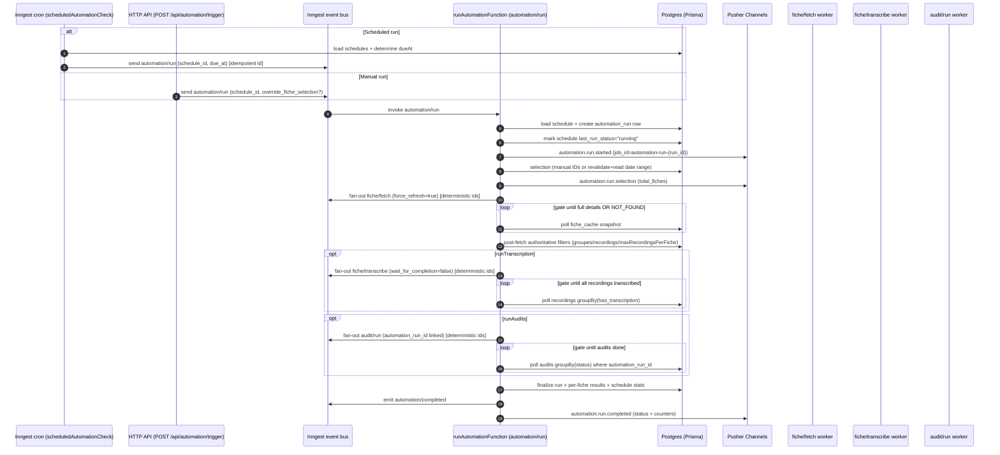
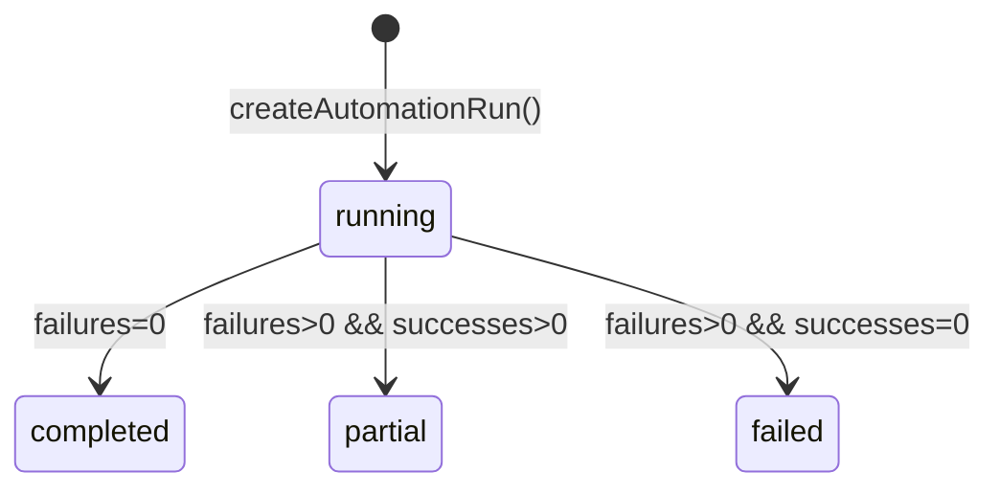
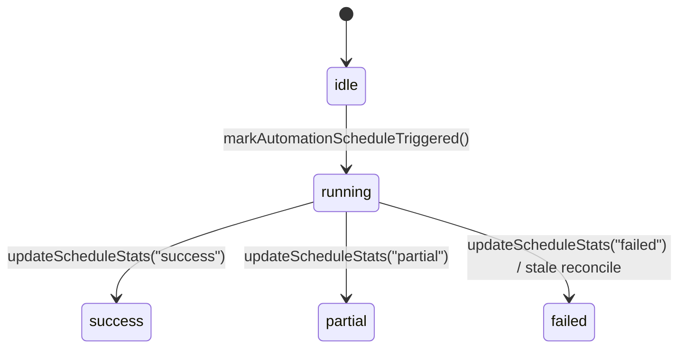

# 07 - Automation (schedules + runs)

## Purpose + scope

This document explains the **current backend automation flow** end-to-end:

- Scheduler tick (cron) and manual trigger
- Fiche selection (manual IDs vs date range/filter)
- Distributed prerequisite fan-out (fiche details fetch)
- Transcription stage gating (optional)
- Audit stage gating (optional)
- Run finalization + notifications + observability
- Stuck-run prevention and reconciliation

Out of scope:

- Detailed fiche caching internals (see `src/modules/fiches/*`)
- Detailed transcription pipeline internals (see `src/modules/transcriptions/*`)
- Detailed audit step fan-out/finalization (see `src/modules/audits/*`)

## User story

As an operator, I configure schedules that automatically pick a set of fiches (by date or by explicit IDs), ensure prerequisites (full details + recordings), optionally transcribe recordings, optionally run audits, and then see a **run-level summary** with reliable terminal status (**completed / partial / failed**) plus per-fiche outcomes.

## Entry points

### HTTP API

- **Trigger run manually**
  - **Endpoint**: `POST /api/automation/trigger`
  - **Permission**: `automation.write` (read is required for the router; write required for trigger)
  - **Body**: `{ scheduleId, overrideFicheSelection? }`
  - **Behavior**: emits Inngest event `automation/run` (returns `event_ids`).

- **Schedules CRUD**
  - `POST /api/automation/schedules` (create)
  - `GET /api/automation/schedules` (list)
  - `GET /api/automation/schedules/:id` (get)
  - `PATCH /api/automation/schedules/:id` (update)
  - `DELETE /api/automation/schedules/:id` (delete)

- **Runs + logs**
  - `GET /api/automation/schedules/:id/runs`
  - `GET /api/automation/runs/:id`
  - `GET /api/automation/runs/:id/logs`

- **Diagnostics**
  - `GET /api/automation/diagnostic` (Inngest env config hints)

### Inngest events and functions

**Orchestrators**

- **`automation/run`** → `runAutomationFunction`
  - File: `src/modules/automation/automation.workflows.ts`
  - Creates a run, selects fiches, fans out prerequisite work, gates on DB signals, finalizes the run.

- **Scheduler cron tick** → `scheduledAutomationCheck`
  - File: `src/modules/automation/automation.workflows.ts`
  - Runs on cron (default every minute), finds “due” schedules, dispatches `automation/run`.

**Fan-out workers (other modules)**

- `fiche/fetch` → fiche details fetch worker
  - File: `src/modules/fiches/fiches.workflows.ts` (`fetchFicheFunction`)
  - Automation dispatches with `force_refresh: true` (avoid stale recordings/details).

- `fiche/transcribe` → transcription orchestrator
  - File: `src/modules/transcriptions/transcriptions.workflows.ts` (`transcribeFicheFunction`)
  - Automation dispatches with `wait_for_completion: false` (automation gates at run level).

- `audit/run` → audit orchestrator
  - File: `src/modules/audits/audits.workflows.ts` (`runAuditFunction`)
  - Automation dispatches with `automation_run_id` + `automation_schedule_id` to link audits to the run.

**Domain events (optional downstream consumers)**

- `automation/completed`
- `automation/failed`

These are emitted by `runAutomationFunction` after finalization (or catastrophic failure).

### Realtime events (Pusher)

Automation emits run-level realtime events:

- `automation.run.started`
- `automation.run.selection`
- `automation.run.completed`
- `automation.run.failed`

**Channel**: `private-job-automation-run-{run_id}`

- Implemented as the normal job-channel rule: `job_id = "automation-run-{run_id}"` → channel `private-job-{job_id}`
- Channel derivation lives in `src/shared/pusher.ts` (`derivePusherChannelsForEvent`)
- Practical note (UI): `POST /api/automation/trigger` returns `event_ids` but not the `run_id`.
  - To discover `run_id`, poll `GET /api/automation/schedules/:id` (includes last runs) or `GET /api/automation/schedules/:id/runs`, then subscribe to `private-job-automation-run-{run_id}`.

## Data model

### Core tables

- **`automation_schedules` (`AutomationSchedule`)**
  - Selection fields are **normalized columns** (not a JSON blob), e.g.:
    - `fiche_selection_mode` (`date_range | manual | filter`)
    - `fiche_selection_groupes` (string[])
    - `fiche_selection_only_with_recordings` (boolean)
    - `fiche_selection_only_unaudited` (boolean)
    - `fiche_selection_use_rlm` (boolean; propagates `use_rlm=true` into `audit/run`)
    - `fiche_selection_max_fiches` (int | null)
    - `fiche_selection_max_recordings_per_fiche` (int | null)
  - Execution toggles:
    - `run_transcription`, `skip_if_transcribed`, `transcription_priority`
    - `run_audits`, `use_automatic_audits`, `specific_audit_configs` (BigInt[])
    - `continue_on_error`, `retry_failed`, `max_retries`
  - Notifications:
    - `webhook_url`, `notify_emails` (string[]), `notify_on_complete`, `notify_on_error`
  - Scheduler bookkeeping:
    - `last_run_at`, `last_run_status` (notably `"running"` during active runs)

- **`automation_runs` (`AutomationRun`)**
  - Terminal status: `running | completed | partial | failed`
  - Stats: `total_fiches`, `successful_fiches`, `failed_fiches`, `transcriptions_run`, `audits_run`
  - `config_snapshot` (captures schedule name/type + overrides + due time)
  - `error_message` / `error_details` for catastrophic failures
  - `result_summary` is kept **minimal**; arrays live in `automation_run_fiche_results`

- **`automation_run_fiche_results` (`AutomationRunFicheResult`)**
  - One row per `(run_id, fiche_id)` with:
    - `status`: `successful | failed | ignored`
    - `error` (failed) or `ignore_reason` + `recordings_count` (ignored)
  - Unique constraint: `@@unique([runId, ficheId])`

- **`automation_logs` (`AutomationLog`)**
  - Ordered logs (`timestamp`) attached to a run (`run_id`)
  - Populated throughout the orchestrator as the primary “what happened” record

### Dependency tables used as gates

- **`fiche_cache`** (`FicheCache`)
  - Gate for “full details ready” uses:
    - normalized relation `fiche_cache_information` **OR**
    - legacy/full JSON shape in `raw_data` (when not yet normalized)
  - Terminal skip rule uses envelope markers:
    - `details_success=false` and `details_message` containing `NOT_FOUND`
  - Recordings signals:
    - `recordings_count` / `has_recordings`, and a fallback derived from `raw_data.recordings[]`

- **`recordings`** (`Recording`)
  - Gate for transcription completeness uses `has_transcription=true` counts per fiche.

- **`audits`** (`Audit`)
  - Gate for audit completeness uses:
    - `automation_run_id = <runId>` (explicit linkage; avoids `createdAt` window bugs)
    - `is_latest=true`
    - `status in (completed|failed)` counted per fiche/config

## Happy path (end-to-end)

### High-level sequence

### Selection: manual vs date-range/filter

**Manual selection**

- `selection.mode === "manual"` → parse `ficheIds` (split on whitespace/commas, trim, maxFiches)
- Emits `automation.run.selection` immediately
- If the list is empty, the run is finalized as `completed` with `reason="no_fiches_manual"`

**Date-range/filter selection**

- Compute date list via `automationService.calculateDatesToQuery(selection)`
  - Dates are in `DD/MM/YYYY`
  - If empty, finalize `completed` with `reason="no_dates"`
- Revalidate sales-list cache **before** selecting:
  - For each date (batched, max 3 concurrent), call `automationApi.fetchFichesForDate(date, onlyWithRecordings=false, apiKey?)`
  - Cache each fiche sales summary via `cacheFicheSalesSummary(...)` with `salesDate=YYYY-MM-DD` and `lastRevalidatedAt=<now>`
  - CRM failures are logged and the workflow continues (falls back to existing DB snapshot)
- Select from DB once for the encompassing range:
  - `getFichesByDateRangeWithStatus(startDate, endDate)` (in `src/modules/fiches/fiches.service.ts`)
- Apply **safe early filters** on the DB snapshot:
  - `onlyUnaudited=true` (uses `fiche.audit.total === 0`)
  - `groupes` is best-effort:
    - if `groupe` is missing, keep and enforce the authoritative group filter after full details
  - `onlyWithRecordings` is explicitly deferred until after full details
- Deduplicate IDs and emit `automation.run.selection`

## Deeper analysis: invariants, state machines, and tuning

### Invariants (the workflow is designed to preserve these)

- **Authoritative decisions happen on full details**
  - `groupes`, `onlyWithRecordings`, and `maxRecordingsPerFiche` are enforced only after `fiche/fetch` completes because sales-list snapshots can be incomplete.
- **Run-level terminal status must be deterministic**
  - Terminal “SKIP” cases (notably 404/NOT_FOUND) are removed from `totalFiches` so later stages don’t wait forever.
- **Cross-replica safety**
  - All gates read **DB state**, not process memory, so any replica can resume work after retries/replays.
- **No duplicate fan-out on retries**
  - Fan-out events use deterministic IDs; replays/retries are safe because Inngest de-duplicates on event ID.

### Idempotency boundaries (deterministic Inngest event IDs)

These IDs are intentionally stable so retries/replays don’t multiply work:

- **Scheduler dispatch**: `automation-schedule-{scheduleId}-{dueAtMs}`
- **Fiche details fan-out**:
  - initial: `automation-{runId}-fetch-{ficheId}`
  - retry-on-stall: `automation-{runId}-fetch-{ficheId}-retry-{n}`
- **Transcription fan-out**:
  - initial: `automation-{runId}-transcribe-{ficheId}`
  - retry-on-stall: `automation-{runId}-transcribe-{ficheId}-retry-{n}`
- **Audit fan-out**:
  - `automation-{runId}-audit-{ficheId}-{configId}`

Practical implication: when you see “duplicates” in logs, verify whether they’re **true duplicates** (different deterministic IDs) or harmless replays of the same IDs.

### Replay-safety and durable waiting (why `step.run` + `step.sleep`)

The automation uses a “durable wait loop” pattern:

- **Memoize stage start time** via a `step.run("started-at-...")` so elapsed time is consistent across replays.
- **Poll in `step.run`** so each poll snapshot is checkpointed.
- **Sleep with `step.sleep`** instead of busy waiting.

This design makes timeouts, retries, and progress accounting stable even if:

- the worker crashes mid-run
- Inngest replays the function
- another replica continues the work

### State model: `AutomationRun.status` vs `AutomationSchedule.lastRunStatus`

These are intentionally different:

- **Run status** (`automation_runs.status`): `running | completed | partial | failed`
- **Schedule last-run status** (`automation_schedules.last_run_status`): `"running"` (overlap prevention) and terminal `"success" | "partial" | "failed"` (stats)

In other words: `AutomationRun.status="completed"` corresponds to `AutomationSchedule.lastRunStatus="success"`.

### Tuning knobs and backpressure (what to adjust first)

| Area | Knob(s) | Default | Primary effect |
|------|---------|---------|----------------|
| **Fan-out chunking** | `AUTOMATION_SEND_EVENT_CHUNK_SIZE` | `200` | Avoids huge `sendEvent` payloads; smaller chunks reduce per-send blast radius but add overhead |
| **Fiche details gate** | `AUTOMATION_FICHE_DETAILS_MAX_WAIT_MS`, `AUTOMATION_FICHE_DETAILS_POLL_INTERVAL_SECONDS` | `10m`, `20s` | Total “fetch budget” and DB poll frequency |
| **Transcription gate** | `AUTOMATION_TRANSCRIPTION_MAX_WAIT_MS`, `AUTOMATION_TRANSCRIPTION_POLL_INTERVAL_SECONDS` | `15m`, `30s` | Total “transcribe budget” and DB poll frequency |
| **Audit gate** | `AUTOMATION_AUDIT_MAX_WAIT_MS`, `AUTOMATION_AUDIT_POLL_INTERVAL_SECONDS` | `30m`, `60s` | Total “audit budget” and DB poll frequency |
| **Scheduler tick** | `AUTOMATION_SCHEDULER_CRON` | `*/1 * * * *` | How often we check for due schedules |
| **Due window** | `AUTOMATION_SCHEDULER_WINDOW_MINUTES` | `20` | How much scheduler jitter we tolerate without missing a run |
| **Stale grace** | `AUTOMATION_SCHEDULER_STALE_GRACE_MS` | `15m` | Extra buffer before declaring “stuck running” |
| **Sales-list caching** | `FICHE_SALES_CACHE_CONCURRENCY` | `10` | Concurrency of per-fiche DB writes during revalidation |
| **Inngest capacity** (deployment) | `INNGEST_PARALLELISM_PER_SERVER`, `INNGEST_SERVER_REPLICAS` | `10`, `6` (compose example) | Total concurrent function work across replicas |

Where pressure usually appears:

- **CRM API**: slow/unstable responses increase “revalidation” time and can reduce selection quality.
- **DB**: short poll intervals + large runs can create heavy read load (groupBy + large `IN (...)`).
- **Inngest ↔ LB**: 502/DNS/network issues can prevent fan-out workers from running.
- **Provider quotas**: transcription/audit providers can throttle, extending gates and increasing stalls/timeouts.

## Distributed fiche fetch (full details prerequisite)

Automation always upgrades candidates to **full fiche details** before making authoritative decisions about:

- `groupe` filtering
- recordings presence/count
- max-recordings guardrails

### Fan-out

- Event: `fiche/fetch`
- Payload: `{ fiche_id, force_refresh: true }`
- Deterministic event id:
  - `automation-{runId}-fetch-{ficheId}`
- Chunking:
  - `AUTOMATION_SEND_EVENT_CHUNK_SIZE` (default 200)

### Gate (“full details ready”)

The orchestrator waits using a durable loop:

- Poll step: `step.run("poll-fiche-details-...")`
- Sleep step: `step.sleep("sleep-fiche-details-...")`

Key knobs:

- `AUTOMATION_FICHE_DETAILS_MAX_WAIT_MS` (default 10 min)
- `AUTOMATION_FICHE_DETAILS_POLL_INTERVAL_SECONDS` (default 20s)

Readiness rules per fiche:

- **ready** if:
  - “full details” detected (normalized `information` relation exists OR legacy/full JSON shape), OR
  - fiche is marked terminal **NOT_FOUND**
- **terminal NOT_FOUND marker**: `detailsSuccess=false` and `detailsMessage` contains `"NOT_FOUND"` (case-insensitive heuristic)

Retry-on-stall:

- When `schedule.retryFailed=true` and `schedule.maxRetries>0`, the orchestrator may re-dispatch `fiche/fetch` for incomplete fiches after the “ready count” stalls for 3 polls:
  - id: `automation-{runId}-fetch-{ficheId}-retry-{n}`

### Post-fetch authoritative filters

After the gate, the run computes:

- **Ignore NOT_FOUND (404)**:
  - Add `AutomationRunFicheResult(status="ignored", ignoreReason="Fiche not found (404)")`
  - Remove from `totalFiches` so later gates won’t wait forever
- **Enforce `groupes`** *after* full details:
  - Fiches outside the selected groupes are ignored (and removed from totals)
- **Guardrail: max recordings**
  - Threshold is either `selection.maxRecordingsPerFiche` or env `AUTOMATION_MAX_RECORDINGS_PER_FICHE`
  - Fiches above threshold are ignored (and removed from totals)
- **Enforce `onlyWithRecordings`**:
  - If requested, fiches with 0 recordings after full details are ignored (and removed from totals)

If some fiches still don’t have full details after waiting, they are added to `results.failed` with an error like:

- `"Fiche not found in cache"`
- `"Fiche details not fetched (still sales-list-only cache)"`
- `"Fiche details not fetched (cache incomplete)"`

If `continueOnError=false` and there are failures, transcription/audit stages are skipped.

## Transcription stage (optional)

### Fan-out

- Event: `fiche/transcribe`
- Payload:
  - `fiche_id`
  - `priority` (`low|normal|high`)
  - `wait_for_completion: false` (automation gates run-level completion)
- Deterministic event id:
  - `automation-{runId}-transcribe-{ficheId}`

### Gating logic

Targets:

- Start from “fiches with recordings”
- Remove terminal NOT_FOUND fiches so they never block waiting

If `skipIfTranscribed=true`:

- The orchestrator pre-computes completion per fiche using `recordings` `groupBy(ficheCacheId, hasTranscription)`
- It only dispatches transcriptions for incomplete fiches, but the gate still measures completion across all targets.

Wait loop knobs:

- `AUTOMATION_TRANSCRIPTION_MAX_WAIT_MS` (default 15 min)
- `AUTOMATION_TRANSCRIPTION_POLL_INTERVAL_SECONDS` (default 30s)

Retry-on-stall:

- If progress stalls for 3 polls and `retryFailed=true` with retries remaining, re-dispatch transcription for incomplete fiches:
  - id: `automation-{runId}-transcribe-{ficheId}-retry-{n}`

Timeout behavior:

- Remaining incomplete fiches are marked `failed`:
  - `"Transcription incomplete (timeout/stall)"`

## Audit stage (optional)

### Fan-out

- Event: `audit/run`
- Payload includes explicit run linkage:
  - `automation_schedule_id`
  - `automation_run_id`
  - `trigger_source: "automation"`
  - `use_rlm` (propagated from `selection.useRlm`)
- Deterministic event id:
  - `automation-{runId}-audit-{ficheId}-{configId}`

### Config resolution

Config IDs are resolved from:

- `schedule.specificAuditConfigs` (if provided), and/or
- “automatic configs” when `useAutomaticAudits=true`:
  - `automationRepository.getAutomaticAuditConfigs()` (`audit_configs.run_automatically=true`)

If no configs resolve, the audit stage is skipped and each target fiche is marked failed with `"No audit configs resolved"`.

### Gating logic

The audit gate polls counts using:

- `automationRunId = <runId>`
- `isLatest = true`

This avoids historical bugs where audit completion was tracked with `createdAt` windows.

Knobs:

- `AUTOMATION_AUDIT_MAX_WAIT_MS` (default 30 min)
- `AUTOMATION_AUDIT_POLL_INTERVAL_SECONDS` (default 60s)

Stall handling:

- If progress is stable for 3 polls, the orchestrator may **extend waiting** (up to `maxRetries`) but does **not** currently re-dispatch missing `audit/run` events.

Timeout behavior:

- Per-fiche outcomes are derived from the audits table:
  - Any failed config marks the fiche as failed (with the first error if available)
  - Missing completed configs mark the fiche as failed:
    - `"Audit incomplete (timeout/stall)"`

## Run finalization

Finalization is deterministic and normalized:

- Compute `finalStatus`:
  - `completed` if no failures
  - `partial` if some successes and some failures
  - `failed` if no successes
- Write:
  - `automation_runs` updated to terminal status + counters
  - `automation_run_fiche_results` replaced with normalized outcomes
  - `automation_logs` contains the full narrative
- Update schedule stats:
  - `automationRepository.updateScheduleStats(...)` increments totals and sets `lastRunStatus`

Events emitted:

- Inngest domain event: `automation/completed` (always emitted on normal completion)
- Pusher realtime: `automation.run.completed` (run-level UX)

Catastrophic errors:

- Run status updated to `failed`
- Inngest domain event `automation/failed` emitted
- Pusher realtime `automation.run.failed` emitted
- Webhook/email error notifications are best-effort

## Stuck-run prevention (scheduler reconciliation)

The scheduler prevents overlap and self-heals “stuck” schedules:

- Scheduler function concurrency is capped:
  - `scheduledAutomationCheck` has `concurrency: [{ limit: 1 }]`
- If a schedule is marked `lastRunStatus="running"`, the scheduler:
  - **skips retrigger** if it’s not stale
  - **allows retrigger** if it looks stale, and attempts reconciliation:
    - `automationRepository.markStaleAutomationRunsForSchedule(...)` marks old `automation_runs(status="running")` as failed and writes an `automation_logs` error row
    - `automationRepository.markAutomationScheduleLastRunStatus(..., "failed")`

Staleness threshold is derived (in code) from:

- `AUTOMATION_FICHE_DETAILS_MAX_WAIT_MS`
- `AUTOMATION_TRANSCRIPTION_MAX_WAIT_MS`
- `AUTOMATION_AUDIT_MAX_WAIT_MS`
- plus `AUTOMATION_SCHEDULER_STALE_GRACE_MS` (default 15 min)

Due detection is **window-based and timezone-aware**:

- `AUTOMATION_SCHEDULER_WINDOW_MINUTES` (default 20; min 5)
- For each schedule, find the most recent due time within the window and compare it to `lastRunAt`

Scheduler dispatches are idempotent:

- event id: `automation-schedule-{scheduleId}-{dueAtMs}`

### Cron semantics (what the scheduler actually supports)

The scheduler uses a minimal 5-field cron parser/matcher (`src/modules/automation/automation.cron.ts`):

- **Supported syntax**: `*`, `*/n`, `a`, `a,b,c`, `a-b`, `a-b/n`
- **Day-of-week**: `0-6` (Sun-Sat) and also accepts `7` as Sunday
- **DOM + DOW semantics**: when both are restricted (not `*`), it uses **OR semantics** (matches if either matches), which is standard cron behavior

Timezone handling is done by computing “date parts” in the schedule’s timezone using `Intl.DateTimeFormat` (`automation.service.ts`).

DST caveat:

- If local time “skips” an hour (spring forward), a `timeOfDay` inside that missing hour may not match exactly.
- The window-based strategy mitigates this, but if DST quirks matter for you, treat schedules as “best effort” and verify expected due times.

### Window-based due detection (why we don’t just test “now matches cron”)

The cron tick can be delayed (container restart, CPU pressure, Inngest downtime). To avoid missing runs, the scheduler:

- Looks **backward** across the last `AUTOMATION_SCHEDULER_WINDOW_MINUTES`
- Picks the most recent scheduled time \(<= now\)
- Runs the schedule if `lastRunAt < dueAt`

Operational implication:

- If the system is down longer than the window, **a run can be missed**. Increase `AUTOMATION_SCHEDULER_WINDOW_MINUTES` if you need stronger guarantees.

### Overlap prevention (and why it uses schedule fields)

Overlap detection is keyed off `automation_schedules.last_run_status`:

- `markAutomationScheduleTriggered(...)` sets `lastRunStatus="running"` and updates `lastRunAt`
- The scheduler skips schedules already marked running unless they are “stale”

Why not query runs directly?

- Schedule fields are a cheap, stable “mutex” and avoid scanning large `automation_runs` history per tick.

### Staleness reconciliation (what gets marked, and why)

If a schedule has been `"running"` longer than the derived threshold, the scheduler:

- Marks old `automation_runs(status="running")` as failed (adds an `automation_logs` error entry)
- Marks the schedule last-run status as failed (so it’s no longer blocked)

This is best-effort reconciliation; it is designed to unblock the system even if the original worker crashed mid-run.

## Cached/uncached scenarios

### 1) Manual run: fiche already cached vs not cached

- **Already full details cached**: the fiche gate passes quickly; no extra CRM work beyond `force_refresh` effects.
- **Cache missing or sales-list-only**: `fiche/fetch` creates/upgrades cache to full details; automation proceeds once DB signals “full details”.

### 2) Date-range run: cache stale vs refreshed

- Automation always attempts **revalidation** before selection by calling the CRM sales-list endpoint per day and caching results.
- If some days fail to revalidate (CRM timeout/500), the run proceeds using whatever DB snapshot exists, which can lead to missing fiches for those days.

### 3) `groupes` filtering with incomplete sales list data

- Sales-list rows may have missing `groupe`; automation keeps those fiches through selection and enforces `groupes` only after full details are present.

### 4) `onlyWithRecordings`

- Never enforced during sales-list selection.
- Enforced after full details:
  - “0 recordings” fiches are ignored (not failed).

### 5) `skipIfTranscribed`

- When enabled, the run minimizes provider usage by not dispatching transcriptions for already complete fiches.
- The gate still measures completion across the full target set.

### 6) `maxRecordingsPerFiche`

- Fiches exceeding the threshold are ignored to avoid runaway fan-out / provider quota pressure.
- Threshold source precedence:
  - schedule `ficheSelection.maxRecordingsPerFiche`
  - else env `AUTOMATION_MAX_RECORDINGS_PER_FICHE`

### 7) `runTranscription=false` with `runAudits=true`

- Automation skips the transcription stage, but the audit pipeline may still trigger transcription if needed.
- Expect audits to take longer and provider usage to shift into the audit workflow.

## Failure modes (what happens today)

### 1) Schedule missing/inactive

- `runAutomationFunction` throws `NonRetriableError` during the `load-schedule` step.
- No `automation_runs` row is created (failure happens before “create-run-record”).

### 2) CRM sales-list API errors during revalidation

- Per-day failures are logged and automation continues.
- Selection reads the DB snapshot, so missing days can silently reduce `total_fiches` (see fix backlog).

### 2.1) CRM auth failures (401/403) or invalid `externalApiKey`

- Revalidation calls (`automationApi.fetchFichesForDate`) will fail and log `{ code, status }` when Axios provides it.
- The run still proceeds using the DB snapshot; selection can be incomplete if the cache is stale.
- Downstream prerequisite fetches (`fiche/fetch` fan-out) can also fail to refresh details, causing the “fiche details” gate to time out and mark fiches failed.

### 3) Fiche details never become “full details”

- Gate times out/stalls → affected fiches are added to `results.failed`.
- If `continueOnError=false`, transcription/audits are skipped.

### 4) Fiche returns 404 during force refresh

- Marked terminal NOT_FOUND and **ignored** (removed from totals so gates don’t hang).

### 5) Transcription stalls

- Gate times out/stalls → remaining fiches marked failed with `"Transcription incomplete (timeout/stall)"`.

### 6) Audits stall

- Gate times out/stalls → per-fiche “audit incomplete” failures are recorded.
- The run becomes `partial` or `failed` depending on outcomes.

### 7) Inngest / load balancer issues (scaled deployments)

Common operational breakpoints:

- Inngest SDK URL must point to the load balancer so invocations distribute across replicas:
  - `docker-compose.prod.scale.yml`: `inngest start --sdk-url http://lb/api/inngest`
- Nginx must fail over quickly on `/api/inngest`:
  - `deploy/nginx-lb.conf` enables `proxy_next_upstream` for 502/503/504 and disables buffering.

Symptoms:

- `scheduledAutomationCheck` can’t dispatch `automation/run` (scheduler returns `status:"failed"` per schedule)
- `runAutomationFunction` stalls waiting for gates because downstream fan-out workers never ran
- Scheduler eventually reconciles stale “running” schedules and allows retrigger

### 7.1) Redis down (cross-workflow dependency)

- Automation orchestrator is DB-driven, but transcription and audit workers use Redis for locks/state.
- If Redis is unavailable, you can see stalled or failed `fiche/transcribe` and `audit/run` work, which then surfaces as:
  - “Transcription incomplete (timeout/stall)”
  - “Audit incomplete (timeout/stall)”
- Check `REDIS_URL` and Redis health in your deployment.

### 8) Pusher / webhook / email failures

- Pusher publishing is best-effort; missing config disables realtime but runs still complete.
- Webhook/email notifications are best-effort; failures are logged but do not fail the run.

### Troubleshooting playbook (symptom → fastest checks)

#### Symptom: scheduler never triggers a schedule

- **Schedule config**
  - `automation_schedules.is_active=true`
  - `schedule_type != MANUAL`
  - required fields exist for the type (e.g., `time_of_day` for DAILY/WEEKLY/MONTHLY)
- **Scheduler env**
  - `AUTOMATION_SCHEDULER_CRON` (tick frequency)
  - `AUTOMATION_SCHEDULER_WINDOW_MINUTES` (if downtime > window, a run can be missed)
- **Overlap prevention**
  - If `last_run_status="running"`, confirm whether it’s legitimately running or stale (compare `last_run_at` to derived stale threshold)
  - Check scheduler reconciliation logs (it may have marked runs stale and retriggered)

#### Symptom: run stuck in “fiche details” (progress X/Y never reaches Y)

- **Dispatch confirmation**
  - In `automation_logs`: “Dispatched fiche/fetch fan-out events” + event id samples
  - In Inngest UI: confirm `fiche/fetch` events are being processed
- **DB snapshot**
  - `fiche_cache` rows exist for the target IDs
  - Full details readiness: `fiche_cache_information` exists (normalized) or legacy JSON indicates full details
  - Terminal NOT_FOUND markers (should be removed from totals)
- **Infrastructure**
  - LB `/api/inngest` health and upstream failover behavior (502s can prevent workers from running)

#### Symptom: run stuck in transcription (progress X/Y never reaches Y)

- **DB signal**
  - `recordings.has_transcription` counts per fiche (groupBy)
- **Common blockers**
  - missing/empty `recording_url` (cannot transcribe)
  - provider throttling / timeouts
  - Redis unavailability (locks/state)
- **Worker confirmation**
  - Inngest UI: `fiche/transcribe` and per-recording workers are running

#### Symptom: run stuck in audits (done X/Y never reaches Y)

- **Config resolution**
  - Verify configs resolved (automatic configs must have `run_automatically=true`)
- **Run linkage**
  - Verify audits are created with `audits.automation_run_id=<runId>` and `is_latest=true`
- **Infrastructure**
  - Inngest → LB invocation issues can prevent audit fan-out workers from running

#### Symptom: run ended `partial` but you expected `completed`

- Inspect `automation_run_fiche_results` for:
  - `failed` rows (error text usually points to the stage)
  - `ignored` rows (group filter, too many recordings, no recordings, NOT_FOUND)
- Check whether a stage timed out (transcription/audit) and marked incomplete fiches as failed.

## Observability checkpoints

### Terminal workflow logs (fastest debugging)

The automation orchestrator emits structured terminal logs via `src/shared/workflow-logger.ts`. Look for these in `docker compose logs server`:

- **Orchestrator** (`[AUTOMATION|schedule-<id>]`):
  - `START: run-automation` with schedule_id, due_at, has_override
  - `FAN-OUT: fiche/fetch x<N>` when dispatching details fetch
  - `WAITING: fiche-details gate (polling DB for full details)` during the durable wait loop
  - `DONE: fiche-details-gate` when all fiches have full details (or timeout)
  - `FAN-OUT: fiche/transcribe x<N>` when dispatching transcriptions
  - `WAITING: transcription gate (polling DB for has_transcription)` during the wait
  - `FAN-OUT: audit/run x<N>` when dispatching audits
  - `WAITING: audit gate (polling DB for audit completion)` during the wait
  - `END: completed|partial|failed` with fiche counts and timing

**Common "stuck" patterns**:
- `WAITING: fiche-details gate` stays forever with no progress: check Inngest is reachable (LB health)
- `WAITING: transcription gate` stays forever: check Redis availability (transcription finalizer)
- `WAITING: audit gate` stays forever: check audit logs + Inngest step worker execution

Additionally, automation writes its own detailed log rows to `automation_logs` (queryable via `GET /api/automation/runs/:id/logs`).

### What to watch (realtime)

- Subscribe to `private-job-automation-run-{run_id}`
  - `automation.run.started` → created run
  - `automation.run.selection` → resolved fiche list + controls
  - `automation.run.completed` / `automation.run.failed` → terminal status
  - If you don’t know `run_id` yet, fetch the latest run via `GET /api/automation/schedules/:id` and then subscribe.

### What to query (DB)

- **Run**:
  - `SELECT * FROM automation_runs WHERE id = <run_id>;`
- **Run logs**:
  - `SELECT * FROM automation_logs WHERE run_id = <run_id> ORDER BY timestamp ASC;`
- **Per-fiche outcomes**:
  - `SELECT * FROM automation_run_fiche_results WHERE run_id = <run_id> ORDER BY fiche_id ASC;`
- **Audit linkage**:
  - `SELECT id, status, fiche_cache_id, audit_config_id FROM audits WHERE automation_run_id = <run_id> AND is_latest = true;`
- **Transcription linkage** (per fiche):
  - `SELECT fiche_cache_id, has_transcription, COUNT(*) FROM recordings WHERE fiche_cache_id = <fiche_cache_id> GROUP BY 1,2;`

### What you should see in `automation_logs` (timeline cheatsheet)

These log messages (stored in `automation_logs`) are the fastest way to understand *where* a run is spending time:

- **Selection**
  - “Processing manual fiche selection” / “Using N manually selected fiches”
  - “Calculated N dates to query”
  - “Revalidating fiche cache for N date(s) before automation”
  - “Loaded N fiches from DB”
  - “Final: N fiches to process”
- **Fiche details gate**
  - “Dispatched fiche/fetch fan-out events”
  - Repeated: “Fiche details progress: X/Y”
  - (optional) “Fiche details stalled; retrying incomplete fetches”
  - “Fiche detail fetch complete (distributed)”
- **Transcription gate**
  - “Dispatched fiche/transcribe fan-out events”
  - Repeated: “Transcription progress: X/Y”
  - (optional) “Retrying transcriptions (n/max)”
  - (timeout) “Transcription timeout/stall - completed X/Y”
- **Audit gate**
  - “Running C configs × F fiches = T total audits”
  - “Dispatched audit/run fan-out events”
  - Repeated: “Audit progress: X/Y (completed=..., failed=...)”
  - (timeout) “Audit timeout/stall - finished X/Y ...”
- **Finalization**
  - “Automation run completed” (plus final status + duration)

### Correlating a run with Inngest + load balancer

- **From the manual trigger**
  - `POST /api/automation/trigger` returns `event_ids` for the initial `automation/run` event. Those IDs can be used to locate the invocation in the Inngest UI (self-hosted) and correlate timestamps.
- **From the orchestrator logs**
  - Fan-out steps log event ID *samples* (and counts) for `fiche/fetch`, `fiche/transcribe`, and `audit/run`. Use those to confirm dispatch actually happened.
- **From the LB**
  - `deploy/nginx-lb.conf` emits `X-Request-Id` and `X-LB-Upstream-Addr`. In incidents, those headers help you correlate “API trigger” requests to a specific replica’s logs.

### Pusher payload limits (why events can look “partial”)

Pusher payloads are size-guarded in `src/shared/pusher.ts`:

- If a payload exceeds `PUSHER_MAX_PAYLOAD_BYTES` (default ~9000 bytes), the backend **shrinks/truncates** it to keep correlation fields.
- Treat realtime as **notify → refetch**:
  - Use Pusher events to update UI state and then refetch `GET /api/automation/runs/:id` for full details.

### Logs and debug files

- `automation_logs` is the primary durable narrative for a run.
- Optional local file logging:
  - Enable with `AUTOMATION_DEBUG_LOG_TO_FILE=1`
  - Produces `automation-debug-logs/automation-run-<RUN_ID>.txt` inside the server container filesystem.

### Scaled deployment debugging (LB + Inngest)

- Nginx LB adds helpful headers (see `deploy/nginx-lb.conf`):
  - `X-LB-Upstream-Addr`: which replica handled the request
  - `X-Request-Id`: correlate request logs across services
- Self-hosted Inngest should call the SDK URL via the LB for distribution:
  - `docker-compose.prod.scale.yml`: `inngest start --sdk-url http://lb/api/inngest`

### Cross-workflow `workflow_logs` (if enabled)

There is a shared `workflow_logs` table used by the `src/shared/workflow-tracer.ts` helper when `WORKFLOW_LOG_DB_ENABLED=1`.

- Automation currently relies on `automation_logs`, but other workflows may persist to `workflow_logs`.
- Example query pattern:
  - `SELECT * FROM workflow_logs WHERE workflow = 'automation' AND entity_type = 'automation_run' AND entity_id = '<run_id>' ORDER BY created_at ASC;`

## Fix backlog (independent)

### Reliability / correctness

- **Return `run_id` from `POST /api/automation/trigger`**
  - **Problem**: the trigger endpoint returns `event_ids` but not the created `run_id`, making “subscribe immediately” UX harder.
  - **Suggested patch (option A)**: create the `automation_runs` row in the HTTP layer first and pass `run_id` into the `automation/run` event.
    - Files: `src/modules/automation/automation.routes.ts`, `src/modules/automation/automation.repository.ts`, `src/modules/automation/automation.workflows.ts`
    - Requires: `runAutomationFunction` to accept an optional `run_id` and “attach” to the existing run row instead of always creating a new one.
  - **Suggested patch (option B)**: emit an additional realtime event on a schedule-scoped channel (e.g. `private-job-automation-schedule-{schedule_id}`) that contains the created `run_id`.
    - File: `src/modules/automation/automation.workflows.ts` (right after run creation)
  - **DoD**: frontend can subscribe without polling schedule runs to discover `run_id`.

- **Persist CRM revalidation failures into the run record**
  - **Why**: a partial sales-list refresh can silently reduce selection size.
  - **Suggested patch**: in `src/modules/automation/automation.workflows.ts` (`fetch-all-fiches`), store `apiErrors` into `automation_logs` metadata and/or `automation_runs.error_details` (non-terminal).
  - **DoD**: run detail endpoint shows which dates failed revalidation.

- **Persist “resolved selection” + “post-fetch filters applied”**
  - **Problem**: after the run completes, it can be hard to reconstruct *why* fiches were dropped (missing group, too many recordings, no recordings, NOT_FOUND).
  - **Suggested patch**: write a structured summary into either:
    - `automation_runs.config_snapshot` (append under a `selection_summary` key), or
    - a dedicated “selection summary” log row with stable keys.
  - **File**: `src/modules/automation/automation.workflows.ts` (after selection + after post-fetch filters)
  - **DoD**: `GET /api/automation/runs/:id` shows a stable explanation of “picked vs ignored vs failed” reasons.

- **Emit a mid-run progress event for better UX**
  - **Suggested patch**: emit `automation.run.progress` from the fiche/transcription/audit gates (e.g., every N polls).
  - **File**: `src/modules/automation/automation.workflows.ts`
  - **DoD**: frontend can render “phase + counts” without polling `/runs/:id`.

- **Add explicit run phase columns**
  - **Why**: reduce ambiguity when a run is slow (“stuck” vs “waiting on audits”).
  - **Suggested patch**: add `phase` column to `automation_runs` (`selection|fetching|transcribing|auditing|finalizing`) and update it at checkpoints.
  - **DoD**: `GET /api/automation/runs/:id` includes phase.

- **Audit stall: optional re-dispatch for missing audits**
  - **Today**: audit stall handling extends waiting but doesn’t resend `audit/run`.
  - **Suggested patch**: compute missing `(fiche, config)` pairs and re-dispatch with deterministic retry ids.
  - **File**: `src/modules/automation/automation.workflows.ts` (audit gate)

### Observability

- **Unify automation logging with `workflow-tracer`**
  - **Suggested patch**: integrate `createWorkflowTracer({ workflow:"automation", entity:{type:"automation_run",id:runId} })` and write to `workflow_logs` + optional files.
  - **Files**: `src/modules/automation/automation.workflows.ts`, `src/shared/workflow-tracer.ts`
  - **DoD**: `workflow_logs` contains correlated automation rows with `inngest_event_id`/`function_id`.

### Performance

- **Reduce DB load in polling gates**
  - **Suggested patch**: poll in larger intervals with exponential backoff after initial quick checks; or precompute stable cacheIds and query fewer columns.
  - **DoD**: same correctness with fewer queries per run.

### Test plan (suggested)

- **Unit tests**
  - `automation.cron.ts`: parsing + matching + DOM/DOW OR semantics
  - `automation.service.ts`: `getMostRecentScheduledTimeWithinWindow` (timezone edge cases)
  - `automation.workflows.ts`: NOT_FOUND marker detection (`detailsSuccess/detailsMessage`)

- **Integration tests (DB)**
  - Finalization writes:
    - `automation_runs` terminal status/counters
    - `automation_run_fiche_results` normalization and uniqueness
  - Stale reconciliation:
    - scheduler marks old running runs failed and writes `automation_logs` error

